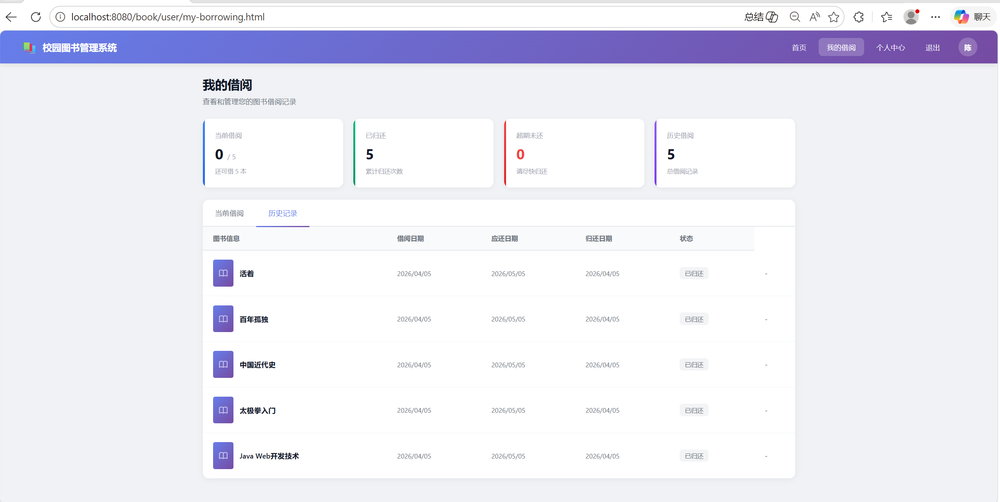
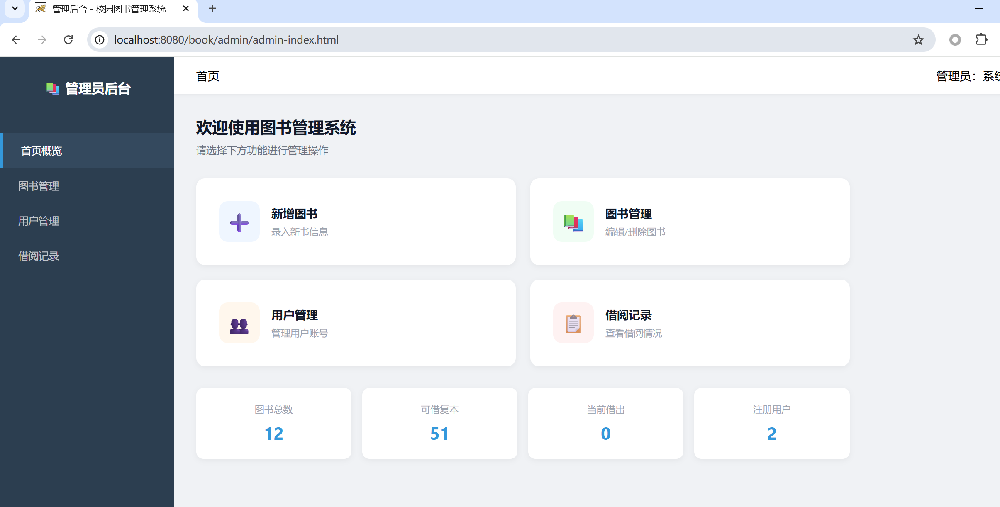
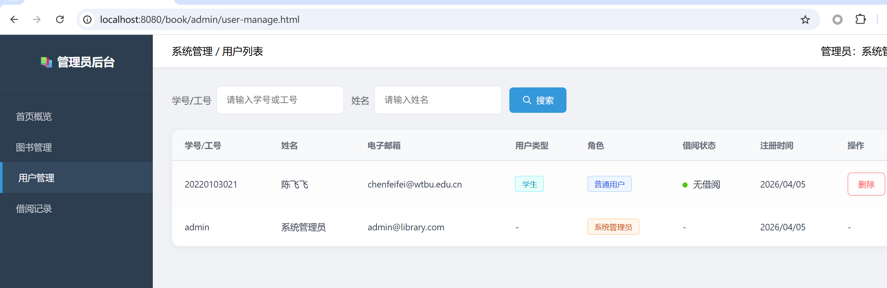
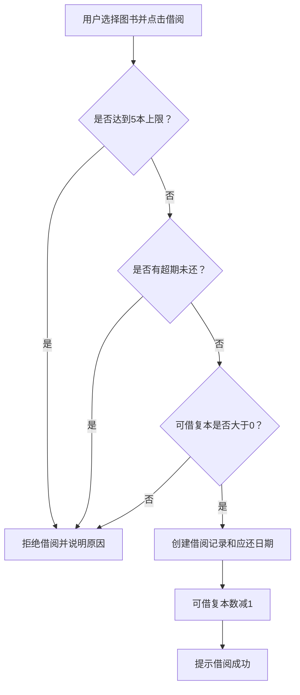
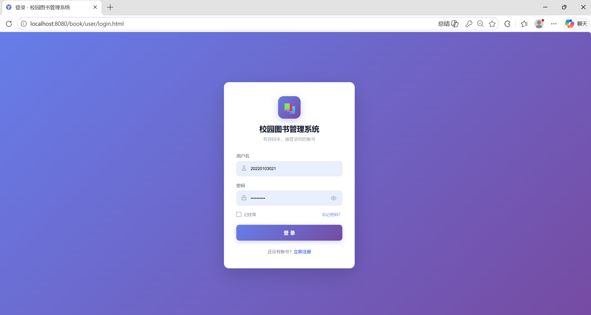

# 1.1 认识项目：体验系统与阅读文档


在开始自主项目的挑战之前，我们将通过"校园图书管理系统"进行一次完整的全流程演练。这个阶段，你的核心任务不是从零写代码，而是**学会阅读文档、拆解任务，并指挥 Trae 严格按照规范去生成和修改代码**。

## 零、 先睹为快：体验完整系统

在让 AI 写代码之前，请务必先访问我们为你部署好的线上体验环境。这将是你接下来要用代码一步步实现的"最终目标"。

* **项目体验地址**：[http://tomcat.chende.top/stu_25204149_assign_1/](http://tomcat.chende.top/stu_25204149_assign_1/)
* **管理员账号**：`admin` / 密码：`123456`
* **普通用户账号**：请在登录页点击注册，自行创建一个属于你的测试账号。

!!! tip "课前观察任务"
    请分别使用管理员账号和你刚才注册的普通用户账号登录系统，尝试寻找并对比：

    1. **能否进入后台？** 普通用户能否访问 `/admin/admin-index.html` 等管理员页面？直接键入 URL 强行访问会发生什么？
    2. **能否删改数据？** 普通用户能否调用图书新增、用户删除等接口？后端是否会拒绝？

    带着这些权限差异的直观感受，在后续查阅《需求分析说明书》并指挥 Trae 编写接口时，你就会明白为什么必须反复向 AI 强调"权限校验"的红线——**前端的隐藏按钮只能改善界面，真正的权限检查必须放在服务端**。

---

## 一、 业务背景与系统目标

### 1.1 业务背景

目前校园图书借阅涉及图书查询、借书、还书、借阅记录管理等工作。如果主要依靠人工登记，不仅查询效率低，还容易出现库存数量不准确、借阅记录遗漏和超期情况不清楚等问题。

**校园图书管理系统**面向学校师生和图书管理员，使用浏览器即可完成图书查询、借阅、归还和后台管理，提高图书借阅与管理效率。

### 1.2 系统目标

- 师生能够方便地查询图书，了解图书是否可以借阅；
- 师生能够在线完成借书、还书和借阅记录查询；
- 管理员能够统一管理图书、用户和借阅记录；
- 系统能够自动处理借阅期限、借阅上限和超期限制等规则；
- 系统能够区分普通用户和管理员，防止越权操作。

### 1.3 项目范围

本项目包含：

- 用户注册、登录、退出和个人信息管理；
- 图书浏览、搜索、分类筛选和详情查看；
- 图书借阅、归还、当前借阅和历史借阅查询；
- 管理员对图书、用户和借阅记录的管理；
- 图书多复本管理、超期判断和权限控制。

本项目暂不包含：

- 图书预约、排队和续借；
- 逾期罚款及在线支付；
- RFID、自助借还机等硬件设备；
- 不同学校之间的图书共享。

!!! info "评价重点不是技术栈是否时髦"
    推荐使用 Spring Boot + Vue，但本课程的前置实验沿用 **Servlet + JDBC + 原生 HTML/CSS/JS** 路线。**项目是否真正运行、业务流程是否完整、代码是否能够理解和解释**，才是评价的关键。

---

## 二、 用户角色与典型场景

| 角色 | 说明 | 主要操作 |
|---|---|---|
| 未登录用户 | 尚未登录系统的访问者 | 注册、登录 |
| 普通用户 | 已注册的学生或教师 | 查询图书、借书、还书、查看借阅记录、维护个人信息 |
| 管理员 | 负责维护系统数据的管理人员 | 管理图书、用户和全部借阅记录 |

### 普通用户界面

登录后的用户首页采用"顶部导航 + 左侧分类 + 右侧图书内容"的布局，提供图书搜索、分类筛选和借阅入口：

{ width="100%" .shadow }

点击图书卡片进入详情页，可查看封面、书名、作者、出版社、简介、总复本数与可借复本数，并发起借阅。图书详情页原型可参考 [`doc/UI/user/book_detail.html`](https://gitee.com/javaweb-dev-tech/lab2_2/blob/master/book_template/doc/UI/user/book_detail.html)。

"我的借阅"页面顶部显示统计卡片，下方通过表格区分"当前借阅"和"历史借阅"，超期记录使用红色标签突出显示：

{ width="100%" .shadow }

个人中心显示用户基本资料，并提供修改邮箱和修改密码功能：

{ width="100%" .shadow }

### 管理员界面

管理员登录后进入后台首页，左侧菜单 + 右侧内容区，顶部显示统计卡片和常用功能入口：

{ width="100%" .shadow }

图书管理页面提供新增、编辑、删除图书，删除前需二次确认；仍有复本借出的图书不可删除：

{ width="100%" .shadow }

用户管理页面支持按学号、工号、姓名搜索，管理员账号或仍有借阅的用户，删除按钮会被禁用：

{ width="100%" .shadow }

借阅管理页面展示全部借阅记录，支持按状态筛选，并可查看超期记录与管理员代还：

{ width="100%" .shadow }    

---

## 三、 核心业务规则一览

借阅规则是系统设计中最容易写错的环节，开发前务必先理解：

| 规则 | 具体要求 |
|---|---|
| 借阅上限 | 每名用户最多同时借阅 5 本图书 |
| 借阅期限 | 每次借阅期限为 30 天 |
| 库存限制 | 只有可借复本数大于 0 时才能借阅 |
| 超期限制 | 用户存在超期未还记录时，不能继续借阅新书 |
| 归还规则 | 只能归还本人正在借阅且尚未归还的图书 |
| 图书数量 | 借阅成功后可借复本数减 1，归还后加 1 |
| 删除图书 | 仍有复本借出的图书不能删除 |
| 删除用户 | 仍有图书未归还的用户不能删除 |
| 管理员保护 | 管理员账号不能通过用户管理功能删除 |
| 权限控制 | 未登录用户不能访问业务页面，普通用户不能访问管理页面 |

借阅检查流程如下：



---

## 四、 获取带练项目资源

项目已经克隆到本地工作目录。请使用 Trae AI IDE 直接打开 `book_template/` 子目录：

```text
A-software-project-training-docs/
└── lab2_2/
    └── book_template/         ← 用 Trae 打开这个目录
        ├── doc/
        │   ├── 需求分析说明书.md     ⭐ 业务规则与验收标准
        │   ├── 系统设计说明书.md     ⭐ 架构、数据库、接口设计
        │   ├── UI/                  页面原型（HTML）
        │   ├── img/                 系统实现截图
        │   └── archive/             历史归档（仅供参考）
        ├── src/
        │   └── main/
        │       ├── java/edu/wtbu/javaweb/book/   后端代码（学生开发）
        │       ├── resources/db.properties        数据库配置
        │       └── webapp/                        前端页面（学生开发）
        ├── pom.xml                                Maven 配置
        └── README.md                              模板工程说明
```

* **Gitee 仓库**：[javaweb-dev-tech/lab2_2](https://gitee.com/javaweb-dev-tech/lab2_2)
* **本节目标目录**：`book_template/`
* **README**：[book_template/README.md](https://gitee.com/javaweb-dev-tech/lab2_2/blob/master/book_template/README.md)

如果尚未克隆，可执行：

```bash
# 克隆实验仓库
git clone https://gitee.com/javaweb-dev-tech/lab2_2.git

# 进入项目目录
cd lab2_2/book_template
```

---

## 五、 认识标准工程目录

打开 `book_template/` 后，你会看到一个对 AI 友好的工程结构。**在指挥 Trae 写代码之前，请务必先熟悉这些文档和目录的位置**：

```text
book_template/
├── doc/                          # ⭐ 核心！项目文档库（Trae 生成代码的唯一准则）
│   ├── 需求分析说明书.md          # 规定系统"要做什么"
│   ├── 系统设计说明书.md          # 规定系统"怎么做"
│   ├── 测试报告.md                # 测试报告模板
│   ├── A-校园图书管理系统.postman_collection.json  # Postman 接口集合
│   ├── UI/                       # 静态 HTML 页面原型
│   │   ├── user/                 #   用户端原型（登录、注册、首页、详情、我的借阅、个人中心）
│   │   └── admin/                #   管理端原型（首页、图书/用户/借阅管理、新增/编辑图书）
│   ├── img/                      # 系统实现截图（开发后陆续补充）
│   └── archive/                  # 历史归档文档（仅参考，不作为开发依据）
├── src/main/
│   ├── java/edu/wtbu/javaweb/book/   # 后端 Servlet 代码（学生开发）
│   ├── resources/db.properties       # 数据库连接配置（学生修改）
│   └── webapp/                       # 前端页面（学生开发或参考原型）
├── pom.xml                       # Maven 配置（Jakarta Servlet 6.0 + MySQL）
└── README.md                     # 模板工程说明
```

!!! warning "开发依据：只认两份说明书"
    本次开发**只**以 `doc/需求分析说明书.md` 与 `doc/系统设计说明书.md` 为依据。

    - `doc/archive/` 是**历史归档**，仅作参考，其中旧版接口路径、数据库名等约定可能与新文档不一致。
    - `doc/UI/` 是**页面原型**，用于确定页面应包含的内容、布局和交互方式；视觉细节可自行优化，但页面核心信息和业务流程必须与需求保持一致。

---

## 六、 体验的第一步：把本地系统跑起来

现在你已经见识过线上的完整版，接下来要让本地的"半成品"也跑起来。请按以下步骤操作：

1. **修改数据库配置**：编辑 `src/main/resources/db.properties`，填入你的 MySQL 连接信息（本地数据库或实验提供的远程数据库）。
2. **初始化数据库**：参考 [系统设计说明书 — 第 4 章 数据库设计](https://gitee.com/javaweb-dev-tech/lab2_2/blob/master/book_template/doc/%E7%B3%BB%E7%BB%9F%E8%AE%BE%E8%AE%A1%E8%AF%B4%E6%98%8E%E4%B9%A6.md) 创建数据库 `library_db` 与三张表：`users`、`books`、`borrow_records`，并插入测试数据（含默认管理员 `admin / 123456`）。
3. **配置 Tomcat**：在 IDEA 中配置 Tomcat 11，将应用上下文（Application Context）设置为 `/book`，部署 `book_template`。
4. **启动并访问**：启动 Tomcat，浏览器访问 `http://localhost:8080/book/user/login.html`。

当你在本地 `localhost` 也能看到与线上体验地址一样的初始登录界面时，意味着你已经准备好进入真正的 AI 辅助开发实战了。

{ width="100%" .shadow }


---

## 七、 你将带着这些认知进入下一节

在进入 1.2 节之前，你应当已经能够回答：

1. **系统有哪些用户？** 未登录用户、普通用户（学生/教师）、管理员。
2. **每类用户能做什么？** 见本节"用户角色与典型场景"小节。
3. **借书和还书需要遵守哪些规则？** 见本节"核心业务规则一览"。
4. **哪些异常情况必须处理？** 5 本上限、超期、可借复本为 0、未登录访问、越权访问等。
5. **项目文档在哪？** `doc/需求分析说明书.md` 与 `doc/系统设计说明书.md`。

带着这些问题的答案，我们将在 [1.2 AI 编程利器登场：Trae IDE 与 Superpowers 技能框架](02-ai-tools.md) 中，正式开始配置 AI 工具与规则。