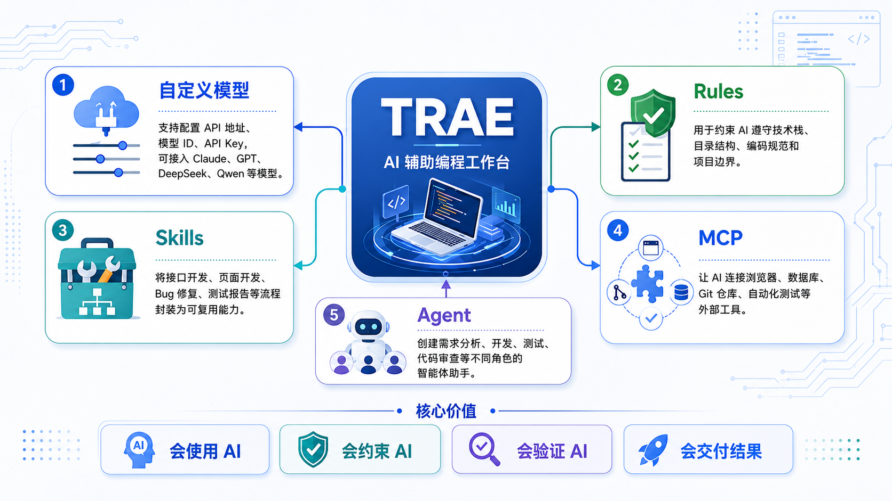

# 1.2 AI 编程利器登场：Trae IDE 与 Superpowers 技能框架

## 让 AI 不只会写代码，更能按工程方法完成任务

!!! quote "为什么同样使用 AI，结果却差别很大"
    如果把 AI 编程比作组建一支开发团队：

    * **只有 AI 模型**：像请来一位写代码很快、但不了解项目规则的新成员；
    * **Trae IDE**：为它准备好编辑器、终端、项目文件和调试工具；
    * **Superpowers-zh**：再教会它先分析、后计划，边实现、边测试，完成后必须验证。

    真正稳定的 AI 协作，不只是“让 AI 生成代码”，而是让它在合适的工具和规则下完成任务。

!!! tip "本节学习目标"
    认识 Trae IDE 与 Superpowers-zh 的作用，完成技能框架安装，并理解它们在后续项目开发中的分工。

---

## 🛠️ Trae IDE：AI 协作的开发环境

**Trae** 是面向 AI 协作设计的开发环境。它不只是给传统编辑器增加一个聊天窗口，而是让 AI 能够读取项目、修改文件、运行命令、分析错误，并协助完成较完整的开发任务。

{ width="100%" .shadow }

### Trae 能帮助你做什么

| 能力 | 你会看到什么 | 在本课程中的用途 |
| :--- | :--- | :--- |
| **IDE 模式** | 在编码过程中进行补全、问答和局部修改 | 日常编写与理解代码 |
| **SOLO 模式** | Agent 根据任务自主读取、修改和验证项目 | 完成较复杂的模块开发 |
| **多代理协作** | 不同 Agent 分工搜索、实现或审查 | 拆分并行任务，降低复杂度 |
| **MCP 工具集成** | AI 按需连接外部工具和资源 | 访问接口、仓库或其他服务 |
| **CUE 智能补全** | 按下 Tab 接受单行或多行编辑建议 | 提高手写代码效率 |
| **内置预览** | 在 IDE 中查看页面与运行结果 | 验证前端页面和交互效果 |

在“校园图书管理系统”带练中，你将主要用 Trae 完成三类任务：

1. **阅读项目**：通过 `@` 提及需求、设计和任务文档，让 AI 先理解上下文；
2. **实现功能**：通过对话或 Agent 模式生成、修改前后端代码；
3. **运行验证**：查看页面、终端和报错信息，检查实现是否满足要求。

!!! warning "Trae 能执行任务，但不会天然遵守你的工程纪律"
    如果没有明确约束，AI 可能跳过测试、擅自修改表结构，或者生成与设计文档不一致的接口。因此，我们还需要 Superpowers-zh 提供工作方法，并在下一节使用 `AGENTS.md` 写清项目规则。

---

## 🧠 Superpowers-zh：AI 的工程方法框架

### 它解决什么问题

只告诉 AI“给用户模块增加批量导出”，它可能立即开始写代码，却没有确认导出格式、数据规模和权限要求。代码虽然生成得快，却可能很快返工。

引入 Superpowers-zh 后，AI 会更倾向于先确认关键问题：

```text
你：给用户模块增加批量导出功能。

AI：开始实现前，需要先确认：
1. 导出 CSV 还是 Excel？
2. 预计数据量有多大，是否需要异步处理？
3. 哪些角色有导出权限？
4. 我会先给出方案，确认后再实现并测试。
```

**Superpowers-zh** 是开源项目 [Superpowers](https://github.com/obra/superpowers) 的中文增强版，项目地址为 [jnMetaCode/superpowers-zh](https://github.com/jnMetaCode/superpowers-zh)。它将常用的软件工程方法整理成 AI 可以按需加载的 Skills，并适配 Trae 等主流 AI 编程工具。

一句话概括：

> **Trae 让 AI 有能力操作项目，Superpowers-zh 让 AI 按更可靠的方法操作项目。**

---

## 🔄 一次开发任务如何推进

Superpowers 将常见开发任务组织为一套连续工作流。不同任务不一定机械地经过所有阶段，但核心原则是一致的：**先想清楚，再动手；完成实现后，用证据验证。**

| 阶段 | 对应 Skill | 主要作用 |
| :--- | :--- | :--- |
| 1. 明确需求 | `brainstorming` | 提问并确认目标、边界和验收标准 |
| 2. 隔离环境 | `using-git-worktrees` | 使用 Git Worktree 创建独立工作区 |
| 3. 拆分任务 | `writing-plans` | 将复杂任务拆成可执行的小步骤 |
| 4. 分步实现 | `subagent-driven-development` | 通过子 Agent 分工执行与审查 |
| 5. 测试驱动 | `test-driven-development` | 按 RED–GREEN–REFACTOR 循环开发 |
| 6. 代码审查 | `requesting-code-review` | 检查正确性、质量和规范 |
| 7. 完成收尾 | `finishing-a-development-branch` | 运行验证并整理开发分支 |

### 需要记住的四条原则

| 原则 | 对开发的要求 |
| :--- | :--- |
| **TDD 优先** | 尽可能先写测试，再实现功能 |
| **系统化调试** | 根据报错和运行证据定位问题，不靠猜测修改 |
| **保持简单** | 只实现当前需要的内容，避免过度设计 |
| **证据优于声明** | 必须通过测试、构建或运行结果证明任务完成 |

!!! failure "AI 说“已经完成”不等于真的完成"
    没有运行、没有测试、没有检查结果的代码，只能算“生成了内容”，不能算“完成了任务”。

---

## 🧰 Superpowers-zh 包含哪些 Skills

Superpowers-zh 包含通用工程 Skills，也提供面向中文开发场景的扩展能力。

### 通用工程 Skills

包括头脑风暴、编写计划、执行计划、测试驱动开发、系统化调试、请求与接收代码审查、完成前验证、并行 Agent、子 Agent 驱动开发、Git Worktree、开发分支收尾、编写 Skills 和使用 Superpowers 等。

### 中文开发场景 Skills

| Skill | 用途 | 调用方式 |
| :--- | :--- | :--- |
| `chinese-code-review` | 按中文团队习惯开展代码审查 | 手动调用 |
| `chinese-git-workflow` | 适配 Gitee、Coding、极狐 GitLab、CNB 等平台 | 手动调用 |
| `chinese-documentation` | 优化中文排版与中英混排 | 手动调用 |
| `chinese-commit-conventions` | 生成符合国内团队习惯的提交信息 | 手动调用 |
| `mcp-builder` | 构建 MCP 工具，扩展 AI 能力 | 按任务触发 |
| `workflow-runner` | 在 AI 工具中运行多角色 YAML 工作流 | 按任务触发 |

---

## 📦 在 Trae 中安装 Superpowers-zh

Superpowers-zh 原生支持 Trae。安装后，相关 Skills 和规则会写入项目的 `.trae/` 目录。

### 方式一：一键安装（推荐）

一键安装依赖 Node.js 环境。请先安装 Node.js，并在终端确认以下命令能够正常输出版本号：

```bash
node -v
npm -v
```

然后进入你的项目根目录，执行安装命令：

```bash
cd /your/project
npx superpowers-zh --tool trae
```

!!! warning "请在项目根目录中执行"
    不要直接在用户主目录 `~` 中安装，否则配置可能影响其他项目。如果自动识别不到 Trae，可以继续使用 `--tool trae` 显式指定。

需要卸载时执行：

```bash
npx superpowers-zh@latest --uninstall
```

---

## ✅ 验证安装结果

安装完成后，重启 Trae，并在项目对话窗口中输入：

```text
你有 superpowers 吗？
```

如果安装成功，AI 应能说明 Superpowers 技能体系，并在后续开发任务中根据场景加载相应 Skill。

你还可以通过一个小任务观察它是否会先确认需求，例如：

```text
请为当前项目增加用户批量导出功能。
```

不要急着让 AI 实现，先观察它是否会询问格式、数据量、权限和验收标准。

---

## 🤝 两件工具如何配合

| 工具 | 核心定位 | 类比 |
| :--- | :--- | :--- |
| **Trae IDE** | 提供读取、编辑、运行和预览项目的能力 | AI 的“手” |
| **Superpowers-zh** | 提供分析、计划、测试、调试和审查方法 | AI 的“工程方法” |
| **AGENTS.md** | 声明当前项目必须遵守的具体规则 | 项目的“红线” |

三者共同构成后续课程的 AI 协作基础：

> Trae 负责执行 → Superpowers-zh 规范过程 → `AGENTS.md` 约束项目边界 → 你负责审核与最终决策

---

## 📝 本节小结

* **Trae 是 AI 协作环境**：帮助 AI 阅读、修改、运行和验证项目；
* **Superpowers-zh 是工程方法框架**：让 AI 先分析和计划，再实现、测试与审查；
* **安装应以项目为单位**：优先在项目根目录使用 `npx superpowers-zh --tool trae`；
* **完成必须有证据**：AI 的文字回复不能代替真实的测试和运行结果；
* **人始终对结果负责**：你需要审核方案、理解代码，并确认最终实现符合项目要求。

下一节，我们将通过 `AGENTS.md` 为 Trae 写下项目级规则，让 AI 明确哪些文档必须先读、哪些技术约束不能违反，以及完成任务后必须进行哪些验证。

[返回阶段一目录](index.md){ .md-button }
[进入下一节：用 AGENTS.md 立下项目规则](03-ai-rules.md){ .md-button .md-button--primary }
