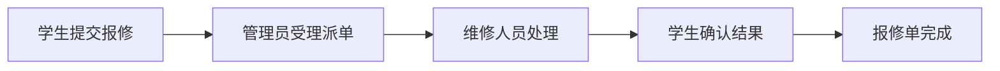

# 2.1 选好项目：问题、调研与范围

## 从一个真实的小问题开始

!!! quote "选题不是给系统起一个名字"
    “我要做一个管理系统”还不是选题。你需要进一步说明：**谁在使用、遇到了什么问题、系统准备怎样帮助他。**

    对基础较弱的同学来说，最好的题目不是功能最多、技术最新，而是自己熟悉、用户容易找到、业务能够讲清，并且能在课程周期内完成。

!!! tip "本节学习目标"
    借助 Trae 和教师提供的选题 Skill/Agent，从候选题目中确定一个范围合适的项目，为下一节填写《项目选题立项书》做好准备。

[浏览项目选题库](../projects/index.md){ .md-button .md-button--primary }
[进入第二篇导读](index.md){ .md-button }

---

## 🎯 本节只需要完成什么

完成本节后，你不需要提交一份很长的调研报告，只需要得到下面 5 项内容：

| 选题结果 | 要回答的问题 |
| :--- | :--- |
| 项目名称 | 你的系统叫什么？ |
| 目标用户 | 谁会使用这个系统？ |
| 具体问题 | 用户当前遇到了什么不方便？ |
| 核心业务流程 | 用户怎样从开始操作到完成目标？ |
| 项目范围 | 哪些功能必须做，哪些本期不做？ |

这些内容将在下一节整理进《项目选题立项书》。

---

## 💡 第一步：先选 2～3 个候选题目

可以从[项目选题库](../projects/index.md)中选择，也可以提出自己的题目。第一次选项目时，优先考虑自己熟悉的场景：

- 校园生活：失物招领、宿舍报修、实验室预约、志愿活动；
- 日常生活：健康打卡、个人记账、宠物领养；
- 行业应用：门店预约、社区工单、商品库存；
- AI 应用：学习助手、简历优化、课程知识问答。

先填写候选题目表：

| 候选题目 | 我为什么感兴趣 | 我能接触到哪些用户 | 难度判断 |
| :--- | :--- | :--- | :--- |
| 题目 1 |  |  | L1 / L2 / L3 |
| 题目 2 |  |  | L1 / L2 / L3 |
| 题目 3 |  |  | L1 / L2 / L3 |

!!! info "多数同学优先选择 L1 或 L2"
    L1 适合第一次独立完成项目；L2 适合已经做过简单增删改查、希望完成多角色业务的同学。L3 通常包含 RAG、推荐或复杂外部服务，建议在普通 Web 功能完成后再挑战。

---

## 🤖 第二步：用 AI 帮你比较，不让 AI 替你决定

教师可以将“项目选题”Skill 或 Agent 配置到 Trae。它的作用是通过提问帮助你发现选题过大、用户不清楚或数据难获取等问题。

在 Trae 中可以这样提问：

```text
请使用教师提供的项目选题 Skill 帮我分析候选题目，不要直接替我决定，也不要虚构调研数据。

我的候选题目：
1.【题目一】
2.【题目二】
3.【题目三】

我的情况：
- 熟悉的生活或校园场景：【填写】
- 能接触到的用户：【填写】
- 已掌握的技术：【填写】
- 希望独立完成还是组队：【填写】

请分别分析：
1. 目标用户和要解决的问题是否明确；
2. 最小业务流程是什么；
3. 必做功能是否能在课程周期内完成；
4. 所需数据和外部服务是否容易获得；
5. 主要风险和缩小范围的建议。

最后用对比表回答，但把最终选择留给我。
```

检查 AI 的回答时，重点看它有没有出现这些问题：

- 把目标用户写成“所有人”；
- 一上来就增加支付、即时聊天、复杂推荐等功能；
- 编造“根据调查，90% 的用户需要……”；
- 只介绍技术，没有说明用户问题；
- 把一个课程项目设计成大型综合平台。

!!! warning "AI 生成的调研结论不是真实证据"
    AI 可以帮你整理问题和比较范围，但不能代替用户访谈或同类产品体验。凡是没有真实来源的数据，都不要写入立项书。

---

## 🔍 第三步：做一次简单但真实的调研

基础项目不要求复杂问卷和大量样本。下面两种方式至少完成一种：

### 方法一：和 1～3 名潜在用户交流

例如，做宿舍报修系统，可以询问学生或宿管：

1. 现在遇到故障时怎样报修？
2. 哪一步最麻烦或最容易遗漏？
3. 提交后能否知道是谁处理、处理到哪一步？
4. 如果有一个系统，最希望它先解决什么？
5. 哪些信息不愿意或不应该公开？

记录用户的原话和你的总结，不要只写“用户认为很好”。

### 方法二：体验 1～2 个同类产品

记录以下内容：

| 调研内容 | 记录要点 |
| :--- | :--- |
| 产品或系统名称 | 体验了什么？ |
| 主要用户 | 谁在使用？ |
| 核心流程 | 用户怎样完成主要任务？ |
| 做得好的地方 | 哪些设计值得参考？ |
| 存在的问题 | 哪些操作复杂或不适合你的场景？ |
| 对自己项目的启发 | 准备保留或避免什么？ |

!!! tip "调研的目标是验证问题，不是证明自己的想法一定正确"
    如果用户认为这个问题不重要，或者已有工具已经解决得很好，你可以调整项目范围，也可以及时更换题目。尽早发现问题，比开发到一半再推翻更好。

---

## 🔄 第四步：画出一条核心业务闭环

业务闭环是指用户从提出需求，到系统处理，再到获得结果的完整过程。

例如，宿舍报修系统的核心闭环：

```text
学生提交报修 → 管理员受理并派单 → 维修人员处理
→ 学生确认结果 → 系统保存维修记录
```

也可以用流程图表示：



一条合格的核心流程，应当包括：

- 明确的开始和结束；
- 至少一类真实用户；
- 用户操作和系统处理；
- 关键状态变化；
- 可以在页面或接口中验证的结果。

### 检查你的流程

如果你的描述是下面这样，说明还不够完整：

```text
用户管理、商品管理、订单管理、统计管理
```

这只是菜单名称，不是业务流程。应改成：

```text
用户浏览商品 → 提交购买意向 → 卖家确认 → 更新交易状态 → 双方查看结果
```

---

## ✂️ 第五步：控制项目范围

确定核心闭环后，再决定功能。将功能分成三类即可：

| 分类 | 含义 | 处理原则 |
| :--- | :--- | :--- |
| **必做** | 没有它就不能完成核心流程 | 优先开发和测试 |
| **选做** | 能让项目更有特色，但不影响基本运行 | 必做完成后再增加 |
| **本期不做** | 难度较大、依赖条件不足或偏离核心目标 | 在立项书中明确排除 |

以宿舍报修系统为例：

| 必做 | 选做 | 本期不做 |
| :--- | :--- | :--- |
| 登录、提交报修、派单、进度更新、确认完成 | 图片识别、超时提醒、故障统计 | 在线支付、智能硬件接入、跨校区统一调度 |

!!! tip "范围控制的简单规则"
    基础项目建议控制在 **2～3 类用户、4～6 个核心模块、1～2 条主要业务流程**。如果功能清单已经超过一页，先检查是否把选做功能误当成必做。

### AI 项目特别提醒

如果题目包含 AI，还要问自己：

> 当大模型或外部 AI 服务暂时不可用时，基础业务系统还能不能运行？

例如，AI 学习助手的资料管理、问题记录和反馈功能应该可以独立运行；RAG 问答、练习推荐等作为增强功能逐步加入。不要把项目做成“一个输入框调用一次 API”。

---

## 📝 第六步：形成你的选题结论

将前面的结果整理为一页选题卡：

```text
项目名称：【填写】

一句话介绍：
面向【目标用户】，解决【具体问题】，通过【核心业务流程】，形成【系统名称】。

调研依据：
我与【用户】进行了交流 / 体验了【同类产品】，发现【主要问题】。

核心业务流程：
【步骤一】→【步骤二】→【步骤三】→【最终结果】

必做功能：
1.【填写】
2.【填写】
3.【填写】

选做功能：
1.【填写】

本期不做：
1.【填写】

选择理由：
【说明自己为什么愿意做、为什么能够完成】
```

这张选题卡是下一节编写《项目选题立项书》的主要输入。

---

## ✅ 本节验收清单

提交选题前逐项检查：

- [ ] 项目名称能反映主要业务，不只是“XX 管理系统”；
- [ ] 能说清楚目标用户是谁；
- [ ] 具体问题来自简单调研或同类产品体验；
- [ ] 能用一句话介绍项目；
- [ ] 有一条从开始到结束的核心业务闭环；
- [ ] 必做功能能够支撑核心闭环；
- [ ] 已列出选做和本期不做的功能；
- [ ] 所需数据和技术条件基本可获得；
- [ ] 没有把 AI 生成内容当成真实调研结果；
- [ ] 自己愿意持续开发，并能在答辩中解释这个题目。

如果有两项以上无法确认，先缩小范围或更换候选题目。

---

## 📝 本节小结

* **先找问题，再想功能**：明确用户当前遇到的具体困难；
* **AI 帮助比较，不替你决定**：用 Skill/Agent 检查范围和风险；
* **调研可以小，但必须真实**：与潜在用户交流，或体验同类产品；
* **先画闭环，再列功能**：功能必须服务于核心业务流程；
* **主动写出本期不做**：小而完整比大而失控更有价值。

[浏览项目选题库](../projects/index.md){ .md-button }
[下一节：完成项目立项](02-proposal-review.md){ .md-button .md-button--primary }
