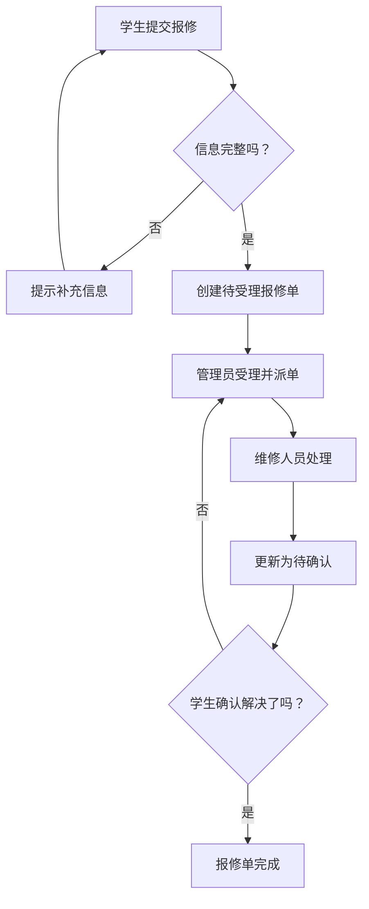

# 2.3 梳理需求：用户、功能与业务规则

## 把“想做什么”写成开发时能用的说明

!!! quote "需求不是功能菜单"
    “用户管理、订单管理、统计管理”只是页面名称，不能告诉开发者系统到底要怎样工作。需求分析要回答的是：**谁在什么情况下做什么操作，系统怎样处理，什么情况可以成功，什么情况必须拒绝。**

    这一节不要求你写复杂的专业文档。只要围绕自己的核心业务流程，把用户、功能、规则和验收条件写清楚，后面设计、编码和测试就有了依据。

!!! tip "本节学习目标"
    根据已完成的《项目选题立项书》，借助 Trae 和教师提供的需求分析 Skill/Agent，完成《需求分析说明书》的核心内容。

[返回上一节：完成项目立项](02-proposal-review.md){ .md-button }
[进入第二篇导读](index.md){ .md-button .md-button--primary }

---

## 🎯 本节完成后，你要写清 6 件事

| 内容 | 要回答的问题 |
| :--- | :--- |
| 用户角色 | 谁会使用系统，各自能做什么？ |
| 核心场景 | 用户在什么情况下需要使用系统？ |
| 功能需求 | 系统需要提供哪些能力？ |
| 业务流程 | 操作从开始到结束怎样流转？ |
| 业务规则 | 哪些条件必须满足，哪些操作必须禁止？ |
| 验收条件 | 怎样判断功能真的完成？ |

这些内容将写进《需求分析说明书》。不用追求功能数量，重点是让核心业务闭环**能开发、能测试、能解释**。

---

## 👥 第一步：先确定用户角色

角色不是按姓名或班级划分，而是按目标和权限划分。基础项目通常只需要 **1～3 类角色**。

以宿舍报修管理系统为例：

| 用户角色 | 使用目的 | 主要操作 | 不能做什么 |
| :--- | :--- | :--- | :--- |
| 学生 | 提交报修并查看处理结果 | 提交报修、查看自己的记录、确认完成 | 不能查看或修改其他学生报修单，不能派单 |
| 宿舍管理员 | 受理报修并安排处理 | 查看待处理报修、派单、查看处理进度 | 不能冒充学生提交报修 |
| 维修人员 | 处理分配给自己的任务 | 查看任务、更新处理进度和结果 | 不能查看未分配给自己的任务 |

### 写角色时检查 4 个问题

1. 这个角色是谁？
2. 他为什么要使用系统？
3. 他最常做的 2～4 个操作是什么？
4. 哪些操作必须限制，避免越权？

!!! warning "不要为了显得复杂而增加角色"
    个人记账、健康打卡等项目可以只有一个用户角色；只有当管理员确实需要维护数据、审核或处理业务时，再增加管理员角色。

---

## 🎬 第二步：描述核心使用场景

场景就是“一个角色在一个具体情境下，完成一个明确目标”。它比功能菜单更接近真实使用过程。

### 场景写作模板

```text
场景名称：【填写】
参与角色：【填写】
触发条件：【什么情况下开始】
用户目标：【想完成什么】
操作过程：【用户和系统分别做什么】
预期结果：【最终看到或获得什么】
异常情况：【哪些条件不满足时应怎样处理】
```

### 示例：学生提交报修

| 项目 | 内容 |
| :--- | :--- |
| 场景名称 | 学生提交宿舍报修 |
| 参与角色 | 已登录学生 |
| 触发条件 | 学生发现宿舍设施出现故障 |
| 用户目标 | 提交完整的故障信息并获得受理结果 |
| 操作过程 | 填写故障类型、地点、描述，可选择上传图片，提交报修 |
| 预期结果 | 系统创建一条“待受理”报修单，学生可在我的报修中查看 |
| 异常情况 | 未登录、必填信息为空、地点格式错误时不能提交，并提示原因 |

基础项目优先写 **3～5 个核心场景**，例如：提交、查询、审核/派单、处理、确认。不要一开始把每个按钮都写成一个场景。

---

## 🧩 第三步：从场景提取功能需求

先有场景，再列功能。每项功能都要能找到对应的用户需求或业务流程。

### 功能需求写作模板

```text
编号：FR-模块-序号
功能名称：【填写】
使用角色：【填写】
前置条件：【操作前必须满足什么】
输入内容：【用户需要填写或选择什么】
处理过程：【系统需要检查或完成什么】
结果：【成功后产生什么页面、数据或状态变化】
异常情况：【失败时怎样提示或拒绝】
优先级：必做 / 选做
```

### 示例：提交报修

```text
编号：FR-REPAIR-01
功能名称：提交报修
使用角色：已登录学生
前置条件：学生已登录系统。
输入内容：故障类型、宿舍地点、故障描述，可选上传现场图片。
处理过程：系统检查必填项和地点格式，创建状态为“待受理”的报修单。
结果：保存报修记录，学生可以在“我的报修”中查看。
异常情况：未登录、必填项为空或格式错误时，拒绝提交并提示具体原因。
优先级：必做。
```

### 先写最少的必做功能

以宿舍报修为例，核心闭环通常只需要：

| 编号 | 功能名称 | 角色 | 优先级 |
| :--- | :--- | :--- | :--- |
| FR-REPAIR-01 | 提交报修 | 学生 | 必做 |
| FR-REPAIR-02 | 查看我的报修 | 学生 | 必做 |
| FR-REPAIR-03 | 受理并派单 | 宿舍管理员 | 必做 |
| FR-REPAIR-04 | 更新维修进度 | 维修人员 | 必做 |
| FR-REPAIR-05 | 确认处理结果 | 学生 | 必做 |
| FR-REPAIR-06 | 查看维修统计 | 宿舍管理员 | 选做 |

!!! tip "每个功能都要能说清结果"
    不要只写“支持报修”“支持管理”。至少说明谁操作、输入什么、系统改变了什么、失败时如何提示。

---

## 🔄 第四步：画出核心业务流程

业务流程把多个功能连起来，说明数据和状态如何变化。后续页面、接口、数据库和测试都要围绕它设计。

### 示例：宿舍报修处理流程



检查流程图是否至少包含：

- 谁发起操作；
- 哪些地方需要判断；
- 判断失败后怎么处理；
- 关键状态怎么变化；
- 流程最终怎样结束。

### 状态变化要写清楚

如果业务存在“待处理、处理中、已完成”等状态，建议补一张状态表：

| 状态 | 含义 | 可以执行的下一步 |
| :--- | :--- | :--- |
| 待受理 | 学生已提交，管理员未处理 | 管理员受理或派单 |
| 处理中 | 已分配给维修人员 | 维修人员更新处理结果 |
| 待确认 | 维修人员已处理，等待学生确认 | 学生确认完成或申请继续处理 |
| 已完成 | 学生确认处理结束 | 仅允许查看记录 |

!!! failure "状态不清楚，代码一定容易出错"
    如果没有明确状态，系统很容易出现“已经完成还可以再次派单”“已经取消还可以确认”等问题。先写清状态，再写代码。

---

## 📏 第五步：明确业务规则与异常情况

业务规则是“不管页面怎么设计，都必须遵守”的约束。它要具体、可以判断、可以测试。

### 模糊规则与清楚规则

| 不够清楚 | 可以开发和测试的写法 |
| :--- | :--- |
| 用户要合理提交报修 | 学生必须登录后才能提交报修，故障类型、宿舍地点和描述不能为空 |
| 管理员及时处理 | 只有管理员可以将“待受理”报修单派给维修人员 |
| 状态正常更新 | 只有处于“处理中”的报修单可以更新为“待确认” |
| 不能重复操作 | 已完成的报修单不能再次派单或确认完成 |

### 示例业务规则表

| 编号 | 业务规则 | 适用功能 |
| :--- | :--- | :--- |
| BR-REPAIR-01 | 未登录用户不能提交报修或查看个人报修记录 | 提交、查询 |
| BR-REPAIR-02 | 学生只能查看和确认本人提交的报修单 | 查询、确认 |
| BR-REPAIR-03 | 只有管理员可以受理和派单 | 受理派单 |
| BR-REPAIR-04 | 只有被分配的维修人员可以更新该报修单进度 | 更新进度 |
| BR-REPAIR-05 | 已完成报修单不能再次派单、更新或确认 | 全部操作 |

### 常见异常与边界场景

至少检查以下情况：

| 类型 | 需要考虑的情况 |
| :--- | :--- |
| 输入问题 | 必填项为空、内容过长、格式不正确 |
| 权限问题 | 未登录、普通用户访问管理功能、查看他人数据 |
| 数据问题 | 报修单不存在、已被删除、状态不允许操作 |
| 重复操作 | 连续点击提交、重复派单、重复确认 |
| 运行问题 | 数据库操作失败、网络中断、外部 AI 服务不可用 |

!!! warning "前端隐藏按钮不等于权限控制"
    即使页面不显示“派单”按钮，用户仍可能直接请求接口。因此权限和状态检查必须在后端实现，不能只依赖前端页面。

---

## ✅ 第六步：为每个核心功能写验收条件

验收条件告诉你以后怎样测试。推荐使用“给定—当—那么”写法：

```text
给定：学生已经登录，填写了有效的报修信息；
当：学生点击提交报修；
那么：系统创建一条状态为“待受理”的报修单，
并在页面提示提交成功。
```

### 示例验收表

| 对应需求 | 验收场景 | 操作 | 通过条件 |
| :--- | :--- | :--- | :--- |
| FR-REPAIR-01 | 正常提交报修 | 登录学生填写完整信息后提交 | 创建待受理记录，页面显示成功提示 |
| FR-REPAIR-01 | 缺少必填项 | 不填写故障地点直接提交 | 拒绝提交，指出缺失字段 |
| BR-REPAIR-02 | 访问他人记录 | 学生尝试访问其他学生的报修单 | 后端拒绝，数据不返回 |
| BR-REPAIR-05 | 重复确认 | 对已完成报修单再次点击确认 | 拒绝操作，状态保持已完成 |

!!! tip "验收条件越早写，后面测试越轻松"
    当你能写出“怎样算通过”，功能边界通常已经比较清楚。后续编写接口、页面和测试报告时，可以直接复用这些条件。

---

## 🤖 第七步：用 AI 检查需求遗漏

教师可以提供“需求分析”Skill 或 Agent。完成需求初稿后，在 Trae 中这样提问：

```text
请使用教师提供的需求分析 Skill 审查以下需求内容。

请先阅读我的《项目选题立项书》和需求初稿，
不要编造用户需求或擅自增加功能。

重点检查：
1. 用户角色、场景和功能是否对应；
2. 核心业务流程能否形成闭环；
3. 是否遗漏登录、权限、状态和重复操作限制；
4. 每项业务规则是否具体、可判断；
5. 验收条件是否可以通过页面或接口测试；
6. 是否有超出立项书范围的内容。

请按“位置—问题—影响—建议”输出，
并把“必须修改”和“可选优化”分开。
```

收到建议后，优先解决：

1. 用户越权、数据错误、状态混乱等会导致核心流程错误的问题；
2. 缺少前置条件、异常处理或验收条件的问题；
3. 与立项书范围不一致的问题。

对于 AI 提出的复杂架构、大量扩展功能或不适合课程范围的建议，可以记录但不必采纳。

---

## 📋 可直接使用的需求分析提纲

本节完成后，可以将内容整理进《需求分析说明书》：

```text
# 需求分析说明书

## 1. 项目概述
- 项目背景、目标和范围（可从立项书整理）

## 2. 用户角色与权限

## 3. 核心使用场景

## 4. 功能需求
- FR-模块-序号

## 5. 核心业务流程与状态说明

## 6. 业务规则与异常情况
- BR-模块-序号

## 7. 验收条件

## 8. 本期不做的功能
```

!!! info "需求文档不需要一次写完所有细节"
    先写清核心闭环，随着原型和开发推进再补充细节。但每次修改需求后，要同步检查流程、规则和验收条件是否仍然一致。

---

## ✅ 本节验收清单

完成需求分析初稿前，请逐项确认：

- [ ] 已识别 1～3 类核心用户角色；
- [ ] 每类角色都有明确目标、操作和权限边界；
- [ ] 已写出 3～5 个核心使用场景；
- [ ] 每项必做功能都有角色、条件、处理和结果；
- [ ] 已画出至少一条核心业务流程；
- [ ] 关键状态及其允许操作明确；
- [ ] 业务规则没有“合理处理”“视情况而定”等模糊表述；
- [ ] 已考虑输入、权限、数据和重复操作等异常情况；
- [ ] 每个核心功能都有至少一个可测试的验收条件；
- [ ] AI 建议已由自己判断，没有超出立项书范围；
- [ ] 内容可以整理成《需求分析说明书》。

---

## 📝 本节小结

* **从用户出发，而不是从菜单出发**：先明确谁在什么场景下解决什么问题；
* **场景推导功能**：每项功能都要有用户、前置条件、处理和结果；
* **流程连接功能**：通过角色动作、判断和状态变化形成业务闭环；
* **规则守住边界**：权限、状态和重复操作必须有明确限制；
* **验收证明完成**：提前写出可观察、可测试的通过条件；
* **AI 辅助查漏，不替代决策**：对范围和真实需求始终由你负责。

[返回上一节：完成项目立项](02-proposal-review.md){ .md-button }
[下一节：完成需求文档](04-document-review.md){ .md-button .md-button--primary }
