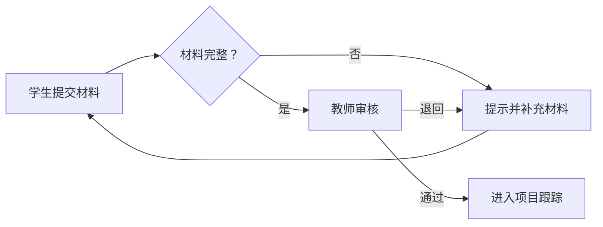

# 功能需求、业务规则与流程

功能需求说明系统必须提供什么能力，业务流程说明这些能力如何协同，业务规则则约束每一步在什么条件下可以执行。

## 从业务流程提取功能

不要只列“用户管理、赛事管理、报名管理”等菜单名称，应先描述一条可以从开始走到结束的业务流程：

```text
学生查看赛事 → 创建团队 → 邀请成员 → 提交报名材料
→ 指导教师审核 → 学生修改 → 审核通过 → 进入项目跟踪
```

从流程中的角色动作、数据变化和异常处理提取功能需求。

## 编写功能需求

每项功能需求至少包括：

- 唯一编号；
- 功能名称；
- 使用角色；
- 前置条件；
- 输入和处理过程；
- 输出结果；
- 异常情况；
- 优先级；
- 验收标准。

示例：

```text
FR-TEAM-01 创建团队
角色：学生
前置条件：用户已登录，赛事允许报名
输入：团队名称、指导教师、成员信息
结果：生成待成员确认的团队记录
异常：报名截止、重复加入团队、成员人数超限
```

## 明确业务规则

业务规则应具体、可判断，例如：

- 每名学生在同一赛事中只能加入一个团队；
- 团队人数必须在 2～5 人之间；
- 所有成员确认后，负责人才能提交报名材料；
- 退回的材料允许修改并再次提交；
- 审核通过后不能直接删除报名记录。

避免使用“合理处理”“根据情况判断”等模糊表述。

## 绘制业务流程



流程图应体现参与角色、关键判断、状态变化和异常分支，并与功能需求保持一致。

## 提交成果

- 编号化功能需求清单；
- 核心业务流程图；
- 业务规则表；
- 状态及状态转换说明；
- 异常流程清单。

## 验收检查

- [ ] 核心功能能够组成完整业务闭环；
- [ ] 每项功能都有角色、条件和结果；
- [ ] 关键业务规则明确且可测试；
- [ ] 正常、异常和边界流程均有说明；
- [ ] 流程图与功能清单不存在矛盾。
