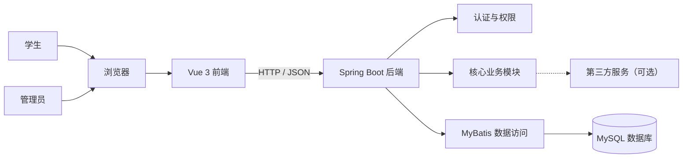
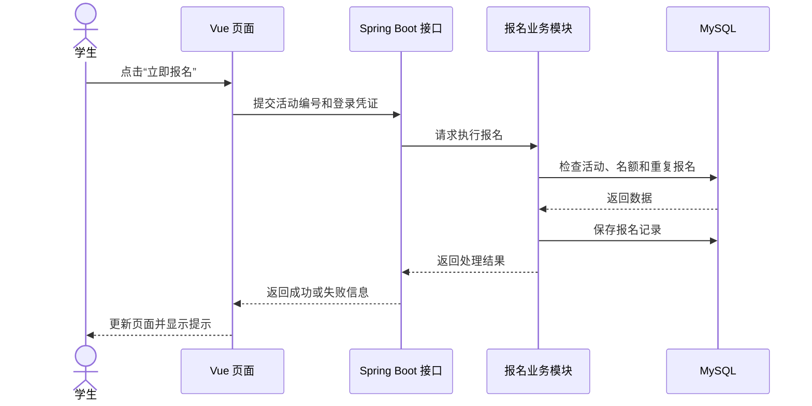
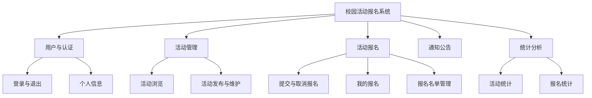
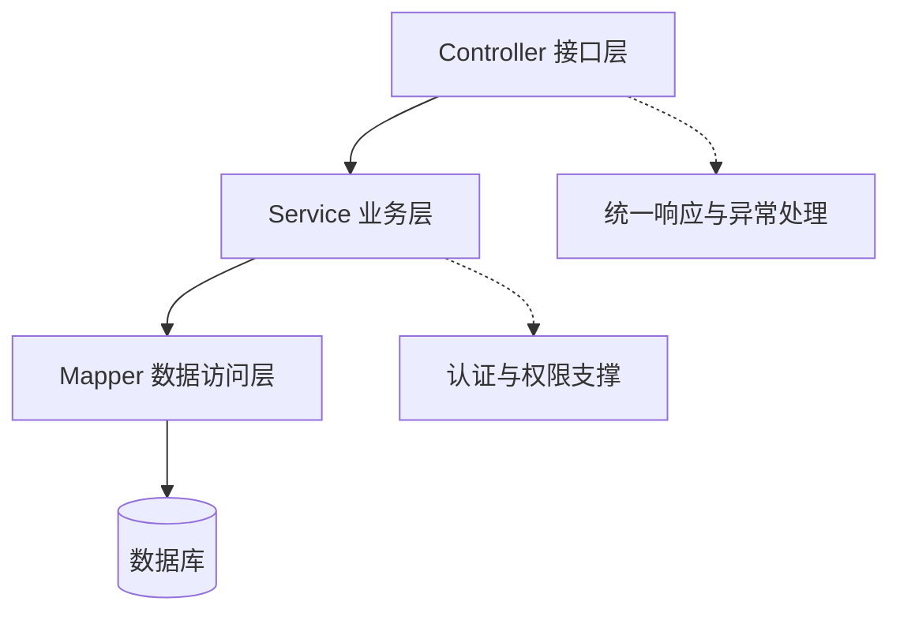

# 3.2 设计架构：系统架构与功能模块

## 先搭好系统骨架，再分别设计页面、数据和接口

!!! quote "架构设计不是画几个方框"
    架构图要让人看明白：系统有哪些组成部分，用户从哪里进入，请求经过哪些部分，数据保存在哪里，各部分分别承担什么职责。

    功能模块设计则要回答：需求中的功能怎样分组，每个模块负责什么，模块之间怎样配合。只有把这些问题想清楚，后面的代码目录、接口和任务分工才不会混乱。

!!! tip "本节学习目标"
    根据上一节确定的设计目标、项目约束和技术选型，选择适合课程项目的系统架构，划分功能模块，说明各部分的职责和关系，为原型、数据库、接口及后续编码提供总体结构。

[返回上一节：明确方案](01-design-selection.md){ .md-button }
[返回第三篇导读](index.md){ .md-button }
[进入下一节：设计原型](03-prototype.md){ .md-button .md-button--primary }

---

## 🎯 本节完成后，你要交付

| 成果 | 要求 |
| :--- | :--- |
| 系统架构图 | 展示用户端、前端、后端、数据库和必要的外部服务 |
| 架构说明 | 说明系统采用什么结构、各层职责及一次请求的处理过程 |
| 功能模块图 | 按用户目标和业务职责划分系统功能 |
| 模块职责表 | 写清每个模块的使用角色、主要功能、输入输出和依赖关系 |
| 项目结构建议 | 说明前后端代码准备怎样分层和组织 |

本节设计的是系统的“骨架”。页面具体长什么样放在 3.3，数据表怎样设计放在 3.4，接口、权限和业务状态的详细规则放在 3.5。

---

## 📄 第一步：从需求和技术方案出发

开始画架构图之前，先读取已经确认的材料：

| 输入材料 | 本节重点关注的内容 |
| :--- | :--- |
| 《需求分析说明书》 | 用户角色、核心业务流程、功能范围和验收条件 |
| 设计目标与约束 | 优先保证的质量、开发周期、团队能力和部署条件 |
| 技术选型表 | 前端、后端、数据库、开发工具和部署技术 |
| 关键设计决策 | 已确认的系统结构及其选择理由 |

把核心需求简单映射到系统组成部分。例如“校园活动报名系统”可以先整理为：

| 需求 | 需要的系统能力 | 可能归属的部分 |
| :--- | :--- | :--- |
| 学生浏览和报名活动 | 页面展示、报名校验、保存记录 | 前端、活动模块、报名模块、数据库 |
| 管理员发布和管理活动 | 管理页面、权限校验、活动维护 | 管理端页面、活动模块、权限模块 |
| 用户登录后访问个人数据 | 身份认证、登录状态和数据隔离 | 登录页面、认证模块、权限模块 |
| 查看活动报名统计 | 数据查询、汇总和图表展示 | 统计模块、数据库、前端图表 |

!!! warning "架构图不能脱离已经确认的方案"
    如果上一节决定使用 Vue 3、Spring Boot 和 MySQL，本节就应围绕这套方案展开。不要为了让架构图看起来复杂，又临时加入微服务、消息队列或多个数据库。

---

## 🏗️ 第二步：选择适合项目的总体架构

### 先理解两个不同概念

| 概念 | 回答的问题 | 示例 |
| :--- | :--- | :--- |
| 系统形态 | 系统整体怎样部署和协作？ | 前后端分离的单体应用 |
| 代码分层 | 后端或前端内部怎样划分职责？ | Controller、Service、Mapper 分层 |

“前后端分离”不等于“微服务”，“分层开发”也不等于把系统拆成多个服务。课程项目通常只需要一个结构清楚的单体系统。

### 常见系统形态

| 系统形态 | 特点 | 适用情况 | 课程项目建议 |
| :--- | :--- | :--- | :--- |
| 服务端页面 | 页面和后端在同一项目中生成 | 页面较少、已有 Servlet 或模板基础 | 可以采用 |
| 前后端分离单体 | 前端负责页面，后端统一提供接口 | 交互页面较多、使用 Vue 与 Spring Boot | 优先推荐 |
| 微服务 | 后端拆成多个独立服务 | 大型系统、多团队、复杂部署和治理 | 一般不采用 |

对于多数管理系统，推荐采用：

> 浏览器中的 Vue 前端 + Spring Boot 单体后端 + MySQL 数据库

它既能让前后端职责清楚，又能把开发、测试和部署的复杂度控制在课程周期内。

!!! info "单体不等于混乱"
    单体系统也可以有清楚的模块和分层。是否容易维护，关键不在服务数量，而在职责是否明确、依赖是否合理、命名是否统一。

---

## 🗺️ 第三步：绘制系统架构图

架构图应从用户视角画到数据和外部服务，展示主要组成部分及它们之间的关系。

### 一个适合课程项目的架构图



图中只放真实存在或已经确定需要的部分。如果项目不使用短信、地图、AI 模型等第三方服务，就不要添加“外部服务”。

### 架构图应说明什么

画图后，用简短文字解释以下内容：

1. 用户通过什么设备或入口访问系统；
2. 前端负责哪些工作，后端负责哪些工作；
3. 前后端通过什么方式传递数据；
4. 业务数据保存在哪里；
5. 是否依赖第三方服务，依赖失败时是否影响核心流程；
6. 系统最终准备怎样部署。

### 一次请求怎样经过系统

以“学生报名活动”为例：



这张图只用于解释主要协作过程。具体接口字段、错误码和报名状态将在后续章节设计。

!!! warning "不要用一条箭头隐藏所有业务"
    如果架构图只有“用户 → 系统 → 数据库”，就无法指导开发。至少要区分用户入口、前端、后端业务、数据访问和数据库。

---

## 🧩 第四步：划分功能模块

架构图说明系统由哪些技术部分组成，功能模块图说明系统为用户提供哪些业务能力。

### 按业务职责划分，不按页面数量划分

以“校园活动报名系统”为例，可以划分为：



功能模块名称应体现业务含义。不要直接使用“Controller 模块”“数据库模块”“增删改查模块”作为业务模块名称。

### 好的模块划分应满足

- 一个模块围绕一组相关的用户目标或业务数据；
- 模块名称能够让教师、用户和开发者理解；
- 模块职责之间尽量少重叠；
- 核心业务流程涉及的模块能够完整衔接；
- 每个模块的规模适中，既不是一个功能一个模块，也不是所有功能都放进“系统管理”。

### 常见划分问题

| 问题 | 表现 | 调整方法 |
| :--- | :--- | :--- |
| 按角色重复划分 | 学生模块和管理员模块都包含活动数据 | 按活动、报名等业务划分，在模块内区分角色操作 |
| 模块过大 | “系统管理”包含全部功能 | 按核心业务对象和流程拆分 |
| 模块过细 | 登录、退出、改密码分别成为独立模块 | 合并为“用户与认证”模块 |
| 职责重叠 | 活动模块和报名模块都负责创建报名记录 | 明确报名记录由报名模块负责 |
| 遗漏支撑能力 | 有业务模块但没有认证和权限 | 补充必要的通用支撑模块 |

---

## 📋 第五步：写清模块职责和关系

模块图画完后，需要通过职责表消除歧义。

### 模块职责表示例

| 模块 | 使用角色 | 主要职责 | 主要输入 | 主要输出 | 依赖模块 |
| :--- | :--- | :--- | :--- | :--- | :--- |
| 用户与认证 | 学生、管理员 | 登录、退出、维护个人信息、识别当前用户 | 账号、密码、个人资料 | 登录结果、用户信息 | 无 |
| 活动管理 | 学生、管理员 | 浏览活动；管理员发布、编辑和关闭活动 | 查询条件、活动资料 | 活动列表、活动详情 | 用户与认证 |
| 活动报名 | 学生、管理员 | 提交或取消报名、查询个人报名、管理报名名单 | 用户、活动、报名操作 | 报名结果、报名记录 | 用户与认证、活动管理 |
| 通知公告 | 学生、管理员 | 发布和查看系统通知 | 通知内容、查询条件 | 通知列表与详情 | 用户与认证 |
| 统计分析 | 管理员 | 汇总活动和报名数据 | 统计条件 | 数量、趋势或分类统计 | 活动管理、活动报名 |

“依赖模块”表示完成职责时需要使用其他模块提供的能力。依赖关系应尽量简单，避免多个模块互相调用形成循环。

### 检查核心业务闭环

把需求中的主流程放到模块上走一遍：

> 用户与认证 → 活动管理（浏览活动）→ 活动报名（检查并保存报名）→ 活动管理（展示最新名额）→ 活动报名（查看我的报名）

如果某一步找不到负责模块，说明模块有遗漏；如果多个模块都声称负责同一步，说明职责需要重新划分。

---

## 🧱 第六步：设计后端分层

对于 Spring Boot 项目，可以按照职责划分后端代码：



| 层次 | 主要职责 | 不应该承担的职责 |
| :--- | :--- | :--- |
| Controller | 接收请求、校验基本参数、调用业务服务、返回结果 | 直接编写复杂业务和数据库操作 |
| Service | 实现业务规则、组织流程、控制数据一致性 | 处理页面样式或直接拼接接口响应文本 |
| Mapper | 执行数据库查询和数据写入 | 决定用户是否允许报名等业务规则 |
| Entity / Model | 表示业务数据或数据库记录 | 承担完整业务流程 |
| Common | 统一响应、异常、工具和公共配置 | 放入某个具体业务模块的专用逻辑 |

!!! info "分层的目的，是让职责更容易找到"
    分层不是为了增加文件数量。小项目仍然要保持简单，只要做到接口接收、业务处理和数据访问不混在同一个类中即可。

---

## 🗂️ 第七步：规划项目目录

目录结构要与架构和模块划分保持一致。下面是一种参考方式，实际名称应根据项目脚手架调整：

```text
project/
├── frontend/                  # Vue 前端
│   └── src/
│       ├── api/               # 接口请求
│       ├── components/        # 通用组件
│       ├── views/             # 业务页面
│       ├── router/            # 页面路由
│       └── stores/            # 状态管理（按需使用）
├── backend/                   # Spring Boot 后端
│   └── src/main/java/.../
│       ├── common/            # 公共响应、异常和工具
│       ├── config/            # 项目配置
│       ├── auth/              # 认证与权限
│       ├── activity/          # 活动业务
│       ├── signup/            # 报名业务
│       └── statistics/        # 统计业务
├── database/                  # 建表和初始化脚本
└── docs/                      # 需求、设计和接口文档
```

项目可以按“技术分层”组织，也可以先按“业务模块”组织、再在模块内分层。选择哪一种都可以，但应遵循已有脚手架，保持整个项目一致。

!!! warning "现在只规划，不急着创建全部目录"
    本篇交付的是设计材料。目录规划用于指导后续搭建项目，不要为了匹配一张图提前创建大量空文件和空目录。

---

## 🤖 第八步：用 AI 辅助检查架构

可以让 Trae 根据已有文档提出架构和模块划分建议：

```text
请先阅读《项目选题立项书》《需求分析说明书》，
以及已经确认的《设计方案与技术选型》内容。
不要修改文件，也不要增加需求之外的技术。

请完成以下任务：
1. 列出系统用户、核心业务流程和已选技术；
2. 给出适合课程周期的最小系统架构，并说明各部分职责；
3. 按业务职责划分功能模块，说明每个模块的角色、功能、输入输出和依赖；
4. 用 Mermaid 分别绘制系统架构图和功能模块图；
5. 用一条核心业务流程检查模块是否存在遗漏或职责重叠；
6. 标出你做出的假设和需要人工确认的问题。

要求：优先采用结构清楚的单体方案；
除非需求有明确依据，不建议微服务、消息队列或其他中间件。
```

AI 给出方案后，应由你检查：

- [ ] 图中的每个部分是否在技术选型或需求中有依据；
- [ ] 功能模块是否覆盖核心业务和角色；
- [ ] 模块职责是否有重复、遗漏或循环依赖；
- [ ] 架构复杂度是否符合团队能力和课程周期；
- [ ] 图、职责表和文字说明是否使用相同名称；
- [ ] 自己能否解释一次核心请求经过了哪些部分。

!!! failure "能生成图，不等于完成设计"
    AI 很容易生成结构完整但不符合项目实际的通用架构。任何没有需求依据的模块、服务和中间件都应删除或标记为待确认。

---

## 📋 本节成果模板

可以用下面的结构整理本节成果，后续再纳入《系统设计说明书》：

```markdown
## 系统架构与功能模块设计

### 1. 架构设计依据
- 核心需求：
- 技术选型：
- 主要约束：

### 2. 总体架构
- 架构形式：
- 选择理由：
- 系统架构图：
- 各组成部分职责：
- 核心请求处理过程：

### 3. 功能模块
- 功能模块图：

| 模块 | 使用角色 | 主要职责 | 主要输入 | 主要输出 | 依赖模块 |
| --- | --- | --- | --- | --- | --- |
|  |  |  |  |  |  |

### 4. 代码分层与项目结构
- 前端结构：
- 后端分层：
- 建议目录：

### 5. 待确认问题
- 问题一：
- 问题二：
```

---

## ✅ 本节自查

- [ ] 总体架构与上一节的技术选型保持一致；
- [ ] 架构图包含用户入口、前端、后端、数据访问和数据库；
- [ ] 图中没有需求之外的不必要服务或中间件；
- [ ] 能够说明一次核心请求怎样经过系统各部分；
- [ ] 功能模块覆盖需求中的核心角色和业务流程；
- [ ] 模块名称体现业务含义，而不是简单照搬技术名称；
- [ ] 每个模块的职责、输入输出和依赖已经写清；
- [ ] 不同模块之间没有明显的职责重复或循环依赖；
- [ ] 后端接口层、业务层和数据访问层的职责清楚；
- [ ] 架构图、模块图、职责表和目录建议使用一致的名称；
- [ ] 团队成员能够根据模块划分理解后续任务分工。

当你能够用 3 分钟说明“系统由哪些部分组成、功能怎样划分、一次请求怎样被处理”，本节设计就达到了目标。

---

## 📝 总结

* **架构图说明系统怎样协作**：画清用户、前端、后端、数据和外部依赖；
* **模块图说明系统负责什么**：围绕业务职责划分模块，不按页面或技术名称机械拆分；
* **单体也可以结构清楚**：课程项目优先控制复杂度，通过模块和分层提高可维护性；
* **职责比方框更重要**：每个模块都要写清角色、输入输出和依赖关系；
* **图、表、代码结构要一致**：统一的命名和边界才能真正指导后续开发。

[返回上一节：明确方案](01-design-selection.md){ .md-button }
[进入下一节：设计原型](03-prototype.md){ .md-button .md-button--primary }
