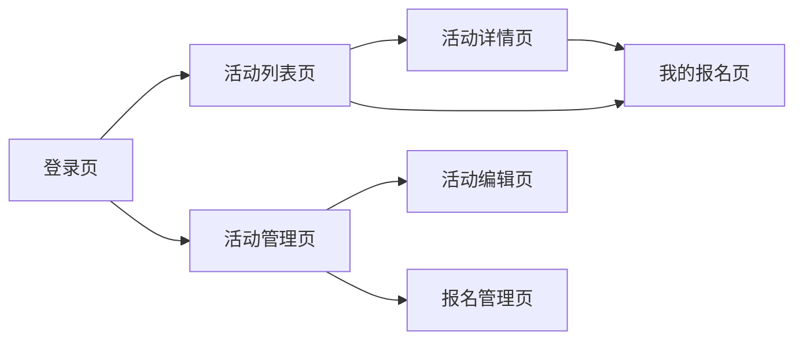
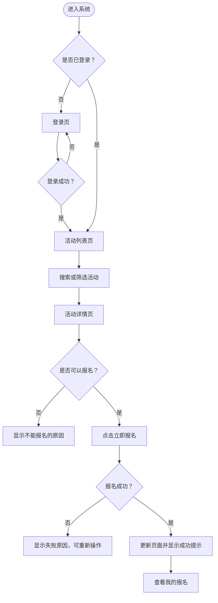

# 3.3 设计原型：UI 原型与页面流程

## 先让用户“走一遍”，再让开发者“写出来”

!!! quote "原型不是美术作业"
    原型首先要解决的不是“好不好看”，而是“能不能用”。它要让人看明白：系统有哪些页面，页面上显示什么，用户可以做什么，点击之后会发生什么，成功或失败时系统怎样反馈。

    在编码前用原型走通核心流程，可以更早发现页面遗漏、操作绕路和需求理解偏差，修改几个方框通常比修改一批代码更容易。

!!! tip "本节学习目标"
    根据用户角色、核心业务流程和功能模块，完成页面清单、核心页面低保真原型、页面状态与交互说明，并绘制页面流程图，让原型能够覆盖和验证需求中的核心任务。

[返回上一节：设计架构](02-architecture.md){ .md-button }
[返回第三篇导读](index.md){ .md-button }
[进入下一节：设计数据](04-database.md){ .md-button .md-button--primary }

---

## 🎯 本节完成后，你要交付

| 成果 | 要求 |
| :--- | :--- |
| 页面清单 | 按角色列出页面、任务、入口和对应需求 |
| 核心页面原型 | 展示页面布局、主要数据、操作入口和必要提示 |
| 页面状态说明 | 说明加载、空数据、错误、无权限和操作反馈 |
| 页面流程图 | 展示用户从入口到完成核心任务的页面与操作路径 |
| 原型评审记录 | 记录发现的问题、修改决定和待确认事项 |

本节重点是信息、操作和流程，不要求完成正式视觉稿，也不要求编写可运行的业务代码。

---

## 📄 第一步：从用户任务整理页面清单

不要一开始就打开原型工具画页面。先读取以下设计材料：

| 输入材料 | 需要提取的内容 |
| :--- | :--- |
| 《需求分析说明书》 | 用户角色、使用场景、核心流程、业务规则和验收条件 |
| 系统功能模块图 | 页面需要支持哪些业务模块 |
| 模块职责表 | 哪些角色可以查看和操作哪些功能 |
| 技术与环境约束 | 系统主要运行在电脑端还是移动端 |

### 从“用户要做什么”推导“需要什么页面”

以“校园活动报名系统”为例：

| 用户任务 | 需要看到的信息 | 需要执行的操作 | 可能需要的页面 |
| :--- | :--- | :--- | :--- |
| 学生寻找合适的活动 | 活动名称、时间、类型和剩余名额 | 搜索、筛选、查看详情 | 活动列表页 |
| 学生决定是否报名 | 活动介绍、地点、要求和报名状态 | 报名、取消报名、返回 | 活动详情页 |
| 学生查看自己的报名 | 已报名活动、时间和当前状态 | 查看详情、取消报名 | 我的报名页 |
| 管理员发布活动 | 活动名称、时间、名额和介绍 | 填写、保存、发布 | 活动编辑页 |
| 管理员管理报名数据 | 报名名单、人数和报名时间 | 查询、导出、取消资格 | 报名管理页 |

### 页面清单示例

| 页面 | 使用角色 | 页面任务 | 入口 | 对应需求 |
| :--- | :--- | :--- | :--- | :--- |
| 登录页 | 学生、管理员 | 登录系统 | 系统入口、登录失效跳转 | 用户登录 |
| 活动列表页 | 学生 | 查找和浏览活动 | 首页导航 | 浏览活动 |
| 活动详情页 | 学生 | 了解活动并报名 | 点击活动卡片 | 查看详情、报名活动 |
| 我的报名页 | 学生 | 查看和管理本人报名 | 个人菜单 | 查询、取消报名 |
| 活动管理页 | 管理员 | 查询和维护活动 | 管理端菜单 | 活动管理 |
| 活动编辑页 | 管理员 | 新增或编辑活动 | 活动管理页 | 发布、编辑活动 |
| 报名管理页 | 管理员 | 查看活动报名名单 | 活动管理页 | 报名管理、统计 |

!!! warning "一个功能不一定对应一个页面"
    搜索、删除、审核等操作通常可以放在已有页面中；内容和任务接近的页面也可以合并。页面不是越多越完整，关键是用户能用较少步骤完成目标。

---

## 🗺️ 第二步：设计系统导航与页面关系

页面清单完成后，先决定页面怎样组织，让不同角色能够找到自己的功能。

### 常见导航方式

| 导航方式 | 适合场景 | 使用建议 |
| :--- | :--- | :--- |
| 顶部导航 | 功能较少、内容浏览为主 | 放置首页、核心功能和个人入口 |
| 侧边导航 | 管理端模块较多 | 按业务模块分组，避免菜单层级过深 |
| 底部导航 | 移动端核心入口较少 | 保留 3～5 个最高频入口 |
| 面包屑 | 管理端或多级页面 | 帮助用户理解当前位置并返回上级 |

### 先画页面关系草图



此时只需要确定主要页面和跳转关系，不必标出每个按钮和异常分支。

### 导航设计要回答

- 用户登录后首先看到什么？
- 不同角色是否进入不同首页或看到不同菜单？
- 用户从哪里进入核心功能？
- 详情页、编辑页完成操作后返回哪里？
- 页面刷新、直接访问链接或登录失效时怎样处理？

!!! info "优先让核心任务容易到达"
    用户最常使用的功能应该放在明显入口。不要为了页面看起来简洁，把核心功能藏在多级菜单或难以发现的图标中。

---

## ✏️ 第三步：绘制低保真页面原型

低保真原型可以使用纸笔、PPT、Axure、墨刀、Figma、draw.io 或简单 HTML 完成。开始阶段用灰色方框、文字和基础控件就足够。

### 每个核心页面至少标出

| 原型要素 | 需要说明的内容 |
| :--- | :--- |
| 页面名称 | 当前是什么页面，主要任务是什么 |
| 导航位置 | 用户可以去哪里，当前位置在哪里 |
| 信息区域 | 展示哪些字段，哪些信息最重要 |
| 操作区域 | 按钮、搜索、筛选、表单和批量操作 |
| 结果反馈 | 操作成功、失败或需要确认时怎样提示 |
| 页面出口 | 完成、取消或返回后去哪里 |

### 活动列表页示例

```text
┌──────────────────────────────────────────────────┐
│ 校园活动                 [活动列表] [我的报名] [我] │
├──────────────────────────────────────────────────┤
│ 关键词 [____________]  类型 [全部⌄]  [搜索] [重置] │
├──────────────────────────────────────────────────┤
│ 活动名称       时间       地点       剩余名额       │
│ 编程兴趣小组   5月10日    实训楼     8 / 30 [详情]  │
│ 志愿服务活动   5月12日    校门口     12 / 50[详情]  │
│                                                  │
│              < 1  2  3 >                        │
└──────────────────────────────────────────────────┘
```

### 活动详情页示例

```text
┌────────────────────────────────────────────┐
│ < 返回活动列表          活动详情            │
├────────────────────────────────────────────┤
│ 活动名称：编程兴趣小组                      │
│ 活动时间：5月10日 14:00—16:00              │
│ 活动地点：实训楼 302                        │
│ 报名情况：22 / 30                           │
│                                            │
│ 活动介绍：……                               │
│ 报名要求：……                               │
│                                            │
│                 [立即报名]                  │
└────────────────────────────────────────────┘
```

### 管理页面还要注意

- 查询条件与表格字段是否对应；
- 新增、编辑、删除等操作是否容易区分；
- 危险操作是否需要二次确认；
- 批量操作是否明确作用对象；
- 表单必填项、格式要求和错误位置是否清楚；
- 数据较多时是否需要分页。

!!! warning "原型中的字段必须有需求依据"
    不要让原型工具或 AI 随意添加手机号、身份证号等字段。页面展示和收集的数据，应当来自已确认的业务需要，并遵循“只收集必要信息”的原则。

---

## 🧾 第四步：设计表单与信息层级

页面上的内容不是平均摆放。用户应先看到完成当前任务最重要的信息。

### 安排信息层级

以活动详情页为例：

| 层级 | 内容 | 设计目的 |
| :--- | :--- | :--- |
| 第一层 | 活动名称、时间、地点、报名状态 | 帮助用户快速判断是否继续了解 |
| 第二层 | 活动介绍、报名要求和组织方 | 帮助用户作出报名决定 |
| 第三层 | 创建时间、编号等辅助信息 | 需要时查看，不抢占主要位置 |

### 表单设计检查

| 检查项 | 设计要求 |
| :--- | :--- |
| 字段名称 | 使用用户能理解的业务语言 |
| 必填标识 | 明确哪些字段必须填写 |
| 输入方式 | 日期用日期选择，类别用选择控件，长文本用文本区域 |
| 格式提示 | 在输入前说明长度、格式或范围 |
| 校验反馈 | 在相关字段附近说明问题及修改方法 |
| 提交操作 | 主按钮明确，保存期间避免重复提交 |
| 取消与返回 | 提醒是否会丢失未保存内容 |

不应只在提交失败后显示“参数错误”。例如活动结束时间早于开始时间时，应直接指出具体字段和正确要求。

---

## 🔄 第五步：补全页面状态与操作反馈

真实页面不只有“有数据且操作成功”的理想状态。每个核心页面至少检查以下状态：

| 状态 | 需要设计什么 | 示例 |
| :--- | :--- | :--- |
| 初始状态 | 用户刚进入页面时看到什么 | 默认查询全部可报名活动 |
| 加载中 | 数据尚未返回时怎样显示 | 加载提示或骨架区域 |
| 空数据 | 没有数据时怎样解释和引导 | “暂无符合条件的活动，请调整筛选条件” |
| 加载失败 | 请求失败时怎样恢复 | 显示原因和“重新加载”按钮 |
| 无权限 | 用户不能访问时怎样处理 | 返回可访问页面并提示权限不足 |
| 操作确认 | 重要或不可逆操作怎样确认 | 取消报名、删除活动前二次确认 |
| 操作成功 | 成功后页面怎样变化 | 更新报名状态和剩余名额 |
| 业务失败 | 规则不允许时怎样解释 | “活动名额已满，暂时无法报名” |

### 同一个按钮也可能有多个状态

活动详情页的报名按钮可以根据业务状态变化：

| 条件 | 按钮状态 | 页面提示 |
| :--- | :--- | :--- |
| 未登录 | 显示“登录后报名” | 点击后进入登录页 |
| 可以报名 | 启用“立即报名” | 点击后提交报名请求 |
| 已报名 | 显示“已报名”或“取消报名” | 同时展示报名记录入口 |
| 名额已满 | 禁用“名额已满” | 说明不能报名的原因 |
| 报名已截止 | 禁用“报名已截止” | 展示截止时间 |
| 请求处理中 | 禁用并显示“提交中……” | 防止重复点击 |

!!! info "页面状态来自业务规则"
    原型不负责最终定义所有状态取值，但必须把用户能够看到和操作的关键状态表现出来。详细的业务状态转换将在 3.5 中统一设计。

---

## 🔀 第六步：绘制核心页面流程

页面关系图说明页面总体怎样连接，页面流程图进一步说明用户为了完成一个任务，要经过哪些页面、操作和判断。

### 学生报名活动流程



### 每条核心流程至少包含

1. 流程从哪里开始；
2. 用户进入了哪些页面；
3. 用户执行了哪些关键操作；
4. 哪些地方需要作出判断；
5. 成功后看到什么、去哪里；
6. 失败、取消、无权限或登录失效时怎样处理；
7. 流程在哪里结束。

### 需要优先绘制的流程

| 流程类型 | 示例 |
| :--- | :--- |
| 核心用户目标 | 浏览活动并完成报名 |
| 核心管理任务 | 管理员创建并发布活动 |
| 关键状态变化 | 取消报名、关闭活动、处理申请 |
| 重要异常路径 | 登录失效、名额已满、无权限访问 |

不需要为每个按钮单独画一张流程图。优先覆盖需求中的核心业务闭环和容易产生误解的分支。

!!! warning "不要只画成功路径"
    如果流程图只有“进入页面 → 点击按钮 → 操作成功”，开发时仍然不知道失败、取消和权限不足怎样处理。至少补充一个关键失败分支。

---

## 🔗 第七步：检查需求、模块、页面和流程是否一致

原型设计完成后，建立简单的对应关系：

| 需求 | 功能模块 | 页面 | 主要操作 | 流程或状态 |
| :--- | :--- | :--- | :--- | :--- |
| 学生浏览活动 | 活动管理 | 活动列表页、活动详情页 | 搜索、筛选、查看详情 | 空数据、加载失败 |
| 学生报名活动 | 活动报名 | 活动详情页、我的报名页 | 报名、取消报名 | 名额已满、重复报名、报名成功 |
| 管理员发布活动 | 活动管理 | 活动管理页、活动编辑页 | 新增、保存、发布 | 校验失败、保存成功 |

检查时重点寻找三类问题：

- **有需求、没页面**：需求规定了功能，但用户找不到入口；
- **有页面、没需求**：原型增加了尚未确认的功能或数据；
- **有页面、走不通**：页面存在，但缺少返回、完成或失败路径。

---

## 🤖 第八步：用 AI 辅助生成和检查原型

AI 可以帮助整理页面清单、生成低保真 HTML 原型、补充状态和检查流程，但需要给它完整的项目上下文。

### 先让 AI 分析，不急着生成页面

```text
请先阅读《需求分析说明书》《系统架构与功能模块设计》，
不要修改文件，也不要直接生成正式界面。

请根据已确认的用户角色、核心流程和功能模块：
1. 整理页面清单，写明角色、页面任务、入口和对应需求；
2. 标出支撑核心业务闭环的页面；
3. 为每个核心页面列出必要信息、操作和页面状态；
4. 绘制核心页面流程图，包含成功与关键失败分支；
5. 找出需求与页面之间的遗漏、重复或矛盾；
6. 将没有文档依据的内容标记为“待确认”。
```

### 再让 AI 生成低保真原型

```text
根据已经确认的页面清单和交互说明，
为“活动详情页”生成一个低保真 HTML 原型。

要求：
1. 只使用灰度样式，不追求视觉装饰；
2. 清楚展示活动信息、报名状态、返回入口和主要操作；
3. 分别表现加载、名额已满、已报名和提交失败状态；
4. 不添加需求文档中没有的字段和功能；
5. 页面中的每个操作注明点击后的结果或跳转目标。
```

### 人工检查 AI 生成的原型

- [ ] 页面和字段是否都有需求依据；
- [ ] 是否为了“看起来完整”增加了多余功能；
- [ ] 核心操作是否明显，步骤是否过多；
- [ ] 页面状态与业务规则是否一致；
- [ ] 是否同时考虑成功、失败和无权限场景；
- [ ] 原型能否在目标屏幕尺寸下正常查看；
- [ ] 自己能否解释每个页面和按钮的用途。

!!! failure "能打开的 HTML 不等于可用的原型"
    AI 生成的页面可能很漂亮，但如果字段不对、流程走不通或状态缺失，仍然不能指导开发。先验证任务和规则，再优化颜色、字体和动画。

---

## 👥 第九步：开展原型评审并迭代

原型最好让潜在用户、同学或教师实际“走一遍”，不要只展示静态截图。

### 给评审者一个具体任务

例如：

> 请从活动列表开始，找到“编程兴趣小组”，查看报名要求并完成报名，然后确认在哪里查看报名结果。

观察并记录：

- 用户是否知道第一步点哪里；
- 用户是否能找到完成任务所需的信息；
- 用户是否在某一步停顿、返回或误点；
- 系统反馈是否让用户理解操作结果；
- 用户使用的词语是否与页面名称一致。

### 原型评审记录示例

| 问题 | 证据 | 严重程度 | 修改决定 | 状态 |
| :--- | :--- | :--- | :--- | :--- |
| 用户没找到“我的报名” | 2 名同学先点击个人头像寻找 | 中 | 将入口放入顶部导航 | 已修改 |
| 报名失败只显示“操作失败” | 用户不知道怎样处理 | 高 | 显示名额已满或重复报名等具体原因 | 已修改 |
| 活动列表字段较多 | 首次浏览时信息拥挤 | 低 | 列表保留时间、地点和剩余名额 | 待确认 |

优先修改会阻断核心流程、导致错误操作或违反需求的问题，视觉细节可以在功能正确后继续优化。

---

## 📋 本节成果模板

可以用下面的结构整理本节成果，后续纳入《系统设计说明书》：

```markdown
## UI 原型与页面流程设计

### 1. 设计依据
- 用户角色：
- 核心业务流程：
- 目标设备与屏幕：

### 2. 页面清单
| 页面 | 使用角色 | 页面任务 | 入口 | 对应需求 |
| --- | --- | --- | --- | --- |
|  |  |  |  |  |

### 3. 页面导航与关系
- 导航方式：
- 页面关系图：

### 4. 核心页面原型
- 页面一：原型图、信息、操作和跳转说明
- 页面二：原型图、信息、操作和跳转说明

### 5. 页面状态
| 页面 | 状态 | 显示内容 | 可执行操作 |
| --- | --- | --- | --- |
|  |  |  |  |

### 6. 核心页面流程
- 流程一：
- 流程二：

### 7. 原型评审记录
| 问题 | 证据 | 严重程度 | 修改决定 | 状态 |
| --- | --- | --- | --- | --- |
|  |  |  |  |  |

### 8. 待确认问题
- 问题一：
- 问题二：
```

---

## ✅ 本节自查

- [ ] 页面清单覆盖需求中的核心角色和用户任务；
- [ ] 每个核心功能都有清楚的页面入口；
- [ ] 页面名称、字段和操作使用用户能理解的语言；
- [ ] 原型标出了主要信息、操作、反馈和页面出口；
- [ ] 表单必填项、输入方式和校验提示设计合理；
- [ ] 核心页面包含加载、空数据、错误和无权限等必要状态；
- [ ] 重要操作包含确认、处理中、成功和失败反馈；
- [ ] 页面流程覆盖成功路径和至少一个关键失败分支；
- [ ] 原型、需求和功能模块之间没有明显遗漏或矛盾；
- [ ] 没有添加需求之外的字段和功能；
- [ ] 已邀请用户、同学或教师走查核心流程并记录修改结果。

当一个不了解实现细节的人能够根据原型顺利完成核心任务，并能理解每一步的结果，本节设计就达到了目标。

---

## 📝 总结

* **从用户任务出发列页面**：先回答用户要完成什么，再决定需要哪些页面；
* **先画低保真，再做视觉优化**：优先验证信息、操作和流程是否正确；
* **页面不只有成功状态**：加载、空数据、失败、无权限和处理中都需要设计；
* **流程必须走得通**：入口、操作、判断、反馈和出口缺一不可；
* **用评审发现真实问题**：让用户完成具体任务，比只问“页面好不好看”更有效。

[返回上一节：设计架构](02-architecture.md){ .md-button }
[进入下一节：设计数据](04-database.md){ .md-button .md-button--primary }
