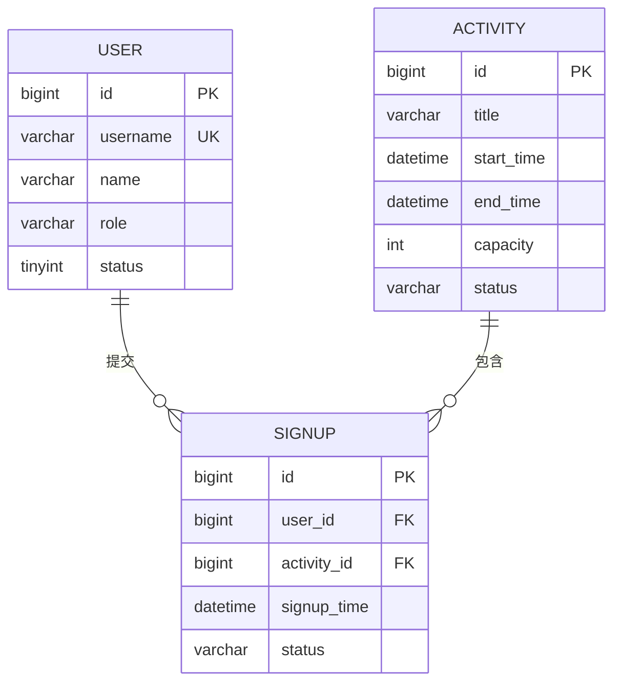

# 3.4 设计数据：E-R 图与数据表

## 先想清楚系统要保存什么，再编写建表 SQL

!!! quote "数据库不是把页面字段搬进表格"
    页面只展示用户当前需要看到的信息，数据库却要长期、准确地保存业务事实。例如“活动剩余名额”可以在页面上显示，但它可能由活动总名额和有效报名记录计算得到，不一定需要单独保存。

    数据库设计的重点，是从业务流程中找出核心实体，明确它们之间的关系，再通过字段、主键、外键、约束和索引保证数据能够正确保存和查询。

!!! tip "本节学习目标"
    根据需求、功能模块和页面原型，识别系统需要长期保存的数据，绘制 E-R 图，设计数据表、字段、主外键、约束和索引，形成数据字典与可执行的建表脚本。

[返回上一节：设计原型](03-prototype.md){ .md-button }
[返回第三篇导读](index.md){ .md-button }
[进入下一节：完善规则](05-api-permission-state.md){ .md-button .md-button--primary }

---

## 🎯 本节完成后，你要交付

| 成果 | 要求 |
| :--- | :--- |
| 核心数据清单 | 说明系统要记录哪些业务数据、从哪里产生、用于什么功能 |
| E-R 图 | 展示核心实体、主要属性、关系和基数 |
| 数据表清单 | 写清每张表的用途、主键和关联关系 |
| 数据字典 | 说明字段名称、类型、是否为空、默认值、约束和业务含义 |
| 建表与初始化脚本 | 能在目标数据库执行，并提供支撑核心流程的少量测试数据 |
| 数据设计检查记录 | 记录设计问题、修改结果和待确认事项 |

本节主要确定数据结构。业务状态的完整取值、状态转换和角色权限将在 3.5 中统一设计，但表中需要先为已经确认的状态预留合适字段。

---

## 📄 第一步：从业务流程中寻找数据

开始设计前，先读取已经确认的材料：

| 输入材料 | 需要提取的内容 |
| :--- | :--- |
| 《需求分析说明书》 | 业务对象、业务规则、查询需求和验收条件 |
| 功能模块与职责表 | 哪个模块创建、读取或修改哪些数据 |
| 页面原型 | 页面需要展示、输入和筛选哪些信息 |
| 页面流程图 | 业务过程中会产生哪些记录和状态变化 |

### 用“谁、对什么、做了什么、留下什么记录”分析

以“学生报名活动”为例：

| 业务问题 | 分析结果 |
| :--- | :--- |
| 谁执行操作？ | 学生用户 |
| 对什么操作？ | 校园活动 |
| 做了什么？ | 提交报名或取消报名 |
| 需要留下什么？ | 报名人、活动、报名时间、报名状态 |
| 后续要查询什么？ | 我的报名、活动报名名单、报名人数 |

由此可以先识别出 `用户`、`活动` 和 `报名记录` 三类核心数据。

### 建立核心数据清单

| 数据对象 | 从哪里产生 | 主要内容 | 用于哪些功能 | 是否长期保存 |
| :--- | :--- | :--- | :--- | :---: |
| 用户 | 注册、导入或管理员创建 | 账号、姓名、角色、状态 | 登录、权限、个人信息 | 是 |
| 活动 | 管理员发布 | 名称、时间、地点、名额、状态 | 浏览、报名、活动管理 | 是 |
| 报名记录 | 学生报名 | 用户、活动、报名时间、状态 | 我的报名、名单、统计 | 是 |
| 查询关键词 | 用户在列表页输入 | 临时搜索条件 | 筛选活动 | 否 |
| 登录提示 | 登录失败时生成 | 错误说明 | 页面反馈 | 通常否 |

!!! warning "不是页面上出现的内容都要存入数据库"
    搜索条件、按钮状态、临时提示和由其他字段实时计算的内容，通常不需要建字段。判断标准是：它是否代表需要长期保存、以后还要查询或追溯的业务事实。

---

## 🧱 第二步：识别实体和属性

### 什么是实体

实体是系统需要长期记录，并具有独立业务含义的对象。常见实体包括：

- 人或组织：用户、学生、教师、部门；
- 业务对象：活动、商品、图书、维修单；
- 过程记录：报名记录、借阅记录、订单、审批记录；
- 分类或配置：活动类型、商品分类、系统配置。

可以用下面的问题判断一个名词是否适合作为实体：

1. 系统是否需要长期保存它？
2. 它是否有多个需要记录的属性？
3. 它是否会被创建、查询、修改或删除？
4. 它是否会与其他对象建立关系？
5. 它是否能用一个唯一标识进行区分？

### 从需求名词中筛选实体

| 候选名词 | 是否作为实体 | 判断理由 |
| :--- | :---: | :--- |
| 用户 | 是 | 需要登录、区分身份并关联报名记录 |
| 活动 | 是 | 需要长期保存并被发布、查询和修改 |
| 报名 | 是 | 需要记录用户与活动的关系及业务状态 |
| 活动类型 | 视项目需要 | 类型固定且很少变化时可用字段；需要维护时可独立成表 |
| 搜索按钮 | 否 | 页面控件，不是业务数据 |
| 剩余名额 | 通常不是独立实体 | 可由总名额和有效报名数量计算 |

### 为实体整理主要属性

| 实体 | 主要属性 | 业务说明 |
| :--- | :--- | :--- |
| 用户 | 用户编号、账号、密码摘要、姓名、角色、状态 | 识别系统使用者及其身份 |
| 活动 | 活动编号、名称、类型、时间、地点、名额、状态 | 表示一场可以发布和报名的活动 |
| 报名记录 | 报名编号、用户编号、活动编号、报名时间、状态 | 表示某个用户参加某个活动的过程记录 |

属性先使用业务语言描述，不必一开始就决定 `VARCHAR(100)` 或 `BIGINT`。先确认“需要保存什么”，再确定“怎样保存”。

---

## 🔗 第三步：确定实体之间的关系

实体之间常见的关系有三种：

| 关系 | 判断方法 | 示例 |
| :--- | :--- | :--- |
| 一对一 | 一个 A 最多对应一个 B，一个 B 也最多对应一个 A | 一个用户对应一份扩展资料 |
| 一对多 | 一个 A 可以对应多个 B，一个 B 只属于一个 A | 一个用户可以创建多个活动 |
| 多对多 | 一个 A 可以对应多个 B，一个 B 也可以对应多个 A | 多个学生可以报名多个活动 |

### 多对多关系需要中间实体

“用户”和“活动”之间是多对多关系，不能只在用户表或活动表中保存一串编号。需要通过“报名记录”连接：



报名记录不只是技术上的“中间表”，它本身也有报名时间、状态等业务属性，因此更准确地说，它是一个关联实体。

### 明确关系的业务规则

画线之后，还需要用文字解释：

| 关系 | 基数说明 | 业务规则 |
| :--- | :--- | :--- |
| 用户—报名记录 | 一个用户可以有多条报名记录 | 每条报名记录只属于一个用户 |
| 活动—报名记录 | 一个活动可以有多条报名记录 | 每条报名记录只对应一个活动 |
| 用户—活动 | 通过报名记录形成多对多关系 | 同一用户不能重复有效报名同一活动 |

!!! info "E-R 图要与业务规则一起读"
    图能表达实体和基数，但不一定能完整表达“名额不能超限”“活动结束后不能报名”等规则。这些规则要先记录，后续在数据约束、业务逻辑和 3.5 的状态设计中落实。

---

## 🔄 第四步：把 E-R 图转换为数据表

从实体关系转换为表结构时，可以遵循以下规则：

1. 一个核心实体通常对应一张表；
2. 一个实体属性通常对应一个字段；
3. 每张表设置稳定、唯一的主键；
4. 一对多关系通常在“多”的一方保存外键；
5. 多对多关系通过中间表或关联实体实现；
6. 可重复的多值属性不要挤在一个文本字段中；
7. 计算结果是否保存，要根据查询频率和一致性风险判断。

### 数据表清单示例

| 表名 | 中文名称 | 主要用途 | 主键 | 主要关联 |
| :--- | :--- | :--- | :--- | :--- |
| `sys_user` | 用户表 | 保存账号、身份和用户状态 | `id` | 被活动和报名记录引用 |
| `activity` | 活动表 | 保存活动基本信息、名额和状态 | `id` | 创建人关联用户；拥有多条报名记录 |
| `activity_signup` | 活动报名表 | 保存用户报名活动的记录 | `id` | 关联用户和活动 |

### 表名和字段名保持一致

建议采用统一命名规则：

| 内容 | 推荐做法 | 示例 |
| :--- | :--- | :--- |
| 表名 | 小写英文，下划线分隔，单数或复数全项目统一 | `activity_signup` |
| 主键 | 统一使用 `id` | `id` |
| 外键字段 | 关联对象名称 + `_id` | `user_id`、`activity_id` |
| 时间字段 | 使用 `_time` 或 `_at`，全项目统一 | `signup_time`、`created_at` |
| 状态字段 | 使用明确名称，避免多个无含义的 `flag` | `status`、`publish_status` |
| 布尔字段 | 使用 `is_` 或具有判断含义的名称 | `is_deleted` |

!!! warning "不要把多个值塞进一个字段"
    例如在活动表中用 `participant_ids = "3,8,12"` 保存报名用户，会导致查询、校验和更新困难。此类多对多数据应使用报名表逐条记录。

---

## 🗃️ 第五步：设计字段和数据字典

数据字典用于解释每个字段怎样存、是否必填、默认值是什么以及代表什么业务含义。

### 选择合适的数据类型

| 数据内容 | 常用类型 | 设计提示 |
| :--- | :--- | :--- |
| 主键、外键 | `BIGINT` | 主外键类型必须一致 |
| 短文本 | `VARCHAR(n)` | 根据实际长度设置，不要全部使用最大长度 |
| 长文本 | `TEXT` | 适合活动介绍、问题描述等内容 |
| 整数数量 | `INT` | 人数、库存、排序值等 |
| 精确金额 | `DECIMAL(p,s)` | 金额不要使用 `FLOAT` 或 `DOUBLE` |
| 日期时间 | `DATE`、`DATETIME` | 根据是否需要具体时间选择 |
| 状态码 | `TINYINT` 或短 `VARCHAR` | 必须在数据字典中说明取值含义 |
| 是否值 | `TINYINT` 或数据库支持的布尔类型 | 全项目统一 0/1 的含义 |

### 活动表数据字典示例

| 字段 | 类型 | 可空 | 默认值 | 键或约束 | 业务含义 |
| :--- | :--- | :---: | :--- | :--- | :--- |
| `id` | `BIGINT` | 否 | 自增 | 主键 | 活动唯一编号 |
| `title` | `VARCHAR(100)` | 否 | 无 | — | 活动名称 |
| `category` | `VARCHAR(30)` | 否 | 无 | — | 活动类型 |
| `start_time` | `DATETIME` | 否 | 无 | — | 活动开始时间 |
| `end_time` | `DATETIME` | 否 | 无 | 结束时间晚于开始时间 | 活动结束时间 |
| `location` | `VARCHAR(100)` | 否 | 无 | — | 活动地点 |
| `capacity` | `INT` | 否 | 无 | 大于 0 | 可报名总人数 |
| `description` | `TEXT` | 是 | `NULL` | — | 活动介绍 |
| `status` | `VARCHAR(20)` | 否 | `DRAFT` | 限定状态取值 | 当前业务状态 |
| `creator_id` | `BIGINT` | 否 | 无 | 外键或逻辑关联 | 创建活动的管理员 |
| `created_at` | `DATETIME` | 否 | 当前时间 | — | 创建时间 |
| `updated_at` | `DATETIME` | 否 | 当前时间 | 更新时维护 | 最后修改时间 |

### 报名表数据字典示例

| 字段 | 类型 | 可空 | 默认值 | 键或约束 | 业务含义 |
| :--- | :--- | :---: | :--- | :--- | :--- |
| `id` | `BIGINT` | 否 | 自增 | 主键 | 报名记录编号 |
| `user_id` | `BIGINT` | 否 | 无 | 关联用户 | 报名人 |
| `activity_id` | `BIGINT` | 否 | 无 | 关联活动 | 所报名活动 |
| `signup_time` | `DATETIME` | 否 | 当前时间 | — | 提交报名时间 |
| `status` | `VARCHAR(20)` | 否 | `VALID` | 限定状态取值 | 报名是否有效或已取消 |
| `cancel_time` | `DATETIME` | 是 | `NULL` | — | 取消报名时间 |
| `created_at` | `DATETIME` | 否 | 当前时间 | — | 记录创建时间 |
| `updated_at` | `DATETIME` | 否 | 当前时间 | 更新时维护 | 最后修改时间 |

!!! warning "密码不能以明文保存"
    用户密码应保存安全哈希结果，字段可以命名为 `password_hash`。不要在数据库脚本、测试数据、代码仓库或设计文档中放入真实用户密码、密钥和隐私数据。

---

## 🔑 第六步：设计主键、外键和约束

约束不仅用于“防止 SQL 报错”，更用于阻止不符合业务事实的数据进入数据库。

### 常见约束及其作用

| 约束 | 作用 | 示例 |
| :--- | :--- | :--- |
| 主键 | 唯一标识一条记录 | `activity.id` |
| 非空约束 | 保证必要数据必须存在 | 活动名称不能为空 |
| 唯一约束 | 防止业务上不允许重复的数据 | 用户账号唯一 |
| 外键约束 | 保证关联记录存在 | 报名记录关联有效用户和活动 |
| 检查约束 | 限制数值范围或字段关系 | 活动名额大于 0 |
| 默认值 | 为新记录提供明确初始值 | 活动初始状态为草稿 |

### 防止重复报名

如果报名记录采用“每个用户和活动只有一条记录，取消时修改状态”的方式，可以为以下字段增加联合唯一约束：

```sql
UNIQUE KEY uk_signup_user_activity (user_id, activity_id)
```

如果业务允许取消后重新创建一条新记录，就不能简单使用上述唯一约束，需要重新设计记录策略。设计前必须先确认是否需要保留每次报名和取消的完整历史。

### 物理外键还是逻辑关联

| 方式 | 优点 | 注意事项 |
| :--- | :--- | :--- |
| 数据库外键 | 数据库直接保证引用完整性 | 删除、导入和迁移时需要注意顺序 |
| 逻辑关联 | 应用控制更灵活 | 必须在业务代码中严格校验，避免产生孤立数据 |

课程项目可以根据所用模板和团队规范选择，但数据字典中必须写清关联关系，不能只保存 `user_id` 却不说明它指向哪里。

!!! info "数据库约束不能代替全部业务规则"
    “名额不能超限”“活动截止后不能报名”等规则涉及多条记录、当前时间或业务状态，通常还需要在 Service 业务层校验，并通过事务保证数据一致性。

---

## ⚡ 第七步：根据查询需求设计索引

索引用于提高查询效率，但并不是每个字段都要建立索引。先从真实页面和接口的查询方式出发。

### 从页面反推常用查询

| 页面或功能 | 常用查询条件 | 可考虑的索引 |
| :--- | :--- | :--- |
| 用户登录 | 账号 | 用户表账号唯一索引 |
| 活动列表 | 状态、类型、开始时间 | 根据实际查询考虑组合索引 |
| 我的报名 | 用户编号、报名状态、报名时间 | 报名表用户编号相关索引 |
| 活动报名名单 | 活动编号、报名状态 | 报名表活动编号相关索引 |
| 判断重复报名 | 用户编号、活动编号 | 联合唯一索引或组合索引 |

### 索引设计原则

- 主键和唯一约束通常会自动形成索引；
- 经常用于查询、关联和排序的字段可以考虑索引；
- 组合查询可根据字段顺序设计联合索引；
- 数据量很小的课程项目不需要追求复杂索引；
- 索引会增加写入和维护成本，不要盲目给所有字段加索引；
- 最终应通过真实 SQL 和执行计划验证，而不是只凭猜测。

!!! warning "先保证结构正确，再讨论性能优化"
    课程项目首先要保证表结构、关联和业务规则正确。没有真实数据和查询证据时，不要设计大量冗余字段、缓存表和复杂索引。

---

## 🕒 第八步：处理状态、历史和删除

数据设计需要提前考虑“数据变化后，还要不要保留以前的事实”。

### 状态字段

状态字段必须有清楚的业务含义。例如：

| 字段 | 示例取值 | 说明 |
| :--- | :--- | :--- |
| 活动状态 | `DRAFT`、`PUBLISHED`、`CLOSED` | 草稿、已发布、已关闭 |
| 报名状态 | `VALID`、`CANCELLED` | 有效报名、已取消 |
| 用户状态 | `ENABLED`、`DISABLED` | 正常使用、已禁用 |

本节先确定需要哪些状态字段以及怎样保存；完整的状态转换条件将在 3.5 设计。

### 是否保留历史记录

| 业务场景 | 推荐处理方式 |
| :--- | :--- |
| 用户取消报名，但管理员需要追溯 | 保留记录并修改状态，记录取消时间 |
| 活动内容发生关键变更，需要审计 | 增加变更记录或操作日志（按项目需要） |
| 临时草稿且从未对外发布 | 可以根据规则物理删除 |
| 已产生报名记录的活动 | 通常不直接物理删除，改为关闭或停用 |

### 逻辑删除不要随意使用

逻辑删除可以保留历史，但会让每次查询都需要处理删除状态。只有在确实需要恢复、追溯或保护关联数据时才使用，并统一字段含义和查询规则。

---

## 🧮 第九步：识别计算字段和冗余数据

页面展示的数据不一定都需要保存。

### “剩余名额”是否建字段

可以有两种方案：

| 方案 | 计算方式 | 优点 | 风险 |
| :--- | :--- | :--- | :--- |
| 实时计算 | 总名额减去有效报名数 | 数据来源清楚，不容易产生两个真相 | 查询时需要统计报名记录 |
| 保存冗余字段 | 活动表保存剩余名额 | 查询简单 | 报名和取消时必须同步更新，可能不一致 |

对于普通课程项目，优先使用容易保持正确的方案。如果决定保存冗余字段，必须说明谁在什么操作中更新它，以及失败时如何回滚。

### 判断一个字段是否应该保存

1. 它能否由其他可靠数据计算得到？
2. 计算成本是否真的影响使用？
3. 保存后是否会出现多个相互矛盾的值？
4. 哪个模块负责更新？
5. 如何验证更新始终一致？

---

## 💻 第十步：生成并验证建表脚本

E-R 图和数据字典确认后，再生成建表 SQL。不要只对 AI 说“帮我设计一个活动系统数据库”。

### 提供给 AI 的上下文

```text
请根据已经确认的 E-R 图和数据字典，
为 MySQL 8.0 生成建表 SQL，不要自行增加表和字段。

要求：
1. 使用 InnoDB 和 utf8mb4；
2. 主键、非空、唯一、默认值和字段注释与数据字典一致；
3. 主键与外键字段类型保持一致；
4. 建表顺序满足关联关系；
5. 索引只依据已经列出的查询需求；
6. 为核心流程生成少量虚构测试数据，不使用真实个人信息；
7. 生成后逐项说明 SQL 与数据字典的对应关系；
8. 标出数据库版本可能不支持的语法。
```

### 脚本至少分为

```text
database/
├── 01_schema.sql       # 建库或建表、约束和索引
├── 02_init_data.sql    # 必要的分类、测试账号和业务数据
└── README.md           # 数据库版本、执行顺序和注意事项
```

### 执行验证

生成 SQL 后，需要在本地目标数据库真实执行：

1. 在空数据库中按顺序运行脚本；
2. 检查所有表是否成功创建；
3. 查看字段、默认值、约束和索引是否符合数据字典；
4. 插入正常数据，确认可以保存；
5. 尝试插入重复账号、无效关联等错误数据，确认约束有效；
6. 使用初始化数据执行核心查询；
7. 删除数据库后重新执行脚本，确认过程可以重复。

!!! failure "生成 SQL 不等于完成数据库设计"
    只有脚本能够执行、约束能够生效、测试数据能够支撑核心流程，并且表结构与文档一致，才算完成。不要提交一份从未运行过的建表脚本。

---

## 🔍 第十一步：检查设计一致性

数据设计完成后，要与需求、模块、原型和后续业务规则交叉检查。

### 一致性检查表

| 检查方向 | 要确认的问题 |
| :--- | :--- |
| 需求 → 数据 | 核心业务对象和规则是否有数据支撑？ |
| 模块 → 数据 | 每个业务模块需要读写哪些表，职责是否清楚？ |
| 原型 → 数据 | 页面展示、表单提交和筛选字段是否有可靠数据来源？ |
| 数据 → 原型 | 表中收集的数据是否真的有业务用途和用户入口？ |
| 关系 → 约束 | 一对多、多对多和唯一性是否通过外键或约束落实？ |
| 状态 → 历史 | 取消、关闭、禁用后是否需要保留原记录？ |
| 查询 → 索引 | 核心列表和关联查询是否有合理的数据结构？ |

### 建立简单追踪关系

| 业务功能 | 页面 | 主要数据表 | 关键规则 |
| :--- | :--- | :--- | :--- |
| 活动浏览 | 活动列表页、详情页 | `activity` | 只展示允许公开的活动 |
| 活动报名 | 活动详情页 | `activity_signup`、`activity` | 不重复报名，不超过名额 |
| 我的报名 | 我的报名页 | `activity_signup`、`activity` | 只能查看当前用户数据 |
| 报名管理 | 报名管理页 | `activity_signup`、`sys_user` | 仅管理员可访问 |

---

## 🤖 第十二步：用 AI 辅助检查数据设计

AI 可以帮助识别遗漏的实体、检查关系、生成 Mermaid E-R 图和 SQL，但必须以现有项目文档为依据。

```text
请先阅读《需求分析说明书》、功能模块设计、页面原型与流程，
不要修改文件，也不要立即生成 SQL。

请按以下顺序检查数据库设计：
1. 从核心业务流程中提取需要长期保存的数据；
2. 识别实体、属性、关系和基数，并说明需求依据；
3. 检查多对多关系、历史记录和状态字段是否处理合理；
4. 对照页面字段，找出缺少数据来源或没有用途的数据；
5. 对照查询需求，提出必要的唯一约束和索引；
6. 用 Mermaid 生成 E-R 图；
7. 输出数据表清单和数据字典初稿；
8. 将不能从文档确认的内容标记为“待确认”。

不要添加需求之外的收藏、积分、评论、消息等功能。
```

人工审核时重点检查：

- [ ] 实体和字段是否都有业务依据；
- [ ] 是否把页面控件或临时数据错误地设计成表；
- [ ] 主外键类型、关系和基数是否一致；
- [ ] 多对多关系是否使用了合理的关联表；
- [ ] 唯一约束是否符合取消、重建和历史保留规则；
- [ ] 状态值是否清楚，是否与页面状态矛盾；
- [ ] 是否出现明文密码、真实隐私数据或密钥；
- [ ] 生成的 SQL 是否在指定数据库版本中真实执行过。

---

## 📋 本节成果模板

可以用下面的结构整理本节成果，后续纳入《系统设计说明书》：

```markdown
## 数据库 E-R 图与数据表设计

### 1. 设计依据
- 核心业务流程：
- 主要数据对象：
- 关键查询和统计需求：

### 2. E-R 图
- E-R 图：
- 实体关系说明：
- 关键业务规则：

### 3. 数据表清单
| 表名 | 中文名称 | 主要用途 | 主键 | 主要关联 |
| --- | --- | --- | --- | --- |
|  |  |  |  |  |

### 4. 数据字典
#### 表：________
| 字段 | 类型 | 可空 | 默认值 | 键或约束 | 业务含义 |
| --- | --- | --- | --- | --- | --- |
|  |  |  |  |  |  |

### 5. 约束和索引
- 主键与外键：
- 唯一约束：
- 检查约束：
- 索引及对应查询：

### 6. 状态、历史与删除策略
- 状态字段：
- 历史保留：
- 删除方式：

### 7. 数据库脚本
- 数据库及版本：
- 脚本位置：
- 执行顺序：
- 验证结果：

### 8. 待确认问题
- 问题一：
- 问题二：
```

---

## ✅ 本节自查

- [ ] 核心实体来自需求、流程或页面，而不是凭空增加；
- [ ] E-R 图包含核心实体、主要属性、关系和正确基数；
- [ ] 一对多和多对多关系已经正确转换为数据表；
- [ ] 每张表都有清楚的用途和稳定的主键；
- [ ] 外键或逻辑关联指向明确，关联字段类型一致；
- [ ] 每个字段都有类型、可空性、默认值和业务说明；
- [ ] 密码不以明文保存，脚本中没有真实隐私数据或密钥；
- [ ] 唯一约束、非空约束和检查规则符合业务要求；
- [ ] 索引来源于真实查询需求，没有盲目添加；
- [ ] 状态、取消、删除和历史保留方式已经初步明确；
- [ ] 页面展示和输入的数据都能找到可靠的数据来源；
- [ ] 建表及初始化脚本已在目标数据库中成功执行；
- [ ] 正常数据和至少一种违反约束的数据都经过验证；
- [ ] E-R 图、数据字典和 SQL 使用相同的表名与字段名。

当你能够从一条核心业务流程说明“产生什么数据、存在哪张表、怎样关联、如何保证正确”，并且脚本能够重复执行，本节设计就达到了目标。

---

## 📝 总结

* **从业务事实找数据**：先分析系统需要长期记录什么，再决定表和字段；
* **先画关系，再写 SQL**：E-R 图帮助发现遗漏实体、错误基数和多对多关系；
* **字段必须有明确含义**：类型、可空性、默认值、约束和状态取值都要说明；
* **约束帮助守住数据正确性**：主键、唯一性和关联关系要与业务规则一致；
* **脚本必须真实执行**：能够建表、插入测试数据并支撑核心查询，设计才算落地。

[返回上一节：设计原型](03-prototype.md){ .md-button }
[进入下一节：完善规则](05-api-permission-state.md){ .md-button .md-button--primary }
