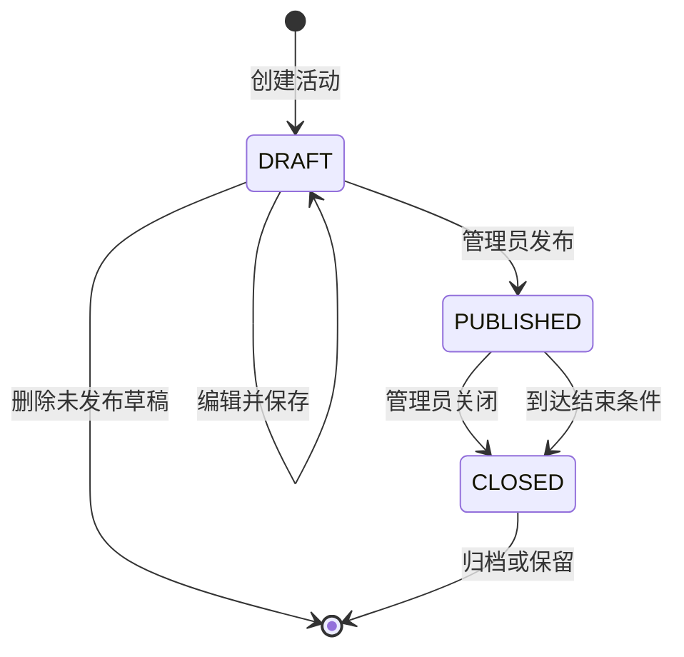
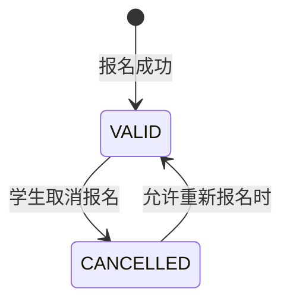

# 3.5 完善规则：接口、权限与业务状态

## 把“怎样调用、谁能操作、何时允许”一次说清楚

!!! quote "页面能点击，不代表业务就成立"
    一个“立即报名”按钮背后至少有三个问题：前端向后端发送什么数据？当前用户是否允许报名？活动在什么状态和时间范围内才能报名？

    如果接口、权限和业务状态分别设计、彼此没有对应，开发时就容易出现接口字段对不上、普通用户访问管理功能、已关闭活动仍可报名等问题。本节要把这些规则放在同一条业务流程中检查。

!!! tip "本节学习目标"
    根据页面流程、功能模块和数据库设计，完成核心接口清单、统一请求与响应约定、角色与数据权限矩阵、业务状态机及异常规则，使前端、后端和数据库对同一业务使用一致的名称和规则。

[返回上一节：设计数据](04-database.md){ .md-button }
[返回第三篇导读](index.md){ .md-button }
[进入下一节：编制文档](06-design-document.md){ .md-button .md-button--primary }

---

## 🎯 本节完成后，你要交付

| 成果 | 要求 |
| :--- | :--- |
| 核心接口清单 | 覆盖主要页面和核心业务流程，写清方法、路径、用途和权限 |
| 接口详细说明 | 包含请求参数、响应数据、业务规则、错误码和调用示例 |
| 统一接口约定 | 统一路径、分页、时间、状态、响应格式和错误处理方式 |
| 权限矩阵 | 明确不同角色可以访问哪些功能、接口和数据范围 |
| 业务状态机 | 定义状态取值、允许的转换、触发操作、执行角色和前置条件 |
| 一致性检查记录 | 确认接口、权限、状态、页面和数据库相互对应 |

本节不要求把所有接口代码写出来，而是形成前后端可以共同遵守、能够指导编码和测试的设计约定。

---

## 📄 第一步：准备设计依据

接口、权限和状态不能脱离前面的成果单独设计：

| 输入材料 | 本节需要使用的内容 |
| :--- | :--- |
| 《需求分析说明书》 | 用户角色、业务规则、验收条件和异常场景 |
| 功能模块设计 | 模块职责和模块之间的协作关系 |
| UI 原型与页面流程 | 页面需要的数据、操作、反馈和跳转 |
| E-R 图与数据字典 | 表、字段、关联关系和已有状态字段 |

以“学生报名活动”为例，可以先整理一条设计链：

```text
页面操作：在活动详情页点击“立即报名”
接口调用：提交当前活动的报名请求
身份要求：用户必须登录
角色要求：当前用户是学生
数据范围：只能为当前登录用户本人报名
状态条件：活动已发布、未截止、名额未满，用户未重复报名
数据变化：新增或恢复有效报名记录
页面反馈：显示成功结果，或明确说明失败原因
```

!!! info "先设计核心流程，再补普通查询"
    优先设计会改变业务数据和状态的接口，例如报名、取消、发布、审核和归还；这些接口通常同时涉及权限、业务规则和数据一致性。

---

## 🔌 第二步：从页面和业务流程识别接口

### 哪些操作通常需要接口

| 页面行为 | 是否通常需要接口 | 示例 |
| :--- | :---: | :--- |
| 获取后端业务数据 | 是 | 查询活动列表、查看报名记录 |
| 新增或修改业务数据 | 是 | 发布活动、提交报名 |
| 改变业务状态 | 是 | 关闭活动、取消报名 |
| 页面内部展开或切换标签 | 否 | 展开一段说明文字 |
| 纯前端格式校验 | 否，但后端仍需校验 | 检查必填项是否为空 |

### 建立“页面—操作—接口”对应表

| 页面 | 用户操作 | 需要的数据或结果 | 对应接口 |
| :--- | :--- | :--- | :--- |
| 登录页 | 提交账号和密码 | 登录结果、用户基本信息 | 用户登录 |
| 活动列表页 | 搜索、筛选、翻页 | 分页活动列表 | 查询活动列表 |
| 活动详情页 | 打开页面 | 活动详情、当前报名状态 | 查询活动详情 |
| 活动详情页 | 点击立即报名 | 报名成功或具体失败原因 | 提交活动报名 |
| 我的报名页 | 查看本人报名 | 当前用户的报名列表 | 查询我的报名 |
| 活动管理页 | 发布活动 | 更新后的活动状态 | 发布活动 |

如果页面中的主要数据或操作找不到对应接口，说明接口有遗漏；如果某个接口没有任何页面、业务流程或外部调用使用，也要检查它是否真的需要。

---

## 🛤️ 第三步：统一接口路径和请求方法

课程项目可以采用 RESTful 风格，使接口名称和行为更容易理解。

### 常用请求方法

| 方法 | 常见用途 | 示例 |
| :--- | :--- | :--- |
| `GET` | 查询数据，不改变业务状态 | 查询活动列表、查看活动详情 |
| `POST` | 创建资源或执行一次业务操作 | 新建活动、提交报名 |
| `PUT` | 完整更新一个资源 | 完整修改活动信息 |
| `PATCH` | 部分更新或执行明确状态变化 | 修改活动状态 |
| `DELETE` | 删除资源或取消关联 | 删除草稿、取消报名 |

请求方法要与项目实际框架和团队约定统一。比“是否完全符合某种风格”更重要的是：同类接口使用一致规则，接口名称能准确表达业务含义。

### 路径命名示例

```text
GET    /api/activities                 查询活动列表
GET    /api/activities/{id}            查询活动详情
POST   /api/activities                 新建活动
PUT    /api/activities/{id}            修改活动
POST   /api/activities/{id}/publish    发布活动
POST   /api/activities/{id}/close      关闭活动
POST   /api/activities/{id}/signups    报名活动
DELETE /api/activities/{id}/signups/me 取消本人报名
GET    /api/me/signups                 查询我的报名
GET    /api/activities/{id}/signups    查询活动报名名单
```

### 路径设计建议

- 使用名词表达资源，例如 `activities`，避免大量使用 `getActivityList`；
- 路径中的英文命名、单复数和大小写全项目统一；
- 资源编号放在路径中，例如 `/activities/{id}`；
- 查询、筛选和分页条件放在查询参数中；
- 发布、关闭等明确业务动作可以使用动作子路径；
- 不在路径中暴露数据库表名、技术层次和敏感信息；
- 不使用 `GET` 执行删除、报名或修改状态等操作。

!!! warning "不要为了 RESTful 而隐藏业务含义"
    `POST /api/activities/{id}/publish` 比一个含义模糊的“修改活动”接口更容易表达发布操作的权限、前置条件和状态变化。设计应优先让团队理解并保持一致。

---

## 📋 第四步：编写核心接口清单

接口清单用于快速了解系统有哪些接口，以及它们属于哪个模块、由谁调用。

### 接口清单示例

| 编号 | 模块 | 方法与路径 | 接口用途 | 调用角色 | 主要状态影响 |
| :--- | :--- | :--- | :--- | :--- | :--- |
| AUTH-01 | 用户与认证 | `POST /api/auth/login` | 用户登录 | 游客 | 建立登录状态 |
| ACT-01 | 活动管理 | `GET /api/activities` | 查询可见活动 | 学生、管理员 | 无 |
| ACT-02 | 活动管理 | `GET /api/activities/{id}` | 查询活动详情 | 学生、管理员 | 无 |
| ACT-03 | 活动管理 | `POST /api/activities` | 创建活动草稿 | 管理员 | 创建 `DRAFT` 活动 |
| ACT-04 | 活动管理 | `POST /api/activities/{id}/publish` | 发布活动 | 管理员 | `DRAFT → PUBLISHED` |
| ACT-05 | 活动管理 | `POST /api/activities/{id}/close` | 关闭活动 | 管理员 | `PUBLISHED → CLOSED` |
| SIGN-01 | 活动报名 | `POST /api/activities/{id}/signups` | 当前用户报名活动 | 学生 | 创建有效报名 |
| SIGN-02 | 活动报名 | `DELETE /api/activities/{id}/signups/me` | 当前用户取消报名 | 学生 | `VALID → CANCELLED` |
| SIGN-03 | 活动报名 | `GET /api/me/signups` | 查询本人报名 | 学生 | 无 |
| SIGN-04 | 活动报名 | `GET /api/activities/{id}/signups` | 查询活动报名名单 | 管理员 | 无 |

接口编号用于文档、测试用例和评审时引用，不需要作为代码路径的一部分。

---

## 🧾 第五步：写清接口的请求与响应

接口清单只说明“有哪些接口”，核心接口还需要详细说明“怎样调用”。

### 接口详细说明应包含

| 内容 | 要回答的问题 |
| :--- | :--- |
| 基本信息 | 接口名称、模块、方法和路径是什么？ |
| 权限要求 | 是否登录？允许哪些角色？数据范围是什么？ |
| 路径参数 | 地址中的编号代表什么？ |
| 查询参数 | 如何搜索、筛选、排序和分页？ |
| 请求体 | 前端提交哪些字段？类型和规则是什么？ |
| 响应数据 | 成功时返回哪些字段？ |
| 业务规则 | 执行前需要检查什么？执行后改变什么？ |
| 错误情况 | 可能因为什么失败？使用哪个错误码？ |

### 示例：提交活动报名

| 项目 | 说明 |
| :--- | :--- |
| 接口编号 | SIGN-01 |
| 方法与路径 | `POST /api/activities/{id}/signups` |
| 接口用途 | 当前登录学生报名指定活动 |
| 登录要求 | 必须登录 |
| 角色要求 | 学生 |
| 路径参数 | `id`：活动编号，`BIGINT` |
| 请求体 | 无需提交用户编号，用户身份从登录凭证获取 |
| 前置条件 | 活动已发布、在报名时间内、名额未满、当前用户没有有效报名 |
| 成功结果 | 返回报名编号、活动编号、报名状态和报名时间 |
| 数据变化 | 创建或更新当前用户的有效报名记录 |

请求示例：

```http
POST /api/activities/1001/signups HTTP/1.1
Authorization: Bearer <token>
Content-Type: application/json
```

成功响应示例：

```json
{
  "code": "SUCCESS",
  "message": "报名成功",
  "data": {
    "signupId": 9001,
    "activityId": 1001,
    "status": "VALID",
    "signupTime": "2026-04-18T10:30:00+08:00"
  }
}
```

失败响应示例：

```json
{
  "code": "ACTIVITY_FULL",
  "message": "活动名额已满",
  "data": null
}
```

!!! warning "不要相信前端提交的用户编号"
    “报名本人活动”“查看我的订单”等接口，应从后端已经验证的登录身份中获得当前用户编号，而不是让前端提交 `userId` 后直接使用。否则用户可能修改参数访问或操作他人数据。

---

## 📦 第六步：统一响应、分页、时间和状态格式

同一项目中的接口应使用一致约定，减少前后端重复判断。

### 统一响应格式

```json
{
  "code": "SUCCESS",
  "message": "操作成功",
  "data": {}
}
```

| 字段 | 含义 | 设计建议 |
| :--- | :--- | :--- |
| `code` | 机器可识别的结果码 | 稳定、唯一，不直接使用随时可能变化的提示文字判断 |
| `message` | 给调用者或用户看的说明 | 清楚说明结果和可采取的行动 |
| `data` | 业务数据 | 无数据时使用项目统一约定的 `null` 或空结构 |

HTTP 状态码和业务错误码可以配合使用：HTTP 状态码表达请求的总体结果，业务错误码说明具体业务原因。

### 分页响应示例

```json
{
  "code": "SUCCESS",
  "message": "查询成功",
  "data": {
    "items": [],
    "page": 1,
    "pageSize": 10,
    "total": 0
  }
}
```

分页参数要统一名称、起始页规则和最大每页数量，不能有的接口使用 `pageNum`，有的使用 `current`，却没有说明区别。

### 时间格式

- 明确接口使用的日期和时间格式；
- 明确时区，避免开发机与服务器产生时间偏差；
- 前端展示格式和接口传输格式可以不同；
- 数据库、后端和前端对时间含义保持一致；
- 不用含糊的字符串表达“本周”“下午”等可计算时间。

示例：`2026-04-18T10:30:00+08:00`。

### 状态值

接口中的状态值要与数据字典和状态机一致，例如统一使用 `DRAFT`、`PUBLISHED`、`CLOSED`，不要数据库使用 `1`、后端使用 `OPEN`、前端又使用“进行中”却没有转换说明。

---

## ❗ 第七步：设计参数校验和错误码

### 前端校验与后端校验

| 校验位置 | 作用 | 示例 |
| :--- | :--- | :--- |
| 前端 | 尽早提示，改善用户体验 | 必填项为空、日期格式错误 |
| 后端 | 保护业务和数据，不能省略 | 权限、活动状态、名额、重复报名 |
| 数据库 | 守住基本数据约束 | 非空、唯一、关联和数值范围 |

前端校验可以被绕过，所以所有会影响业务正确性和安全性的规则都必须在后端重新检查。

### 错误码表示例

| 错误码 | HTTP 状态建议 | 含义 | 页面处理建议 |
| :--- | :---: | :--- | :--- |
| `INVALID_PARAMETER` | 400 | 请求参数格式或取值错误 | 标出具体字段和正确要求 |
| `UNAUTHORIZED` | 401 | 未登录或登录凭证失效 | 保存必要上下文并进入登录页 |
| `FORBIDDEN` | 403 | 已登录但没有操作权限 | 提示权限不足并返回可访问页面 |
| `ACTIVITY_NOT_FOUND` | 404 | 活动不存在或不可见 | 返回活动列表并刷新数据 |
| `ACTIVITY_NOT_OPEN` | 409 | 当前活动状态不允许报名 | 刷新详情并显示当前状态 |
| `ACTIVITY_FULL` | 409 | 活动名额已满 | 禁用报名按钮并更新名额信息 |
| `ALREADY_SIGNED_UP` | 409 | 当前用户已经有效报名 | 更新为“已报名”状态 |
| `INTERNAL_ERROR` | 500 | 未预期的服务器错误 | 显示通用提示并记录问题编号 |

### 错误信息应帮助用户继续操作

```text
不清楚：操作失败。
较清楚：活动名额已满，暂时无法报名。

不清楚：参数错误。
较清楚：活动结束时间必须晚于开始时间。
```

!!! warning "不要把技术细节直接显示给用户"
    数据库错误、程序堆栈、服务器路径和内部异常信息应记录在服务端日志中，不应直接返回到页面。对用户返回可理解的业务说明即可。

---

## 🔐 第八步：区分认证、功能权限和数据权限

### 三个不同问题

| 类型 | 回答的问题 | 示例 |
| :--- | :--- | :--- |
| 身份认证 | 你是谁？ | 账号密码登录后确认当前用户 |
| 功能权限 | 你能做什么？ | 只有管理员可以发布活动 |
| 数据权限 | 你能操作哪些数据？ | 学生只能取消自己的报名 |

只在前端隐藏菜单不等于完成权限控制。攻击者仍然可以绕过页面直接调用接口，因此后端必须在每个受保护的接口上校验身份、角色和数据范围。

### 角色权限矩阵示例

| 功能或接口 | 游客 | 学生 | 管理员 | 数据范围 |
| :--- | :---: | :---: | :---: | :--- |
| 用户登录 | 允许 | 允许 | 允许 | 本人账号 |
| 浏览已发布活动 | 按需求决定 | 允许 | 允许 | 允许公开或管理的数据 |
| 查询活动详情 | 按需求决定 | 允许 | 允许 | 学生仅查看可见活动 |
| 提交活动报名 | 禁止 | 允许 | 禁止或按需求决定 | 只能为本人报名 |
| 取消活动报名 | 禁止 | 允许 | 按管理规则决定 | 学生只能取消本人报名 |
| 创建、编辑、发布活动 | 禁止 | 禁止 | 允许 | 管理员负责的数据或全部数据 |
| 查看活动报名名单 | 禁止 | 禁止 | 允许 | 有管理权限的活动 |
| 查看我的报名 | 禁止 | 允许 | 不适用 | 当前登录用户本人 |

矩阵中的“按需求决定”必须在最终文档中确认，不能一直保留模糊状态。

### 数据权限检查示例

学生取消报名时，后端不能只执行：

```text
根据报名编号删除记录
```

而应检查：

```text
报名记录存在
并且报名记录.user_id == 当前登录用户.id
并且报名记录当前允许取消
```

### 权限拒绝后的处理

- 未登录：返回统一未认证结果，前端进入登录流程；
- 登录失效：清理失效登录状态，提示重新登录；
- 角色不允许：返回权限不足，不泄露受保护的数据；
- 数据不属于当前用户：拒绝操作，避免通过响应暴露他人信息；
- 管理权限范围不足：拒绝访问并记录必要的安全日志。

!!! failure "前端权限控制只负责体验，后端权限控制才守住边界"
    前端可以隐藏无权菜单和按钮，但后端仍必须拒绝无权限请求。数据库查询也要带上必要的数据范围条件，不能先查询全部数据再交给前端过滤。

---

## 🔄 第九步：识别需要设计状态的业务对象

状态表示业务对象在某个时刻所处的阶段，并决定当前允许执行哪些操作。

### 哪些对象通常需要状态

| 业务对象 | 为什么需要状态 | 示例状态 |
| :--- | :--- | :--- |
| 活动 | 草稿、发布和关闭阶段允许的操作不同 | `DRAFT`、`PUBLISHED`、`CLOSED` |
| 报名记录 | 需要区分有效报名和已取消记录 | `VALID`、`CANCELLED` |
| 用户账号 | 需要控制是否允许登录和使用 | `ENABLED`、`DISABLED` |
| 审批单 | 需要记录提交、处理和结束过程 | `DRAFT`、`PENDING`、`APPROVED`、`REJECTED` |

不要把页面临时状态当成业务状态。例如“加载中”是页面状态，“活动已关闭”才是需要后端和数据库共同识别的业务状态。

### 状态命名原则

- 一个状态只表达一种明确业务含义；
- 名称使用稳定的英文编码，页面再转换为中文；
- 数据库、后端、接口文档和测试使用同一组编码；
- 不用 `0、1、2` 却不提供取值说明；
- 不把多个互不相关的含义压进同一个状态字段。

---

## 🔀 第十步：绘制业务状态机

状态机要说明：当前是什么状态，谁执行什么操作，在什么条件下可以变成什么状态。

### 活动状态机示例



### 活动状态转换表

| 当前状态 | 触发操作 | 执行角色 | 前置条件 | 目标状态 | 数据或页面结果 |
| :--- | :--- | :--- | :--- | :--- | :--- |
| 无 | 创建活动 | 管理员 | 必填信息基本有效 | `DRAFT` | 保存草稿，可继续编辑 |
| `DRAFT` | 编辑保存 | 管理员 | 当前用户有管理权限 | `DRAFT` | 更新活动信息 |
| `DRAFT` | 发布活动 | 管理员 | 时间、地点、名额等信息完整有效 | `PUBLISHED` | 学生可以看到并按规则报名 |
| `PUBLISHED` | 关闭活动 | 管理员 | 活动尚未关闭 | `CLOSED` | 停止新的报名 |
| `DRAFT` | 删除草稿 | 管理员 | 从未发布且没有关联业务记录 | 记录删除 | 从草稿列表移除 |

### 报名状态机示例



是否允许 `CANCELLED → VALID` 必须由业务需求决定。如果允许重新报名，还需要明确是否复用原记录、是否更新时间、是否重新校验名额。

!!! warning "状态不能被任意修改"
    不要设计一个通用接口让前端直接提交任意 `status`。后端应提供含义明确的业务操作，例如“发布活动”“取消报名”，并根据当前状态、角色和前置条件决定是否允许转换。

---

## 🧠 第十一步：把业务规则放到状态转换中

状态变化通常需要同时检查多个条件。以报名活动为例：

```text
允许报名 =
    当前用户已登录
    且当前用户角色为学生
    且活动存在并且对当前用户可见
    且活动状态为 PUBLISHED
    且当前时间处于允许报名的时间范围
    且有效报名人数小于活动名额
    且当前用户没有有效报名记录
```

### 规则放在哪里执行

| 位置 | 适合承担的职责 |
| :--- | :--- |
| 前端页面 | 根据已知状态调整按钮和提示，减少无效操作 |
| Controller | 接收请求、基本格式校验、获取当前用户 |
| Service | 校验权限、业务状态、名额、重复记录并执行状态转换 |
| 数据库 | 保证非空、唯一、关联等基本约束 |

关键业务规则不能只写在前端，也不能分散在多个页面中。后端业务层应作为最终判断者。

---

## 🛡️ 第十二步：考虑重复请求和并发操作

即使课程项目用户不多，也要理解两个常见问题。

### 重复提交

用户连续点击两次报名按钮、网络超时后重试，都可能让同一个请求执行多次。

可以结合以下方式处理：

- 前端提交期间禁用按钮；
- 后端检查是否已有有效报名；
- 数据库使用适合业务规则的唯一约束；
- 同一取消请求重复到达时返回明确且一致的结果；
- 对支付等高风险业务使用更严格的幂等机制，本课程普通项目按实际需要设计。

### 最后一个名额

两个用户可能几乎同时看到“剩余 1 个名额”并提交报名。只在前端检查名额无法保证正确。

后端需要在一次可靠的业务处理中完成：

```text
检查活动状态和名额
→ 检查重复报名
→ 创建有效报名记录
→ 更新必要数据
→ 任一步失败则整体回滚
```

可以根据项目技术基础使用事务、数据库锁、条件更新或其他合适方式。设计文档至少要指出这一风险和准备采用的处理策略。

!!! info "不需要过度设计，但不能忽略数据一致性"
    课程项目不必构建高并发架构，但报名、库存、借阅等会改变有限数量的操作，应保证不会因为重复请求或同时操作产生明显错误。

---

## 🔍 第十三步：检查接口、权限和状态的一致性

### 核心操作追踪表示例

| 用户操作 | 接口 | 允许角色 | 数据范围 | 当前状态 | 目标状态或数据变化 | 失败反馈 |
| :--- | :--- | :--- | :--- | :--- | :--- | :--- |
| 发布活动 | `POST /activities/{id}/publish` | 管理员 | 有权管理的活动 | `DRAFT` | `PUBLISHED` | 信息不完整、无权限 |
| 报名活动 | `POST /activities/{id}/signups` | 学生 | 当前用户本人 | 活动 `PUBLISHED` | 创建 `VALID` 报名 | 已截止、名额已满、重复报名 |
| 取消报名 | `DELETE /activities/{id}/signups/me` | 学生 | 当前用户本人 | 报名 `VALID` | `CANCELLED` | 超过取消时间、记录不存在 |
| 关闭活动 | `POST /activities/{id}/close` | 管理员 | 有权管理的活动 | `PUBLISHED` | `CLOSED` | 状态不允许、无权限 |

### 交叉检查问题

| 检查对象 | 要确认的问题 |
| :--- | :--- |
| 原型 | 按钮状态和提示是否与权限、状态机一致？ |
| 页面流程 | 每个关键操作是否有接口和失败分支？ |
| 功能模块 | 接口是否归属明确的业务模块？ |
| 数据字典 | 状态字段和取值是否与状态机一致？ |
| 数据约束 | 唯一性和关联关系能否支撑业务规则？ |
| 接口文档 | 请求参数、响应字段和数据库含义是否一致？ |
| 测试条件 | 每个状态转换是否能够设计成功与失败用例？ |

如果页面写“审核通过”、接口写“确认”、状态机写 `FINISHED`，三者可能代表不同含义。应在设计阶段统一业务术语和状态名称。

---

## 🤖 第十四步：用 AI 辅助检查规则设计

AI 可以帮助整理接口、发现权限遗漏和生成状态图，但必须读取前面的真实设计成果。

```text
请先阅读《需求分析说明书》、功能模块设计、页面原型与流程、
E-R 图和数据字典，不要修改文件，也不要自行增加功能。

请围绕核心业务流程完成以下检查：
1. 建立“页面操作—接口—角色—数据范围—状态变化”对应表；
2. 输出核心接口清单，并为改变业务数据的接口补充详细说明；
3. 检查请求参数、响应字段、时间和状态编码是否统一；
4. 生成角色与数据权限矩阵，分别检查认证、功能权限和数据权限；
5. 识别需要状态管理的业务对象，绘制 Mermaid 状态机并生成状态转换表；
6. 列出每个状态转换的前置条件、失败原因和错误码；
7. 检查重复提交、越权访问和并发修改可能造成的问题；
8. 将没有文档依据的内容标记为“待确认”。

不要只依赖前端隐藏按钮实现权限；
不要设计允许前端任意修改 status 的通用接口。
```

人工审核时重点检查：

- [ ] 接口是否覆盖核心页面和业务流程；
- [ ] AI 是否增加了需求之外的接口或角色；
- [ ] “我的数据”接口是否从登录身份获取用户，而非相信前端编号；
- [ ] 权限矩阵是否同时说明功能权限和数据范围；
- [ ] 状态转换是否存在无法进入、无法退出或任意跳转的问题；
- [ ] 每个业务失败是否有稳定错误码和可理解提示；
- [ ] 状态名称是否与数据库、页面和接口完全一致；
- [ ] 并发和重复请求的建议是否与项目复杂度相符。

!!! failure "接口生成得多，不代表系统设计得完整"
    一组自动生成的增删改查接口，如果没有身份、数据范围、状态条件和失败规则，仍然不能安全地指导开发。先保证核心操作正确，再补充辅助接口。

---

## 📋 本节成果模板

可以用下面的结构整理本节成果，后续纳入《系统设计说明书》：

````markdown
## 接口、权限与业务状态设计

### 1. 设计依据与统一约定
- 接口基础路径：
- 认证方式：
- 响应格式：
- 分页规则：
- 时间与时区：
- 状态编码规则：

### 2. 核心接口清单
| 编号 | 模块 | 方法与路径 | 接口用途 | 调用角色 | 状态影响 |
| --- | --- | --- | --- | --- | --- |
|  |  |  |  |  |  |

### 3. 核心接口详细说明
#### 接口：________
- 接口编号：
- 方法与路径：
- 权限和数据范围：
- 路径及查询参数：
- 请求体：
- 成功响应：
- 前置条件：
- 数据或状态变化：
- 错误码：

### 4. 错误码
| 错误码 | HTTP 状态 | 含义 | 页面处理 |
| --- | --- | --- | --- |
|  |  |  |  |

### 5. 权限矩阵
| 功能或接口 | 游客 | 普通用户 | 管理员 | 数据范围 |
| --- | --- | --- | --- | --- |
|  |  |  |  |  |

### 6. 业务状态设计
#### 对象：________
- 状态机：

| 当前状态 | 触发操作 | 执行角色 | 前置条件 | 目标状态 | 失败结果 |
| --- | --- | --- | --- | --- | --- |
|  |  |  |  |  |  |

### 7. 重复请求与数据一致性
- 可能的重复或并发场景：
- 处理策略：
- 事务边界：

### 8. 待确认问题
- 问题一：
- 问题二：
````

---

## ✅ 本节自查

- [ ] 每个核心页面操作都有对应接口或明确的前端处理方式；
- [ ] 接口方法、路径、参数和用途命名清楚且风格统一；
- [ ] 核心接口写明请求、响应、前置条件、数据变化和错误码；
- [ ] 响应、分页、时间、时区和状态编码已经统一；
- [ ] 前端校验和后端校验的职责已经区分；
- [ ] 认证、功能权限和数据权限分别得到设计；
- [ ] 后端会校验权限，没有只依赖前端隐藏菜单或按钮；
- [ ] “本人数据”来自后端登录身份，不信任前端提交的用户编号；
- [ ] 权限矩阵覆盖核心角色、功能及数据范围；
- [ ] 核心业务对象具有明确且不重复的状态；
- [ ] 状态机和状态转换表说明了角色、条件和失败结果；
- [ ] 没有允许前端任意设置业务状态的通用接口；
- [ ] 重复提交和关键并发操作有基本处理策略；
- [ ] 接口、权限、状态、原型和数据库使用一致的业务名称；
- [ ] 每个核心操作都能设计成功、无权限和业务失败测试场景。

当你能够对一项核心操作清楚说明“调用哪个接口、谁能调用、能操作谁的数据、当前状态是否允许、成功后怎样变化、失败时返回什么”，本节设计就达到了目标。

---

## 📝 总结

* **接口让前后端使用同一套约定**：路径、参数、响应、时间和错误码都要统一；
* **权限不只是隐藏按钮**：后端必须同时校验身份、角色和数据范围；
* **状态决定业务能否执行**：每次状态变化都要有角色、操作、条件和目标状态；
* **失败情况也是设计内容**：参数错误、登录失效、越权和业务冲突都要有明确结果；
* **三类规则必须彼此对应**：页面操作、接口、权限、状态和数据库要使用相同业务语言。

[返回上一节：设计数据](04-database.md){ .md-button }
[进入下一节：编制文档](06-design-document.md){ .md-button .md-button--primary }
