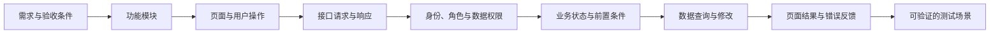
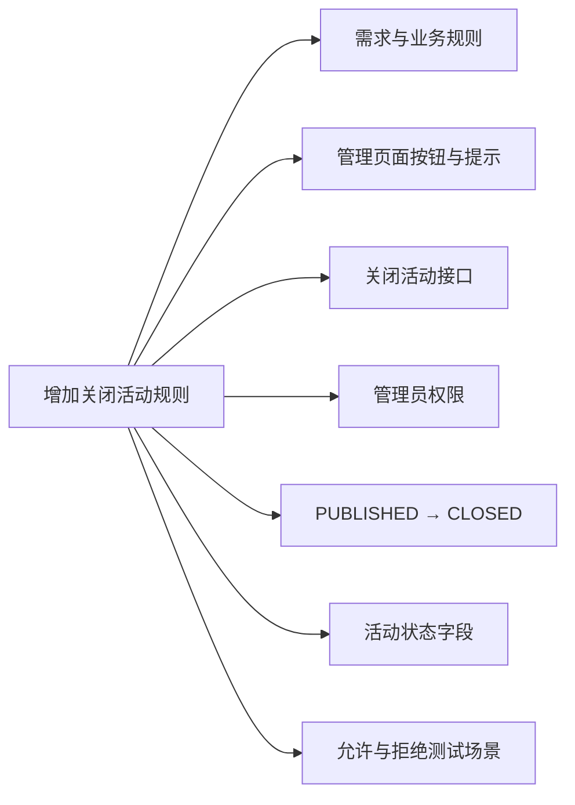
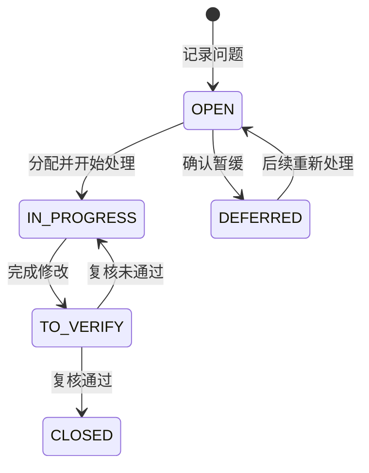

# 3.7 评审优化：设计检查与迭代改进

## 在写代码之前，用一次评审提前发现返工风险

!!! quote "评审不是挑错，而是共同确认方案能否落地"
    设计者已经熟悉自己的方案，很容易自动补全图表中没有写出的条件。评审者则会追问：普通用户能否调用这个接口？最后一个名额怎样处理？页面上的字段从哪里来？活动关闭后报名记录怎么办？

    这些问题越早发现，修改成本越低。评审的目标不是证明设计没有任何问题，而是找出会影响开发、测试和交付的风险，并形成明确的修改决定。

!!! tip "本节学习目标"
    组织并完成一次系统设计评审，从需求一致性、技术可行性、架构、原型、数据、接口、权限、状态和安全等方面检查《系统设计说明书》，记录问题、完成修改和复核，形成可以指导开发的设计基线。

[返回上一节：编制文档](06-design-document.md){ .md-button }
[返回第三篇导读](index.md){ .md-button }
[返回课程路线](../guide/roadmap.md){ .md-button .md-button--primary }

---

## 🎯 本节完成后，你要交付

| 成果 | 要求 |
| :--- | :--- |
| 设计评审记录 | 记录评审时间、参与人、材料、结论和主要讨论内容 |
| 评审问题清单 | 每个问题都有位置、证据、影响、等级、负责人和状态 |
| 修改后的设计文档 | 已处理阻断和重要问题，图、表、正文保持同步 |
| 问题复核记录 | 说明问题是否按决定解决，是否产生新的不一致 |
| 《系统设计说明书》基线版 | 版本和确认状态明确，可以作为开发与测试依据 |
| 后续优化清单 | 记录暂不影响开发、可以在后续迭代处理的建议 |

评审结束不是要求“问题数量为零”，而是所有影响开发的关键问题都已有明确结论和处理结果。

---

## 📦 第一步：准备评审材料

评审前应把需要检查的材料集中准备好：

| 材料 | 评审用途 |
| :--- | :--- |
| 《项目选题立项书》 | 检查目标、范围、人员和进度约束 |
| 《需求分析说明书》 | 检查设计是否覆盖角色、功能、规则和验收条件 |
| 《系统设计说明书》初稿 | 本次评审的主要对象 |
| 核心页面原型 | 走查用户任务、页面状态和操作反馈 |
| 数据库脚本 | 检查表结构是否能够执行并支撑业务 |
| 接口文档或接口清单 | 检查前后端约定、权限和错误处理 |
| 需求—设计追踪表 | 快速发现遗漏和无依据设计 |
| 待确认问题清单 | 集中讨论尚未决定的问题 |

### 评审前由设计者自查

- [ ] 所有材料都指向当前版本；
- [ ] 文档中的图片、链接和附件可以打开；
- [ ] 核心流程、架构图、E-R 图和状态机清楚可读；
- [ ] 数据库脚本已经在目标数据库执行；
- [ ] 待确认问题已经列出，没有隐藏在正文中；
- [ ] 需求、页面、接口、表和状态具有基本追踪关系；
- [ ] 文档中没有真实账号、密码、密钥和隐私数据。

!!! warning "材料不完整时，不要假装进行正式评审"
    如果核心流程、数据库或接口仍然只是零散想法，可以先进行方案讨论，但应明确标记为“设计讨论”，完成材料后再进入正式评审。

---

## 👥 第二步：确定评审参与者和职责

个人项目也不应只由设计者自己评审。可以邀请同学、教师或潜在用户参与。

| 角色 | 主要职责 | 适合关注的内容 |
| :--- | :--- | :--- |
| 主持人 | 控制范围和时间，确保逐项形成结论 | 议程、问题确认、评审结论 |
| 设计说明人 | 介绍方案和依据，回答问题 | 架构、模块、关键决策 |
| 业务或用户代表 | 判断流程是否符合真实任务 | 页面、业务规则、操作反馈 |
| 开发视角评审者 | 判断方案是否能按当前技术实现 | 架构、接口、数据和项目结构 |
| 测试视角评审者 | 寻找边界、失败和不可验证之处 | 验收、错误码、状态和权限 |
| 记录人 | 记录问题、决定、负责人和状态 | 评审问题清单与会议记录 |

项目规模较小时，一个人可以承担多个角色，但设计说明人最好不要同时负责记录所有问题，以免遗漏讨论结论。

### 评审规则

开始前约定：

- 讨论设计和证据，不评价个人能力；
- 问题必须指出具体位置和可能影响；
- 有争议时回到需求、约束和验证结果；
- 无法现场确认的问题记录下来，不凭印象决定；
- 每个重要问题都要有结论、负责人和计划时间；
- 不在评审中临时扩展与核心范围无关的新功能。

---

## 🗓️ 第三步：设计评审议程

一次课程项目设计评审可以控制在 30～60 分钟。建议按下面的顺序进行：

| 环节 | 建议时间 | 主要任务 |
| :--- | :---: | :--- |
| 说明目标和范围 | 5 分钟 | 确认本次评审对象、版本和重点 |
| 方案概览 | 5 分钟 | 介绍设计目标、约束、技术和总体架构 |
| 核心流程走查 | 15～25 分钟 | 沿页面、接口、权限、状态和数据走完整流程 |
| 专项检查 | 10～15 分钟 | 检查架构、数据库、安全、部署和可测试性 |
| 确认问题与结论 | 5～10 分钟 | 去重、分级、分配负责人和完成时间 |

评审时间有限时，优先检查：

1. 核心业务闭环；
2. 会改变数据和业务状态的操作；
3. 多角色权限和本人数据范围；
4. 容易产生返工的数据库与接口约定；
5. 当前团队最不熟悉、风险最高的技术方案。

!!! info "不要从文档第一页逐字念到最后一页"
    评审不是朗读说明书。先用架构图说明全局，再沿核心业务场景检查设计链条，最后处理专项风险，通常更容易发现真实问题。

---

## 🔄 第四步：沿核心业务场景走查

场景走查把分散在不同章节的设计串起来，是本次评审最重要的环节。

### 一条完整设计链



### 示例：学生报名活动

评审者可以按顺序提问：

| 环节 | 评审问题 |
| :--- | :--- |
| 需求 | 哪类用户在什么情况下需要报名？怎样算完成？ |
| 模块 | 哪个模块负责报名，是否与活动模块职责重叠？ |
| 页面 | 报名入口在哪里？已报名、名额已满时怎样显示？ |
| 接口 | 调用哪个接口？请求中为什么不需要用户编号？ |
| 权限 | 如何确认是学生本人报名？管理员是否允许报名？ |
| 状态 | 活动在什么状态和时间范围内允许报名？ |
| 数据 | 修改哪些表？怎样防止重复报名和名额超限？ |
| 反馈 | 成功、重复报名、名额已满和登录失效分别返回什么？ |
| 测试 | 怎样准备数据并验证以上成功与失败场景？ |

### 至少走查这些场景

| 场景类型 | 活动报名系统示例 |
| :--- | :--- |
| 核心用户成功路径 | 学生查找活动并完成报名 |
| 核心管理成功路径 | 管理员创建并发布活动 |
| 业务失败路径 | 名额已满、重复报名、报名已截止 |
| 权限失败路径 | 学生调用活动发布接口 |
| 数据范围路径 | 学生只能查看和取消自己的报名 |
| 状态变化路径 | 活动从草稿到发布再到关闭 |
| 异常恢复路径 | 请求失败、重复提交或登录失效后怎样处理 |

!!! warning "能走通成功路径还不够"
    很多严重问题只会出现在失败、越权和状态变化时。至少选择一个核心失败场景和一个权限场景进行完整走查。

---

## 🎯 第五步：检查需求覆盖和范围一致性

### 需求覆盖检查

- 每个核心角色是否有对应的使用入口？
- 每项核心需求是否对应明确的功能模块？
- 每个业务流程是否有页面、接口、数据和状态支撑？
- 每个验收条件是否能够通过页面、接口或数据验证？
- 关键异常和边界情况是否有处理结果？
- 非功能要求是否在架构、部署或质量设计中得到体现？

### 范围控制检查

- 设计是否增加了需求中没有确认的功能？
- 是否引入了不解决实际问题的复杂技术？
- 是否存在超出课程周期的模块或集成？
- 是否把“以后可以优化”误写成“本期必须完成”？
- 是否仍然保持一个可以独立演示的核心闭环？

### 使用追踪表检查

| 检查结果 | 含义 | 处理建议 |
| :--- | :--- | :--- |
| 需求有设计对应 | 具备实现依据 | 继续检查设计质量 |
| 需求没有设计对应 | 设计遗漏 | 补充设计或调整需求范围 |
| 设计没有需求依据 | 可能超范围 | 删除、降级为后续优化或补充正式依据 |
| 一个需求对应相互矛盾的设计 | 文档不一致 | 明确唯一方案并同步修改 |

---

## 🏗️ 第六步：检查技术方案和架构

### 技术选型

- 每项技术是否解决明确问题？
- 团队是否能够安装、使用、调试并解释？
- 技术版本是否相互兼容？
- 是否符合已有模板和部署环境？
- 是否存在更简单且能满足需求的方案？
- 外部 API 或服务不可用时，核心流程是否仍可运行？

### 系统架构

- 架构图中的每个部分是否真实需要？
- 前端、后端、数据库和外部服务职责是否清楚？
- 一个请求经过哪些部分，是否可以解释？
- 系统形态是否符合团队人数和课程周期？
- 是否为了展示复杂度而使用微服务或过多中间件？
- 开发架构和部署架构是否相互矛盾？

### 功能模块

- 模块是否按业务职责划分？
- 模块边界是否清楚，有没有重复职责？
- 模块依赖是否存在循环？
- 核心流程能否通过模块协作完成？
- 模块划分能否指导后续任务分工？

!!! info "评审复杂度，而不是追求复杂度"
    如果简单的前后端分离单体能够满足需求，就应优先采用。评审应帮助项目删除不必要的复杂性，把时间留给核心功能、测试和部署。

---

## 🖥️ 第七步：检查原型与页面流程

### 页面覆盖

- 页面清单是否覆盖所有核心用户任务？
- 不同角色能否找到各自功能入口？
- 是否存在页面有功能但需求没有依据？
- 页面名称是否与模块和需求术语一致？

### 信息与操作

- 用户完成任务所需的信息是否齐全？
- 页面字段是否都有数据来源？
- 主操作是否明显，危险操作是否需要确认？
- 表单必填、格式和错误位置是否清楚？
- 完成、取消和返回后分别去哪里？

### 页面状态

- 是否设计加载、空数据、失败和无权限状态？
- 处理中是否防止重复提交？
- 页面按钮是否与权限和业务状态一致？
- 错误提示是否说明原因和下一步？

### 页面流程

- 从入口到核心目标是否完整？
- 是否存在无法返回或无法继续的“死胡同”？
- 登录失效和直接访问受限页面怎样处理？
- 成功、失败和取消路径是否都有结果？

可以邀请一位没有参与设计的同学，根据原型完成一个具体任务。观察实际停顿和误操作，比只看截图更容易发现问题。

---

## 🗃️ 第八步：检查数据库设计

### 实体与关系

- 核心业务对象是否都有数据支撑？
- 实体、属性和关系是否来自真实需求？
- 一对多、多对多关系和基数是否正确？
- 中间表是否需要保存时间、状态等业务属性？
- 是否错误地把页面控件或临时提示设计成表？

### 表与字段

- 每张表是否有明确用途和主键？
- 主外键或逻辑关联是否清楚，类型是否一致？
- 字段类型、长度、可空性和默认值是否合理？
- 状态字段是否有完整取值说明？
- 时间、金额、密码和隐私数据的处理是否正确？
- 页面字段和接口字段能否找到可靠数据来源？

### 约束和索引

- 必要的非空、唯一和关联约束是否存在？
- 约束是否符合取消、重建和历史保留规则？
- 索引是否来自真实查询，而不是全部字段都加？
- 逻辑删除、历史数据和审计信息是否按实际需要设计？

### 脚本验证

- 建表脚本能否在空数据库中执行？
- 初始化数据能否支撑核心流程？
- 正常数据能否写入？
- 重复账号、无效关联等错误数据是否被阻止？
- 删除后重新执行脚本是否仍能成功？

!!! failure "只看 E-R 图不能完成数据库评审"
    必须同时检查数据字典、约束、SQL 和核心查询。图上关系正确，不代表脚本能够执行或业务数据能够保持一致。

---

## 🔌 第九步：检查接口设计

### 接口覆盖与命名

- 每个核心页面操作是否有对应接口？
- 接口是否归属清楚的业务模块？
- 方法和路径是否准确表达查询、创建和状态操作？
- 是否存在没有页面、流程或外部调用使用的多余接口？
- 同类接口的命名、分页和筛选规则是否统一？

### 请求与响应

- 路径参数、查询参数和请求体是否区分清楚？
- 字段名称、类型、必填和校验规则是否明确？
- 响应结构、分页、时间和状态格式是否统一？
- 成功和主要失败场景是否有示例？
- HTTP 状态和业务错误码是否能够表达失败原因？

### 数据变化与一致性

- 会改变数据的接口是否说明前置条件和结果？
- 多表更新是否具有明确事务边界？
- 重复提交是否可能创建重复数据？
- 并发操作是否可能突破名额、库存等限制？
- 失败后是否会留下部分成功的数据？

---

## 🔐 第十步：检查权限、安全与隐私

### 认证和会话

- 哪些接口需要登录？
- 登录凭证怎样传递、失效和退出？
- 未登录与无权限是否使用不同结果？
- 密码是否使用安全哈希保存，而不是明文或可逆加密？

### 功能权限

- 每项管理功能是否有允许角色？
- 后端是否对接口执行权限校验？
- 是否错误地只通过前端隐藏按钮控制权限？

### 数据权限

- “我的数据”是否从当前登录身份获取用户编号？
- 普通用户能否通过修改路径参数访问他人数据？
- 管理员是否只能管理允许范围内的数据？
- 查询是否在后端或数据库层限制数据范围？

### 数据与隐私

- 是否只收集完成业务所需的数据？
- 文档、日志和测试数据中是否包含真实敏感信息？
- 密钥、密码和本机配置是否可能提交到 Git？
- 接口错误是否泄露数据库、路径或程序堆栈？
- 删除、导出和日志记录是否符合项目实际需要？

!!! warning "权限评审要实际尝试越权场景"
    不要只看权限矩阵。选择一个学生接口和一个管理员接口，说明如果修改用户编号、活动编号或直接调用路径，后端将怎样拒绝无权操作。

---

## 🔀 第十一步：检查业务状态和异常规则

### 状态完整性

- 每个状态是否有唯一、明确的业务含义？
- 初始状态和结束状态是否清楚？
- 每个状态是否可以通过合法操作进入？
- 是否存在进入后无法处理的状态？
- 是否允许从任意状态跳到任意状态？

### 状态转换

- 谁可以触发转换？
- 需要满足哪些时间、数据和权限条件？
- 转换会修改哪些表或字段？
- 转换失败时是否整体回滚？
- 页面按钮、接口操作和数据库状态是否一致？
- 状态变化是否需要保留操作时间和历史记录？

### 异常与边界

- 名额为 0、库存不足或数据不存在时怎样处理？
- 同一操作重复执行会产生什么结果？
- 两个用户同时操作最后一个名额时怎样保证正确？
- 外部服务超时是否阻断核心业务？
- 服务器错误时给用户什么提示，后台记录什么证据？

状态评审可以直接使用状态机和状态转换表。尝试为每条转换设计一个成功用例和一个失败用例，通常能快速发现条件遗漏。

---

## 🧪 第十二步：检查可实现性和可测试性

### 可实现性

- 当前技术栈是否能实现设计中的全部核心能力？
- 是否有需要提前验证的技术难点？
- 外部依赖是否已经确认访问方式、费用和限制？
- 目录和模块划分能否直接转化为开发任务？
- 项目是否能在计划周期内完成和部署？

对于不确定的高风险点，可以安排一个小型技术验证，例如：

```text
验证目标：确认部署服务器能够运行 JDK 17 和 MySQL 客户端。
验证范围：只检查环境和最小 Spring Boot 应用启动，不开发业务功能。
完成证据：版本输出、启动日志和访问结果。
```

### 可测试性

- 每个核心需求是否有明确预期结果？
- 页面和接口失败是否有稳定、可识别的结果？
- 权限矩阵能否转化为允许与拒绝测试？
- 状态转换表能否转化为状态用例？
- 初始化数据能否支撑成功和失败场景？
- 日志和错误信息能否帮助定位问题？

!!! info "无法验证的设计，很难证明已经完成"
    “系统安全性高”“性能良好”“体验友好”都需要进一步变成可观察条件。课程项目可以使用适合规模的简单标准，但不能完全没有判断依据。

---

## 📝 第十三步：记录和分级评审问题

评审发现的问题应记录事实和影响，不能只写“这里不好”“建议优化”。

### 问题记录模板

| 字段 | 说明 |
| :--- | :--- |
| 问题编号 | 便于追踪，例如 DR-001 |
| 问题位置 | 文档章节、图、表、接口或页面 |
| 问题描述 | 当前设计具体存在什么问题 |
| 证据 | 与哪个需求、规则或约束矛盾 |
| 影响 | 会造成什么开发、数据、权限或交付风险 |
| 严重程度 | 阻断、重要、一般或建议 |
| 修改建议 | 推荐方向，不替负责人隐藏决策 |
| 负责人和期限 | 谁处理、何时完成 |
| 状态 | 待处理、处理中、待复核、已关闭或暂缓 |

### 严重程度建议

| 等级 | 判断标准 | 示例 | 处理要求 |
| :--- | :--- | :--- | :--- |
| 阻断 | 不解决就无法开始或继续核心开发 | 核心流程没有确定；数据库关系互相矛盾 | 开发前必须解决 |
| 重要 | 可能造成明显返工、数据错误或越权 | 报名接口信任前端用户编号 | 进入相关开发前解决 |
| 一般 | 不阻断核心流程，但会影响一致性或体验 | 错误码命名不统一 | 计划内修改 |
| 建议 | 可提高质量，但不影响本期交付 | 原型提示文字可以更友好 | 纳入后续优化 |

### 问题清单示例

| 编号 | 问题位置 | 问题与影响 | 等级 | 修改决定 | 负责人 | 状态 |
| :--- | :--- | :--- | :--- | :--- | :--- | :--- |
| DR-001 | SIGN-01 报名接口 | 请求体包含 `userId`，可能操作他人数据 | 重要 | 从登录身份获取用户编号 | 后端负责人 | 待处理 |
| DR-002 | 活动状态机 | 发布后没有关闭路径，活动无法结束 | 阻断 | 增加关闭操作和 `CLOSED` 状态 | 设计负责人 | 待处理 |
| DR-003 | 活动详情原型 | 名额已满时仍显示可点击按钮 | 一般 | 禁用按钮并说明原因 | 前端负责人 | 待处理 |

!!! warning "严重程度看影响，不看修改工作量"
    一个只需改一行的越权问题可能是“重要”，一项需要调整多个页面但只影响视觉一致性的修改仍可能是“一般”。

---

## 🔧 第十四步：修改设计并进行影响分析

处理问题时，不要只修改评审者指出的那一行。先检查这一决定会影响哪些设计成果。

### 影响分析示例

如果决定“活动发布后可以由管理员关闭”，需要同步检查：



### 常见变化的影响范围

| 设计变化 | 需要同步检查 |
| :--- | :--- |
| 增加页面字段 | 原型、接口、数据字典、校验和隐私要求 |
| 修改接口路径或字段 | 页面调用、接口文档、测试和追踪表 |
| 修改角色权限 | 菜单、按钮、后端校验、数据范围和权限矩阵 |
| 增加业务状态 | 页面状态、接口操作、数据库取值和状态机 |
| 修改表关系 | E-R 图、SQL、业务逻辑、接口响应和初始化数据 |
| 更换技术方案 | 架构、项目结构、环境、部署、风险和进度 |

### 修改原则

- 一个问题一次形成一个明确决定；
- 先修改设计源文件，再更新导出图片或附件；
- 图、表、正文和追踪关系同步更新；
- 不在修复问题时顺便增加未评审的新功能；
- 对重要决策保留修改理由；
- 修改完成后更新文档版本和变更记录。

---

## ✅ 第十五步：复核问题并关闭

问题负责人完成修改后，应由原评审者或其他成员进行复核。

### 复核要回答

1. 原问题是否按照评审决定解决？
2. 修改是否覆盖所有受影响的图、表和章节？
3. 修改是否引入新的矛盾、遗漏或超范围内容？
4. 页面、接口、权限、状态和数据库是否仍然一致？
5. 是否已经具备可以验证的成功和失败场景？

### 问题状态



“已关闭”表示问题已经得到验证，不是负责人说“已经改了”。暂缓问题必须说明原因、影响和未来处理条件。

---

## 📌 第十六步：形成设计基线

设计基线是团队共同确认、用于指导后续开发和测试的版本。

### 进入基线的条件

- 核心需求均有可实现的设计支撑；
- 核心业务成功、失败和权限路径能够走通；
- 阻断问题全部关闭；
- 重要问题已经关闭，或有不会影响当前开发的明确处理计划；
- 架构、原型、数据、接口、权限和状态基本一致；
- 数据库脚本能够执行；
- 待确认事项不影响即将开始的核心开发；
- 文档版本、日期、状态和参与确认人员已经记录。

### 基线确认记录

| 项目 | 内容 |
| :--- | :--- |
| 文档名称 | 《校园活动报名系统——系统设计说明书》 |
| 基线版本 | V1.0 |
| 确认日期 | 2026-04-25 |
| 评审结论 | 通过 / 修改后通过 / 不通过 |
| 未关闭问题 | 编号、等级和处理计划 |
| 确认人员 | 项目成员、教师或评审同学 |
| 下一步 | 按模块拆分开发任务并搭建项目骨架 |

!!! info "基线不是以后永远不能修改"
    开发中发现新事实时仍然可以变更设计，但要记录原因、评估影响、更新关联材料，并让团队知道当前应遵守哪个版本。

---

## 🤖 第十七步：用 AI 辅助设计评审

AI 可以同时检查多份文档、生成追踪关系和发现名称不一致，适合作为第一轮评审助手。

### 综合评审提示词

```text
请以软件项目设计评审者身份工作。
先完整阅读《项目选题立项书》《需求分析说明书》
和《系统设计说明书》，以及引用的原型、数据库和接口材料。
不要修改文件，不要补充没有依据的功能。

请按以下维度检查：
1. 需求覆盖和项目范围；
2. 技术选型与架构可行性；
3. 功能模块职责和依赖；
4. 页面任务、状态和流程；
5. E-R 图、数据字典、约束和 SQL；
6. 接口请求、响应、错误码和数据变化；
7. 身份认证、角色权限和数据权限；
8. 业务状态、转换条件和异常路径；
9. 重复请求、并发和数据一致性；
10. 文档术语、图表和追踪关系的一致性。

对每个问题输出：
- 问题位置；
- 当前设计的具体证据；
- 与哪个需求、约束或其他设计矛盾；
- 可能影响；
- 严重程度；
- 修改建议；
- 需要人工确认的问题。

不要只给通用建议；没有证据时标记为“待确认”。
```

### 核心流程攻击式走查提示词

```text
请围绕“学生报名活动”进行失败和越权场景走查，
不要假设页面能够保护后端。

依次检查：未登录、角色错误、修改用户编号、活动不存在、
活动未发布、报名已截止、名额已满、重复报名、连续点击、
两个用户争抢最后一个名额、数据库写入中途失败。

对每个场景说明：
1. 哪一层发现问题；
2. 接口返回什么状态和错误码；
3. 数据是否发生变化；
4. 页面怎样提示和恢复；
5. 当前设计文档是否已经覆盖。
```

### 人工审核 AI 评审结果

- [ ] 问题是否有真实文档证据；
- [ ] 严重程度是否根据影响判断；
- [ ] 是否把个人偏好误写成必须修改的问题；
- [ ] 是否建议了超出课程范围的复杂方案；
- [ ] 是否错误理解了业务术语或角色；
- [ ] 是否重复报告同一个根本问题；
- [ ] 修改建议是否会破坏其他已确认设计；
- [ ] 最终业务决定是否经过人工确认。

!!! failure "AI 评审不能代替共同确认"
    AI 能发现形式不一致和常见风险，但不了解所有真实用户、团队能力和课堂约束。评审结论、问题等级和修改决定仍由项目成员与教师确认。

---

## 📋 设计评审记录模板

可以使用下面的模板记录评审过程和结果：

````markdown
# 项目名称——系统设计评审记录

## 1. 评审信息

| 项目 | 内容 |
| --- | --- |
| 评审对象 | 《系统设计说明书》V0.__ |
| 评审时间 |  |
| 评审地点或方式 |  |
| 主持人 |  |
| 设计说明人 |  |
| 评审参与人 |  |
| 记录人 |  |

## 2. 评审范围

- 本次重点：
- 不在本次范围的内容：
- 使用的材料：

## 3. 核心场景走查

| 场景 | 页面 | 接口 | 权限 | 状态 | 数据变化 | 结论 |
| --- | --- | --- | --- | --- | --- | --- |
|  |  |  |  |  |  |  |

## 4. 评审问题清单

| 编号 | 问题位置 | 问题与证据 | 影响 | 等级 | 修改决定 | 负责人 | 期限 | 状态 |
| --- | --- | --- | --- | --- | --- | --- | --- | --- |
|  |  |  |  |  |  |  |  |  |

## 5. 待确认事项

| 编号 | 问题 | 影响范围 | 确认人 | 计划时间 | 状态 | 结论 |
| --- | --- | --- | --- | --- | --- | --- |
|  |  |  |  |  |  |  |

## 6. 评审结论

- [ ] 通过：可以形成设计基线并进入开发
- [ ] 修改后通过：完成指定问题并复核后进入开发
- [ ] 不通过：核心方案需要重新设计并再次评审

结论说明：

## 7. 修改与复核记录

| 问题编号 | 修改位置 | 修改内容 | 复核人 | 复核结果 | 关闭日期 |
| --- | --- | --- | --- | --- | --- |
|  |  |  |  |  |  |

## 8. 基线确认

| 项目 | 内容 |
| --- | --- |
| 基线版本 |  |
| 确认日期 |  |
| 未关闭问题及计划 |  |
| 下一步工作 |  |
````

---

## ✅ 本节自查

- [ ] 评审对象、版本、范围和参与人已经明确；
- [ ] 立项书、需求说明书、设计说明书及附件准备完整；
- [ ] 至少走查了一条核心成功流程；
- [ ] 至少走查了一条业务失败流程和一条权限失败流程；
- [ ] 核心需求能够追踪到模块、页面、接口、数据和状态；
- [ ] 技术方案符合团队能力、课程周期和部署环境；
- [ ] 页面字段、操作和状态都有需求及数据依据；
- [ ] E-R 图、数据字典和数据库脚本相互一致；
- [ ] 接口请求、响应、错误码和数据变化说明清楚；
- [ ] 认证、功能权限和数据权限都经过检查；
- [ ] 状态转换具有角色、前置条件、目标和失败结果；
- [ ] 重复请求、关键并发和事务一致性风险得到考虑；
- [ ] 每个评审问题都有位置、证据、影响和严重程度；
- [ ] 阻断和重要问题具有负责人、期限和修改决定；
- [ ] 修改后完成了影响分析和问题复核；
- [ ] 图、表、正文和追踪关系已经同步更新；
- [ ] 《系统设计说明书》版本和变更记录已经更新；
- [ ] 已形成明确的评审结论和设计基线；
- [ ] 暂缓问题说明了原因、影响和后续处理计划。

当核心流程能够从需求一路追踪到页面、接口、权限、状态、数据和测试结果，阻断问题全部关闭，团队也知道开发应遵守哪个版本，第三篇的设计工作就完成了。

---

## 📝 总结

* **评审围绕风险和证据展开**：指出具体位置、事实和影响，不只表达个人偏好；
* **沿核心业务场景走查**：把需求、页面、接口、权限、状态和数据连成完整链条；
* **成功、失败和越权都要检查**：边界场景往往比正常流程更容易暴露设计问题；
* **问题必须闭环**：记录、分级、修改、复核和关闭缺一不可；
* **形成设计基线再进入开发**：后续可以变更，但必须评估影响并同步更新文档。

[返回上一节：编制文档](06-design-document.md){ .md-button }
[返回第三篇导读](index.md){ .md-button }
