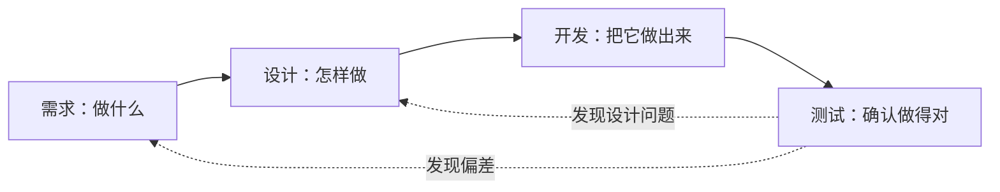

# 🏗️ 第三篇：原型与系统设计

## 把“系统要做什么”，变成“准备怎样实现”

!!! quote "为什么先设计再编码"
    需求分析说明用户需要什么，系统设计则要回答：采用什么技术，系统怎样划分，页面怎样跳转，数据怎样保存，前后端怎样通信，不同角色能做什么，业务状态怎样变化。

    跳过设计直接写代码，就像没有图纸先盖房子。开始时似乎更快，等页面、接口和数据库对不上时，就会在反复修改中付出更多时间。

!!! tip "完成第三篇后，你将拥有"
    一套能够指导开发和测试的设计成果：设计方案、系统架构、功能模块、页面原型、页面流程、E-R 图、数据字典、接口清单、权限矩阵、业务状态机，以及经过评审的《系统设计说明书》。

[开始 3.1：明确方案](01-design-selection.md){ .md-button .md-button--primary }
[返回第二篇：项目选题与需求分析](../chapter02/index.md){ .md-button }

---

## 🎯 这一篇要帮你做到

| 选得合适 | 分得清楚 | 看得明白 | 存得正确 | 连得起来 | 守得住规则 | 能够落地 |
| :---: | :---: | :---: | :---: | :---: | :---: | :---: |
| 根据需求和约束选择技术方案 | 用架构与模块明确系统职责 | 用原型和流程验证用户操作 | 用 E-R 图和表结构组织数据 | 用接口约定前后端协作 | 用权限和状态控制业务边界 | 用说明书和评审指导开发 |

本篇遵循一条完整的设计路径：

> 明确目标与约束 → 选择技术方案 → 设计架构与模块 → 设计原型与流程 → 设计数据 → 设计接口、权限与状态 → 编制说明书 → 评审并形成设计基线

设计不是一次把所有细节想完，而是让不同设计成果逐步对应、互相检查。发现问题后可以返回前面的步骤修改，但每次修改都要保持页面、接口、数据和规则一致。

---

## 🔄 从需求到设计，再到开发

第二篇与第三篇回答的问题不同：

| 阶段 | 主要问题 | 典型成果 |
| :--- | :--- | :--- |
| 需求分析 | 为谁做？解决什么问题？系统必须做什么？怎样算完成？ | 《项目选题立项书》《需求分析说明书》 |
| 系统设计 | 准备怎样实现？各部分怎样协作？数据和规则怎样落地？ | 原型、架构、数据库、接口及《系统设计说明书》 |
| 编码实现 | 怎样把设计变成能够运行、能够验证的系统？ | 前后端代码、数据库脚本和可运行版本 |

可以把它们理解为：



!!! warning "设计不能替需求增加功能"
    系统设计可以细化实现方式，但不能擅自扩大已经确认的范围。如果设计过程中发现需求不清楚或互相矛盾，应先记录问题，回到需求文档确认后再继续。

---

## 🗺️ 你将完成的 7 个小节

| 小节 | 主要任务 | 本节成果 |
| :--- | :--- | :--- |
| [3.1 明确方案](01-design-selection.md) | 提取设计目标和约束，比较并确定技术方案 | 设计目标与约束 + 技术选型表 + 关键决策 |
| [3.2 设计架构](02-architecture.md) | 设计系统总体结构、功能模块、职责和项目分层 | 系统架构图 + 功能模块图 + 模块职责表 |
| [3.3 设计原型](03-prototype.md) | 整理页面清单，设计低保真原型、页面状态和流程 | 核心页面原型 + 页面流程图 + 原型评审记录 |
| [3.4 设计数据](04-database.md) | 识别实体关系，设计数据表、字段、约束和索引 | E-R 图 + 数据字典 + 建表与初始化脚本 |
| [3.5 完善规则](05-api-permission-state.md) | 统一接口约定，明确角色权限、数据范围和状态转换 | 接口清单 + 权限矩阵 + 业务状态机 |
| [3.6 编制文档](06-design-document.md) | 汇总设计成果，建立需求与设计追踪关系 | 《系统设计说明书》初稿 + 设计追踪表 |
| [3.7 评审优化](07-design-review.md) | 走查核心场景，记录问题、修改复核并确认版本 | 评审记录 + 问题清单 + 设计基线版 |

每一节都为下一节提供输入。例如，页面原型中的字段会影响接口和数据表，数据库中的状态字段要与状态机一致，权限矩阵又会影响页面按钮和后端接口校验。

---

## 🧭 用一条核心流程贯穿全部设计

不要把架构、原型、数据库和接口当作互不相关的作业。选择项目最重要的一条业务流程，贯穿所有设计成果。

以“校园活动报名系统”的学生报名流程为例：


设计过程中始终检查：

- 用户从哪个页面进入？
- 页面需要展示哪些信息？
- 点击按钮后调用哪个接口？
- 当前用户是否有权执行？
- 当前业务状态是否允许？
- 需要读取或修改哪些数据？
- 成功、失败和异常时怎样反馈？
- 怎样证明这个流程设计正确并且能够实现？

当这些问题能够使用同一套业务名称和规则回答，设计才真正连成了一个整体。

---

## 📦 开始第三篇前，准备什么

| 准备内容 | 建议要求 |
| :--- | :--- |
| 《项目选题立项书》 | 项目目标、范围、人员、计划和风险已经确认 |
| 《需求分析说明书》 | 用户角色、核心流程、功能、规则和验收条件基本明确 |
| 调研和评审记录 | 能说明需求来自哪里，哪些问题已经确认 |
| 技术基础和环境 | 了解自己会什么、准备使用什么开发和部署环境 |
| 绘图与文档工具 | 能够绘制 Mermaid、原型或其他基本设计图 |
| AI 编程工具 | 已能在 Trae 中提供项目文档并审核 AI 输出 |

如果角色、核心功能或项目范围仍然不清楚，请先返回[第二篇](../chapter02/index.md)完善需求分析，不要用系统设计替代尚未完成的需求确认。

---

## 📋 第三篇的主要交付成果

本篇过程中会产生多项设计材料，但最终应整理为一个相互一致的设计成果集：

```text
项目设计成果/
├── 系统设计说明书
├── 系统架构图与功能模块图
├── 核心页面原型与页面流程图
├── E-R 图、数据字典与数据库脚本
├── 接口清单或接口文档
├── 角色权限矩阵与业务状态机
└── 设计评审记录与问题清单
```

!!! info "最终核心交付是一份经过评审的《系统设计说明书》"
    各类图、表、原型和脚本可以作为正文内容或附件，但必须与说明书使用相同的业务名称、接口编号、状态取值和数据结构。

---

## 🛠️ 本篇推荐的设计原则

### 1. 从核心闭环开始

先把一条最重要的业务流程设计完整，再扩展其他功能。例如先设计“浏览活动—查看详情—提交报名—查看报名结果”，再考虑统计、通知和其他增强功能。

### 2. 选择合适的复杂度

| 项目情况 | 更适合的做法 |
| :--- | :--- |
| 个人或小组课程项目 | 清楚的单体系统、必要的模块分层 |
| 页面和交互较多 | 前后端分离，使用统一接口约定 |
| 业务数据关系明确 | 先画 E-R 图，再生成建表 SQL |
| 多角色系统 | 同时设计功能权限和数据权限 |
| 存在审批、报名、借阅等过程 | 使用状态机说明允许的状态变化 |

微服务、消息队列、缓存和复杂中间件只有在需求明确需要、团队能够掌握并且有时间验证时才引入。

### 3. 使用统一业务语言

同一个概念在需求、页面、接口、数据库和代码中尽量使用相同名称。如果“报名”“申请”“预约”代表同一件事，就应统一；如果代表不同业务，就要分别定义。

### 4. 同时考虑成功与失败

设计不只描述理想路径，还要说明：

- 未登录或无权限怎么办；
- 数据为空或不存在怎么办；
- 状态不允许操作怎么办；
- 重复提交或同时操作怎么办；
- 外部服务或数据库失败怎么办。

### 5. 每项设计都能够验证

架构应能够解释一次请求，原型应能够走通用户任务，数据库脚本应能够执行，接口应能够给出请求与响应示例，权限和状态应能够转化为测试场景。

---

## 🤝 在系统设计中怎样使用 AI

AI 可以帮助比较方案、整理表格、生成 Mermaid 图、检查遗漏和形成文档初稿，但必须基于项目的真实材料。

本篇推荐的协作过程：

> 提供需求和已有设计 → 说明当前任务与边界 → AI 分析并给出候选方案 → 人工比较和确认 → 形成设计成果 → AI 辅助检查一致性 → 人工评审并修改

### 给 AI 足够的上下文

```text
请先阅读《项目选题立项书》和《需求分析说明书》，
以及当前已经确认的设计材料。

本次只处理“________设计”，不要修改其他文件，
不要增加需求之外的功能，也不要直接开始编码。

请先输出：
1. 你从文档中确认的事实；
2. 仍然缺少或互相矛盾的信息；
3. 候选方案及各自的优缺点；
4. 推荐方案和依据；
5. 需要人工确认的问题；
6. 完成后怎样检查与其他设计保持一致。
```

### 人必须完成的工作

- 确认用户、业务规则和项目边界；
- 判断技术是否适合自己的能力和环境；
- 审核 AI 是否增加了没有依据的内容；
- 运行并验证数据库脚本等可执行成果；
- 让用户、同学或教师走查原型和核心流程；
- 解释关键设计决定及其影响；
- 对最终《系统设计说明书》负责。

!!! failure "看起来完整，不等于适合当前项目"
    AI 很容易生成通用的微服务架构、十几张数据表或大量增删改查接口。如果这些内容没有需求依据、团队无法解释或课程周期内无法验证，就应删除或简化。

---

## 🔍 本篇要持续进行的一致性检查

| 检查方向 | 要回答的问题 |
| :--- | :--- |
| 需求 → 模块 | 每个核心需求由哪个模块负责？ |
| 模块 → 页面 | 用户从哪里进入并完成模块功能？ |
| 页面 → 接口 | 页面数据从哪里来，操作调用哪个接口？ |
| 接口 → 权限 | 谁可以调用，能够操作哪些数据？ |
| 接口 → 状态 | 当前状态是否允许，成功后状态怎样变化？ |
| 接口 → 数据 | 读取和修改哪些表，怎样保证数据正确？ |
| 状态 → 页面 | 不同业务状态下按钮和提示怎样变化？ |
| 设计 → 测试 | 成功、失败、越权和边界情况怎样验证？ |

如果其中任何一项无法回答，就把它记录为待确认问题，不要依靠开发阶段临时猜测。

---

## ✅ 本篇结束时，你要能够回答

完成第三篇后，你应该能够用 5 分钟说明：

> **系统为什么选择这套技术？整体由哪些部分组成？核心功能怎样划分？用户怎样完成主要任务？数据保存在哪里？前后端怎样通信？不同角色能做什么？业务状态怎样变化？这些设计怎样被评审和验证？**

并且能够提供以下证据：

- [ ] 技术选型有需求、约束和风险依据；
- [ ] 系统架构图和功能模块图能够解释系统职责；
- [ ] 核心页面原型和流程能够完成用户任务；
- [ ] E-R 图、数据字典和数据库脚本相互一致；
- [ ] 核心接口具有请求、响应、权限、状态和错误说明；
- [ ] 角色权限矩阵同时包含功能权限和数据范围；
- [ ] 核心业务状态具有明确的转换条件；
- [ ] 需求能够追踪到页面、接口和数据；
- [ ] 设计评审问题已经记录、修改和复核；
- [ ] 《系统设计说明书》已形成明确版本，可以指导下一阶段开发。

---

## 📝 总结

* **设计把需求变成实现方案**：从目标和约束出发，逐步确定架构、页面、数据和协作规则；
* **核心流程贯穿全部成果**：需求、模块、页面、接口、权限、状态和数据必须连得起来；
* **复杂度要与项目匹配**：先保证结构清楚、业务正确、能够部署，再考虑进阶技术；
* **AI 帮助分析和检查**：关键业务决定、方案确认和最终责任仍由人承担；
* **评审让设计成为共同基线**：问题经过记录、修改和复核后，再依据确认版本进入开发。

[开始 3.1：明确方案](01-design-selection.md){ .md-button .md-button--primary }
[返回第二篇：项目选题与需求分析](../chapter02/index.md){ .md-button }
