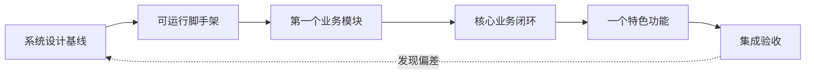
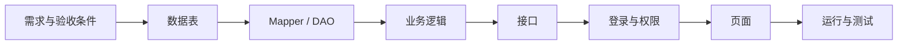

# 💻 第四篇：项目开发与业务实现

## 从课程脚手架出发，把系统设计变成可运行的软件

!!! quote "开发不是让 AI 一次生成整个项目"
    前三篇已经明确了为谁做、做什么和准备怎样实现。接下来要把需求、页面、接口、权限和数据逐步落到代码中。

    本篇从一个已经能够运行的课程脚手架开始，先建立自己的项目骨架，再完成登录权限、第一个业务模块和一条完整核心流程。核心业务稳定后，可以增加一个有价值的特色功能，最后形成能够连续演示的 `v0.5` 阶段版本。

!!! tip "完成第四篇后，你将拥有"
    一个能够从数据库初始化到页面访问、从用户操作到业务结果连续运行的项目；一条经过正常、失败和越权验证的核心业务流程；一个可选的特色功能；以及 README、接口、测试记录和连续 Git 提交。

[开始 4.1：启动项目](01-project-scaffold.md){ .md-button .md-button--primary }
[返回第三篇：原型与系统设计](../chapter03/index.md){ .md-button }

---

## 🎯 这一篇要帮你做到

| 跑得起来 | 改得明白 | 做得完整 | 守得住规则 | 有一个亮点 | 能够演示 |
| :---: | :---: | :---: | :---: | :---: | :---: |
| 从脚手架成功启动项目 | 让工程与自己的设计对应 | 完成页面、接口和数据库闭环 | 实现登录、权限、状态和异常处理 | 增加一个有业务价值的特色功能 | 形成可复现的阶段版本 |

本篇遵循一条清楚的开发路径：

> 运行脚手架 → 改造成自己的项目 → 完成第一个模块 → 打通核心业务流程 → 增加一个特色功能 → 集成验收并保存阶段版本

每一步都要保持：

```text
小任务
→ 先读现状
→ 制定计划
→ 修改少量文件
→ 运行验证
→ 检查差异
→ Git 提交
```

---

## 🔄 从系统设计进入项目开发

第三篇和第四篇解决的问题不同：

| 阶段 | 主要问题 | 典型成果 |
| :--- | :--- | :--- |
| 需求分析 | 系统必须做什么，怎样算完成？ | 《需求分析说明书》 |
| 系统设计 | 准备怎样实现，各部分怎样协作？ | 《系统设计说明书》、原型、数据库和接口设计 |
| 项目开发 | 怎样把设计变成可以运行和验证的软件？ | 代码、数据库脚本、测试证据和阶段版本 |

开发不是机械照抄设计。实现过程中可能发现字段缺失、状态冲突或接口无法落地。这时应记录问题，判断需要修改代码还是返回需求与设计，而不是在不同页面中各自使用一套规则。



!!! warning "不能运行的代码，不算完成设计"
    文档中的架构、接口和数据库最终都要通过代码运行验证。如果实际实现与设计发生变化，要说明原因并同步更新相关材料。

---

## 🧰 两套课程脚手架，只选择一套

本篇提供两条技术路线。它们的交付要求相同，不需要同时学习。

### Spring Boot + Vue

- 远程仓库：[scaffold-springboot](https://gitee.com/javaweb-dev-tech/scaffold-springboot)
- 适合已有 Spring Boot 或 Vue 基础、准备使用前后端分离结构的项目；
- 提供 Spring Boot、MyBatis-Plus、Vue 3、JWT、分页、统一响应和示例模块。

### Servlet + HTML + CSS + JavaScript

- 远程仓库：[scaffold-servlet](https://gitee.com/javaweb-dev-tech/scaffold-servlet)
- 适合正在学习 Java Web、希望理解 Servlet、Session、Filter 和 JDBC 的项目；
- 提供 Jakarta Servlet、原生 JDBC、Session、过滤器、原生前端和示例模块。

| 选择依据 | Spring Boot + Vue | Servlet + 原生前端 |
| :--- | :--- | :--- |
| 项目形态 | 前后端分离 | 单个 Web 工程 |
| 身份认证 | JWT | Session + Cookie |
| 页面开发 | Vue 组件 | HTML + JavaScript |
| 数据访问 | MyBatis-Plus | JDBC |
| 适合重点 | 工程协作和组件化 | Web 请求流程和基础原理 |

!!! info "脚手架提供工程底座，不提供最终业务"
    脚手架已经解决登录、统一响应、异常处理和示例 CRUD。学生仍需根据自己的需求完成业务数据表、页面、接口、权限、状态、测试和文档。

---

## 🗺️ 你将完成的 6 个小节

| 小节 | 主要任务 | 本节成果 |
| :--- | :--- | :--- |
| [4.1 启动项目](01-project-scaffold.md) | 选择一套脚手架，配置数据库并完成启动验证 | 可运行初始工程 + 启动记录 + 首次提交 |
| [4.2 改造工程](02-project-customization.md) | 建立设计到代码的对应关系，更新项目身份、文档和数据库 | 项目开发骨架 + 项目级 `AGENTS.md` |
| [4.3 开发基础](03-first-module.md) | 理解登录权限，仿照示例完成第一个业务模块 | 登录权限验证 + 第一个纵向模块 |
| [4.4 完成业务](04-core-workflow.md) | 连接多角色操作，处理状态、异常和数据一致性 | 完整核心业务流程 + 异常测试 |
| [4.5 增加特色](05-feature.md) | 选择并实现一个与业务相关的特色能力 | 可演示特色功能 + 效果和降级记录 |
| [4.6 集成验收](06-integration-review.md) | 从干净环境启动、验收流程、整理问题和演示 | 集成验收记录 + `v0.5` 阶段版本 |

每一节只增加一个主要成果。上一节没有运行和验证通过时，不要急着进入下一节。

---

## 🧩 用一个纵向切片完成模块

开发第一个模块时，不要先写完全部数据库，再写全部后端，最后才做全部页面。选择一个小功能，从数据一直做到用户可见结果。



例如“图书查询”模块：

```text
图书表
→ 查询数据
→ 分页业务
→ 查询接口
→ 图书列表页面
→ 登录或公开访问规则
→ 查询、空数据和错误验证
```

只有页面、接口和数据库真实连接，刷新后数据仍然正确，才能认定该模块完成。

---

## 🔗 用一条核心流程连接整个项目

完成第一个模块后，继续实现项目最重要的一条跨角色流程。

```text
宿舍报修：
学生提交
→ 管理员分配
→ 维修人员处理
→ 学生确认
```

```text
活动报名：
管理员发布
→ 学生报名
→ 系统校验状态和名额
→ 学生查看结果
```

核心流程的每一步都要回答：

- 谁在操作？
- 当前状态是否允许？
- 用户能操作哪些数据？
- 调用哪个接口？
- 修改哪些表或字段？
- 成功后进入什么状态？
- 失败时页面和数据怎样处理？

!!! failure "需要手工修改数据库才能继续，不算业务闭环"
    状态变化和角色协作必须通过页面和接口完成。初始化测试数据可以使用脚本，但演示过程中不能手工把记录改成下一状态。

---

## 📦 开始第四篇前，准备什么

| 准备内容 | 建议要求 |
| :--- | :--- |
| 《需求分析说明书》 | 核心角色、功能、规则和验收条件已经确认 |
| 《系统设计说明书》 | 技术、模块、页面、数据、接口、权限和状态基本可实现 |
| 设计评审记录 | 阻断开发的问题已经处理 |
| 页面原型 | 至少能够走通核心任务 |
| 数据库脚本 | 可以创建核心表和必要初始化数据 |
| 开发环境 | JDK、MySQL、Git 以及对应路线工具已经准备 |
| 代码仓库 | 学生拥有可以提交和查看历史的项目仓库 |
| AI 编程工具 | 能够读取项目文档、代码和 `AGENTS.md` |

如果需求范围、核心流程或技术路线仍不明确，请先返回[第三篇](../chapter03/index.md)完成系统设计和评审。

---

## 📋 第四篇的主要交付成果

```text
项目开发成果/
├── 可运行的项目源代码
├── 数据库初始化与迁移脚本
├── 登录、角色与数据权限
├── 第一个完整业务模块
├── 一条跨角色核心业务流程
├── 一个可选的特色功能
├── 接口与测试记录
├── 集成问题清单
├── 项目 README 与启动说明
├── 连续 Git 提交记录
└── v0.5 完整业务演示版本
```

!!! tip "特色功能不是所有项目的强制复杂任务"
    基础较弱或进度较慢时，可以选择统计、搜索、提醒等轻量特色，也可以先把核心业务做好。AI、推荐和第三方服务只在基础流程稳定且有真实需要时加入。

---

## 🧗 根据自己的基础选择目标

| 学习层次 | 本篇目标 |
| :--- | :--- |
| 保底目标 | 项目能够运行，完成登录、一个业务模块、数据库和基本验证 |
| 标准目标 | 完成多角色核心流程、状态、异常、权限和集成验收 |
| 进阶目标 | 在核心流程稳定后加入 AI、推荐、知识问答或其他创新能力 |

基础目标不是“低质量项目”。一个范围小、真实运行、权限正确、能够解释的项目，比功能很多但无法连续演示的项目更有价值。

---

## 🛠️ 本篇持续遵守的开发原则

### 1. 先运行，再修改

保存一个确认可运行的脚手架初始版本。每完成一个小任务都重新启动和验证。

### 2. 一次只做一个小任务

不要让 AI 一次完成整个项目。任务应具体到一个数据表、一个接口、一个页面或一个状态转换。

### 3. 优先复用脚手架

复用登录、统一响应、异常处理、请求封装、分页和示例分层。未经确认不要修改基础设施和公共规则。

### 4. 权限以后端判断为准

前端隐藏按钮不能阻止越权请求。后端必须检查登录身份、角色和具体数据范围。

### 5. 每次完成都要有证据

至少检查代码构建、接口响应、页面操作和数据库结果。失败场景与成功场景同样需要记录。

### 6. 每个成果对应 Git 提交

提交前查看 `git status` 和 `git diff`。不提交真实密钥、密码、本机配置、依赖缓存和构建产物。

---

## 🤝 在项目开发中怎样使用 AI

本篇推荐的协作过程：

> 提供文档和代码上下文 → AI 阅读现状 → 输出小步计划 → 人工审核 → 一次实现一个任务 → 运行验证 → 审查差异 → Git 提交

### 一个通用任务提示词

```text
请先阅读项目根目录的 AGENTS.md、README、
需求分析说明书、系统设计说明书，
以及与本次任务直接相关的代码和数据库脚本。

本次任务：【填写一个具体的小任务】
对应需求：【FR-*】
使用角色：【填写】
完成标准：【页面、接口和数据怎样算正确】
明确不做：【本次范围之外的内容】

不要立即修改代码。请先输出：
1. 当前实现和可以复用的能力；
2. 准备修改的文件及原因；
3. 分步实施计划；
4. 正常、失败和权限验证方式；
5. 需要人工确认的问题。

不要修改无关文件，不要增加未确认功能和依赖。
```

### 人必须完成的工作

- 确认需求、角色、状态和业务规则；
- 判断 AI 的方案是否符合项目结构；
- 阅读主要改动和数据库脚本；
- 亲自启动并操作页面；
- 检查接口、日志和数据库结果；
- 处理密钥和隐私配置；
- 决定是否接受、修改或回退 AI 代码；
- 对 Git 提交和最终成果负责。

!!! warning "AI 说“已经完成”，不等于功能真的完成"
    没有执行命令、页面操作、接口响应和数据证据的结论不能作为验收结果。发现错误时提供复现步骤和完整日志，让 AI 先定位原因，不要连续尝试无依据修改。

---

## 🔍 本篇要持续进行的一致性检查

| 检查方向 | 要回答的问题 |
| :--- | :--- |
| 需求 → 代码 | 当前功能是否有已确认需求依据？ |
| 页面 → 接口 | 页面调用的路径、参数和字段是否正确？ |
| 接口 → 权限 | 谁能调用，后端是否真实校验？ |
| 接口 → Service | 业务规则和状态判断是否集中处理？ |
| Service → 数据 | 读取和修改哪些表，失败时是否保持一致？ |
| 数据 → 页面 | 页面显示是否来自真实数据库结果？ |
| 设计 → 实现 | 状态、字段、接口和权限是否仍与设计一致？ |
| 实现 → 测试 | 正常、失败、越权和边界情况怎样证明？ |

发现不一致时不要只修改最容易的一处。先判断哪个是当前确认的基线，再同步修改代码、数据库、页面、接口文档和测试。

---

## ✅ 本篇结束时，你要能够回答

完成第四篇后，你应该能够用 5～8 分钟说明并演示：

> **项目怎样启动？使用了哪套技术路线？登录身份怎样传递？第一个业务模块怎样从数据库到达页面？核心流程由哪些角色完成？状态、权限和异常怎样处理？特色功能解决什么问题？怎样证明当前版本可以运行？**

并且能够提供以下证据：

- [ ] 新环境能够按照 README 初始化和启动；
- [ ] 数据库脚本能够创建项目所需数据；
- [ ] 登录、退出和当前用户查询正常；
- [ ] 未登录和越权请求被后端拒绝；
- [ ] 第一个业务模块真实读写数据库；
- [ ] 核心流程能够跨角色连续完成；
- [ ] 页面、接口和数据库状态一致；
- [ ] 失败和重复操作不会产生错误数据；
- [ ] 特色功能与业务相关并具有失败处理，或明确标记不适用；
- [ ] 测试和验收记录来自真实运行；
- [ ] 文档和接口材料与代码一致；
- [ ] 仓库不包含真实密钥和隐私数据；
- [ ] Git 提交能够说明开发过程；
- [ ] 已形成 `v0.5` 完整业务演示版本。

---

## 📝 总结

* **脚手架让你更快进入业务**：复用工程基础，把时间用在自己的项目上；
* **纵向模块证明真实连接**：数据库、后端、接口、页面和权限一起完成；
* **核心流程体现项目价值**：跨角色连续操作，成功和失败都能解释；
* **特色功能重在有用**：只增加一个与业务相关、能够验证的亮点；
* **集成验收形成阶段版本**：从干净环境复现项目，记录问题并保存 `v0.5`。

[开始 4.1：启动项目](01-project-scaffold.md){ .md-button .md-button--primary }
[返回第三篇：原型与系统设计](../chapter03/index.md){ .md-button }
