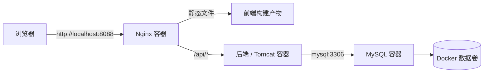

# 5.5 部署验证：本地 Docker 与可访问系统

## 不在 IDE 中运行，也能让系统稳定访问

!!! quote "部署成功，不是看到容器显示 Up"
    Docker 容器启动，只说明进程可能正在运行；它不代表浏览器可以访问、前端能调用接口、数据库正确初始化，更不代表核心业务流程能够完成。

    本节要在相对干净的本地或局域网环境中，按部署说明启动数据库、后端、前端或 Tomcat/Nginx 服务；然后从浏览器访问系统，重新执行核心流程，并记录地址、命令、日志和验证证据。

!!! tip "本节学习目标"
    使用 Docker 和 Docker Compose 将项目所需服务启动起来，理解容器、端口、服务名、日志与数据卷的基本作用；完成浏览器访问、登录、核心流程和部署后数据验证，形成真实可访问的部署版本。

[返回上一节：完成部署准备](04-deployment-preparation.md){ .md-button }
[返回第四篇：项目开发与业务实现](../chapter04/index.md){ .md-button }

---

## 🎯 本节完成后，你要交付

| 成果 | 要求 |
| :--- | :--- |
| Docker 部署配置 | `Dockerfile`、`docker-compose.yml`、Nginx 配置（如适用）与当前代码一致 |
| 运行中的服务 | 数据库、应用服务、前端或 Nginx 容器能够正常启动 |
| 可访问系统 | 浏览器通过本机或局域网地址打开系统，不依赖 IDE 运行 |
| 部署验证记录 | 记录启动命令、服务状态、访问地址、测试账号、日志与截图 |
| 部署后核心流程证据 | 在部署环境中重新完成一次登录与核心业务流程 |
| 问题与处理记录 | 记录容器启动、网络、数据库、配置等实际问题及处理方式 |

!!! warning "本节最低要求"
    至少完成**本机 Docker 部署**：关闭 IDE 中运行的服务后，仍能通过浏览器访问项目，并在部署环境中完成一条核心流程。局域网访问、云服务器、域名和 HTTPS 属于进阶要求。

---

## 一、先理解 Docker 部署中的几个角色

Docker 不要求你立刻掌握复杂运维知识，但需要理解项目中的几个基本对象。

| 对象 | 作用 | 课程项目中的例子 |
| :--- | :--- | :--- |
| 镜像（Image） | 打包运行环境和程序的只读模板 | MySQL 8、Nginx、后端 JAR、Tomcat WAR |
| 容器（Container） | 基于镜像实际运行的实例 | `project-mysql`、`project-backend`、`project-nginx` |
| Dockerfile | 说明怎样构建自定义镜像 | 编译 Spring Boot 后端、复制 WAR 到 Tomcat |
| Docker Compose | 一次定义并启动多个关联服务 | MySQL + 后端 + 前端 + Nginx |
| 网络（Network） | 让容器通过服务名互相访问 | 后端通过 `mysql:3306` 访问数据库 |
| 数据卷（Volume） | 保存容器外的持久数据 | MySQL 数据、上传文件、日志 |
| 端口映射 | 把容器端口暴露给本机浏览器 | `8088:80`、`3306:3306` |

### 一个典型的访问链路



!!! info "容器内的 localhost 不是你的电脑"
    后端容器中的 `localhost` 只表示后端容器本身。若数据库也在 Docker Compose 中运行，后端应通过服务名 `mysql` 连接数据库，例如 `jdbc:mysql://mysql:3306/project_db`。

---

## 二、第一步：确认 Docker 环境与项目文件

### 1. 检查 Docker 是否可用

在终端执行：

```bash
docker --version
docker compose version
```

若使用旧版 Docker Compose，也可能是：

```bash
docker-compose --version
```

建议记录：

| 项目 | 实际版本 |
| :--- | :--- |
| 操作系统 | 【填写】 |
| Docker Desktop / Docker Engine | 【填写】 |
| Docker Compose | 【填写】 |
| 可用磁盘空间 | 【填写】 |

### 2. 检查部署目录

部署前确认项目至少包含：

```text
project/
├── backend/
│   ├── Dockerfile                 # Spring Boot 路线通常需要
│   └── pom.xml
├── frontend/
│   ├── Dockerfile                 # 前后端分离项目通常需要
│   └── package.json
├── deploy/
│   ├── docker-compose.yml
│   └── nginx/
│       └── default.conf
├── sql/
│   └── init.sql                   # 或数据库迁移目录
├── .env                            # 本机私有部署变量，不提交 Git
└── README.md
```

Servlet + HTML + CSS + JavaScript 路线的目录可能为：

```text
project/
├── pom.xml
├── src/main/webapp/
├── deploy/
│   ├── Dockerfile                 # 基于 Tomcat 的镜像
│   ├── docker-compose.yml
│   └── nginx/default.conf
├── sql/init.sql
└── README.md
```

### 3. 从配置中核对服务名

打开 `docker-compose.yml`，确认服务和依赖关系：

```yaml
services:
  mysql:
    image: mysql:8.0

  backend:
    build: ./backend
    depends_on:
      - mysql
    environment:
      DB_HOST: mysql

  nginx:
    image: nginx:stable
    depends_on:
      - backend
```

检查重点：

- [ ] MySQL 服务名与后端的数据库主机名一致；
- [ ] 后端服务名与 Nginx `proxy_pass` 一致；
- [ ] 前端接口使用 `/api` 或实际代理地址；
- [ ] 数据库名、账号、密码来自 `.env` 或环境变量；
- [ ] 不在 Compose 中写入真实个人密码或第三方密钥；
- [ ] 数据卷用于保存 MySQL、上传文件或日志（如适用）。

---

## 三、第二步：准备本机部署变量与端口

### 1. 创建本机 `.env` 文件

如果项目提供了 `deploy/.env.example`，复制后填写本机实际值：

```bash
cp deploy/.env.example deploy/.env
```

示例：

```text
# deploy/.env，仅保存在本机，不提交 Git
MYSQL_ROOT_PASSWORD=your-local-root-password
DB_NAME=project_db
DB_USER=project_user
DB_PASSWORD=your-local-db-password
JWT_SECRET=replace-with-a-long-random-string
APP_PORT=8080
WEB_PORT=8088
```

确认 `.gitignore` 已忽略：

```gitignore
.env
*.local
```

### 2. 处理端口冲突

如果端口已经被本机程序占用，Compose 会启动失败。常见默认端口：

| 服务 | 常用端口 | 冲突时可改为 |
| :--- | :---: | :---: |
| MySQL | 3306 | 3307、13306，或不映射到宿主机 |
| 后端 / Tomcat | 8080 | 8081、18080 |
| Vue 开发服务 | 5173 | 5174（部署后通常不需要） |
| Nginx | 80 | 8088、8888 |

检查端口：

=== "macOS / Linux"

    ```bash
    lsof -i :8088
    lsof -i :3306
    ```

=== "Windows PowerShell"

    ```powershell
    netstat -ano | findstr :8088
    netstat -ano | findstr :3306
    ```

!!! tip "优先暴露 Nginx，不必暴露所有服务"
    课程项目通常只需让浏览器访问 Nginx，例如 `http://localhost:8088`。MySQL 和后端可只在 Docker 网络中互通，减少端口冲突和误操作。

---

## 四、第三步：构建并启动服务

### 1. 首次构建与后台启动

在 `docker-compose.yml` 所在目录执行：

```bash
docker compose up -d --build
```

含义：

```text
up       创建并启动服务
-d        后台运行，终端可以继续执行其他命令
--build   重新构建本项目的自定义镜像
```

首次执行会下载基础镜像和依赖，耗时可能较长。不要因为短时间没有页面就重复执行多次启动命令。

### 2. 查看服务状态

```bash
docker compose ps
```

理想结果示例：

```text
NAME                 STATUS          PORTS
project-mysql        running         3306/tcp
project-backend      running         8080/tcp
project-nginx        running         0.0.0.0:8088->80/tcp
```

状态解释：

| 状态 | 含义 | 建议 |
| :--- | :--- | :--- |
| running / Up | 容器正在运行 | 继续检查日志和浏览器访问 |
| exited | 容器已经退出 | 查看该服务日志，定位启动失败原因 |
| restarting | 容器不断启动又退出 | 通常是配置、数据库连接或应用异常 |
| created | 容器已创建但未正常启动 | 检查依赖服务和启动命令 |

### 3. 常用 Compose 命令

```bash
# 查看实时日志
docker compose logs -f

# 只查看后端日志
docker compose logs -f backend

# 只查看数据库日志
docker compose logs -f mysql

# 停止并删除容器、网络（保留命名卷）
docker compose down

# 停止并同时删除数据卷：会清空数据库数据，谨慎使用
docker compose down -v

# 重启指定服务
docker compose restart backend

# 重新构建并启动某个服务
docker compose up -d --build backend
```

!!! warning "`docker compose down -v` 会删除数据卷"
    如果 MySQL 使用 Docker Volume 保存数据，执行 `down -v` 可能清空测试数据。执行前先确认是否需要备份，或准备好重新导入初始化脚本。

---

## 五、第四步：按服务查看日志，而不是猜测

容器无法访问时，优先看日志，不要先盲目修改十几个配置。

### 1. MySQL 日志

```bash
docker compose logs mysql
```

关注：

- 初始化是否完成；
- 数据库、账号是否成功创建；
- 密码或权限是否错误；
- 数据卷中是否存在旧版本数据；
- 端口是否冲突（若映射到本机）。

### 2. 后端或 Tomcat 日志

```bash
docker compose logs backend
# Servlet + Tomcat 路线按实际服务名替换，例如：
docker compose logs tomcat
```

关注：

- 数据库连接地址是否写成错误的 `localhost`；
- 缺少环境变量、配置文件或密钥；
- 数据库表是否存在；
- JAR/WAR 是否成功加载；
- 后端是否监听预期端口；
- 是否出现未处理异常或启动失败堆栈。

### 3. Nginx 日志

```bash
docker compose logs nginx
```

关注：

- 配置文件是否加载成功；
- `proxy_pass` 的服务名、端口是否正确；
- 静态文件目录是否存在；
- 访问 API 时是否返回 502、404 或 504。

### 4. 日志记录表

| 服务 | 现象 | 关键日志 | 判断 | 处理方式 |
| :--- | :--- | :--- | :--- | :--- |
| MySQL | 【填写】 | 【填写】 | 【填写】 | 【填写】 |
| 后端/Tomcat | 【填写】 | 【填写】 | 【填写】 | 【填写】 |
| Nginx | 【填写】 | 【填写】 | 【填写】 | 【填写】 |

!!! info "日志中可以有警告，但不能忽略错误"
    某些库会输出非阻断警告。是否能接受，应结合服务状态、浏览器访问、核心流程和错误堆栈判断。只要存在连接失败、表不存在、权限不足、反复重启等问题，就需要记录并处理。

---

## 六、第五步：验证浏览器、接口和核心流程

### 1. 先完成部署冒烟验证

打开浏览器访问部署地址，例如：

```text
http://localhost:8088
```

依次检查：

- [ ] 首页或登录页可以打开；
- [ ] 页面静态资源（CSS、JS、图片）正确加载；
- [ ] 浏览器控制台没有持续报错；
- [ ] 正确账号可以登录；
- [ ] 错误账号或密码被拒绝；
- [ ] 登录后可访问受限页面；
- [ ] 接口请求地址正确，不出现大量 404、502 或 CORS 错误；
- [ ] 一个主要列表可以读取数据库真实数据；
- [ ] 创建或修改一条数据后，刷新页面仍存在；
- [ ] 退出登录后受限页面和接口不能继续访问。

### 2. 用浏览器开发者工具验证接口

打开浏览器开发者工具的 **Network** 面板，完成一次登录和核心操作，检查：

| 检查项 | 正常表现 |
| :--- | :--- |
| 请求地址 | 使用 `/api/...` 或部署环境实际地址，不是开发机固定地址 |
| 请求方法 | GET / POST / PUT / DELETE 与接口设计一致 |
| 响应状态码 | 成功、参数错误、未登录、无权限分别合理返回 |
| 响应内容 | 不包含堆栈、数据库密码和敏感内部信息 |
| 请求耗时 | 没有长时间卡住或重复发起 |
| Cookie / Token | 登录后存在，退出后失效 |

### 3. 在部署环境重新执行核心流程

不要只验证首页和登录。必须在 Docker 部署环境中重新执行 5.2 的核心流程用例。

```text
部署环境启动
→ 使用测试账号登录角色 A
→ 发起核心业务
→ 切换角色 B
→ 处理下一状态
→ 必要时切换角色 C
→ 回到角色 A 查看最终结果
→ 检查数据与状态
```

核心流程验证记录：

| 步骤 | 角色 | 操作 | 部署环境预期结果 | 实际结果 | 证据 |
| :---: | :--- | :--- | :--- | :--- | :--- |
| 1 | 【填写】 | 【填写】 | 【填写】 | 【填写】 | 【截图 / 接口】 |
| 2 | 【填写】 | 【填写】 | 【填写】 | 【填写】 | 【截图 / 接口】 |
| 3 | 【填写】 | 【填写】 | 【填写】 | 【填写】 | 【截图 / 接口】 |

!!! failure "开发环境通过，不等于部署环境通过"
    只有在 Docker 启动的环境中重新走通核心流程，才能证明配置、网络、数据库和构建产物真正匹配。

---

## 七、第六步：验证容器重启和数据持久化

部署环境不仅要“第一次能跑”，还要确认重启后数据和服务是否正确恢复。

### 1. 重启应用服务

```bash
docker compose restart backend
# 或 Servlet 路线：
docker compose restart tomcat
```

重启后检查：

- 服务是否恢复 running；
- 浏览器是否可以重新访问；
- 之前新增的业务数据是否仍存在；
- 登录状态是否符合预期（Session 可能失效是正常的，但应能重新登录）；
- 后端日志是否有新的错误。

### 2. 重启全部服务

```bash
docker compose down
docker compose up -d
docker compose ps
```

如果数据库使用命名卷，数据应保留。若项目希望每次从初始化数据开始，应在 README 中明确如何执行重置，而不是让学生猜测是否应使用 `down -v`。

### 3. 数据持久化验证表

| 验证项 | 操作 | 预期结果 | 实际结果 |
| :--- | :--- | :--- | :--- |
| 业务数据保留 | 新增测试记录后重启应用 | 记录仍可查询 | 【填写】 |
| 数据库卷保留 | `down` 后重新 `up` | 未删除 Volume 时数据仍存在 | 【填写】 |
| 初始化可恢复 | 删除测试数据后按说明重置 | 恢复初始账号和演示数据 | 【填写】 |
| 上传文件（如有） | 上传文件后重启容器 | 文件仍可访问 | 【填写】 |

---

## 八、常见部署问题与排查方向

| 现象 | 可能原因 | 优先检查 |
| :--- | :--- | :--- |
| `docker compose up` 失败 | YAML 缩进、端口冲突、镜像下载失败 | Compose 文件、端口、网络 |
| MySQL 容器反复退出 | 初始化密码缺失、旧数据卷与变量冲突 | MySQL 日志、`.env`、Volume |
| 后端连不上数据库 | `DB_HOST=localhost`、密码错误、数据库未就绪 | 后端日志、服务名、`depends_on`、账号权限 |
| 后端报“表不存在” | 初始化脚本未执行、库名错误、旧数据库卷 | SQL 脚本、数据库连接配置 |
| 页面显示 502 | Nginx 无法连接后端 | `proxy_pass` 服务名、后端端口、后端状态 |
| 页面显示 404 | Nginx location、前端路由或 context path 不一致 | Network 请求、Nginx 配置、后端路径 |
| 浏览器跨域报错 | 前后端跨域、CORS 配置错误 | 优先用 Nginx `/api` 同源代理 |
| 页面能打开但数据为空 | API 地址错误、数据库无数据、登录凭据失效 | Network 响应、初始化脚本、账号状态 |
| 重新启动后数据丢失 | 未使用 Volume，或执行了 `down -v` | Compose volumes、操作历史 |
| 静态资源 404 | 前端构建目录或 Nginx root 配置错误 | `dist/`、Dockerfile、Nginx root |

### 推荐排查顺序

```text
1. docker compose ps：哪些服务没有 running？
→ 2. docker compose logs <服务名>：第一个明确错误是什么？
→ 3. 检查 .env 与配置：服务名、端口、账号、库名是否一致？
→ 4. 用浏览器 Network：请求实际发到哪里，返回什么状态？
→ 5. 检查数据库：表和数据是否存在？
→ 6. 修复一个明确问题后，只重启受影响服务并重新验证。
```

不要一遇到问题就执行 `docker system prune -a`、删除所有 Volume 或重新安装 Docker。这些操作可能清除有价值的数据，并不能帮助理解根因。

---

## 九、进阶：局域网与云服务器访问

本机 Docker 部署通过后，可根据实际条件尝试进阶部署。

### 1. 局域网访问

让同一 Wi-Fi 或实验室网络中的同学访问：

```text
http://你的局域网IP:8088
```

检查：

- 电脑防火墙是否允许端口；
- 服务是否绑定到 `0.0.0.0` 而不是仅 `127.0.0.1`；
- 路由器或校园网络是否隔离设备；
- 前端没有写死 `localhost` 接口地址；
- 同学可使用独立浏览器和账号完成核心流程。

### 2. 云服务器部署（可选）

云部署前应额外准备：

- Linux 基础命令与远程登录；
- Docker 与 Docker Compose；
- 防火墙和安全组端口；
- 域名与 HTTPS（可选）；
- 数据库备份、日志查看和容器更新方案；
- 不使用默认弱密码；
- 不暴露数据库端口到公网。

!!! warning "不要为了“公网地址”牺牲安全"
    如果还没有理解密码、端口、防火墙和备份，先完成本机或局域网部署即可。一个稳定可复现的本地 Docker 部署，比一个短暂可访问但配置泄露的公网服务更有价值。

---

## 十、填写部署验证记录模板

将以下内容复制到项目的 `docs/部署说明.md`、`docs/testing/部署验证记录.md` 或《测试报告》的部署章节。

```markdown
# 【项目名称】部署验证记录

## 1. 部署版本与环境

| 项目 | 内容 |
| :--- | :--- |
| 代码版本 | 【分支 / 标签 / 提交编号】 |
| 部署日期 | 【填写】 |
| 部署人员 | 【填写】 |
| 部署目标 | 本机 Docker / 局域网 / 云服务器 |
| Docker / Compose 版本 | 【填写】 |
| 操作系统 | 【填写】 |

## 2. 启动记录

启动目录：【填写】

```bash
# 实际执行命令
【填写】
```

| 服务 | 容器名称 | 状态 | 端口映射 | 关键日志结论 |
| :--- | :--- | :--- | :--- | :--- |
| MySQL | 【填写】 | running / failed | 【填写】 | 【填写】 |
| 后端 / Tomcat | 【填写】 | running / failed | 【填写】 | 【填写】 |
| Nginx | 【填写】 | running / failed | 【填写】 | 【填写】 |

## 3. 访问与冒烟验证

- 浏览器访问地址：【填写】
- 接口地址：【填写】
- 测试账号：【填写】

| 编号 | 验证项 | 预期结果 | 实际结果 | 状态 | 证据 |
| :--- | :--- | :--- | :--- | :--- | :--- |
| DEP-01 | 首页或登录页访问 | 正确显示 | 【填写】 | 通过/失败 | 【填写】 |
| DEP-02 | 正确账号登录 | 登录成功 | 【填写】 | 通过/失败 | 【填写】 |
| DEP-03 | 主要列表读取数据 | 显示数据库数据 | 【填写】 | 通过/失败 | 【填写】 |
| DEP-04 | 未登录访问受限资源 | 被拒绝 | 【填写】 | 通过/失败 | 【填写】 |

## 4. 核心流程部署验证

| 步骤 | 角色 | 操作 | 预期结果 | 实际结果 | 状态 | 证据 |
| :---: | :--- | :--- | :--- | :--- | :--- | :--- |
| 1 | 【填写】 | 【填写】 | 【填写】 | 【填写】 | 通过/失败 | 【填写】 |
| 2 | 【填写】 | 【填写】 | 【填写】 | 【填写】 | 通过/失败 | 【填写】 |
| 3 | 【填写】 | 【填写】 | 【填写】 | 【填写】 | 通过/失败 | 【填写】 |

## 5. 重启与数据持久化验证

| 项目 | 操作 | 预期结果 | 实际结果 | 状态 |
| :--- | :--- | :--- | :--- | :--- |
| 应用重启 | 【填写】 | 服务恢复、数据仍存在 | 【填写】 | 通过/失败 |
| 服务整体重启 | 【填写】 | 服务恢复、数据卷保留 | 【填写】 | 通过/失败 |
| 数据重置 | 【填写】 | 可恢复初始测试数据 | 【填写】 | 通过/失败 |

## 6. 部署问题与处理

| 编号 | 现象 | 根因 | 处理方式 | 是否已验证 |
| :--- | :--- | :--- | :--- | :--- |
| DEP-BUG-01 | 【填写】 | 【填写】 | 【填写】 | 是/否 |

## 7. 结论

- [ ] 服务全部正常运行
- [ ] 浏览器可访问系统
- [ ] 登录、权限与核心流程在部署环境通过
- [ ] 重启后服务和数据符合预期
- [ ] 已知限制已记录

部署结论：【通过 / 有条件通过 / 不通过】
```

---

## 十一、提交前自查

- [ ] 已在关闭 IDE 运行服务后完成 Docker 启动；
- [ ] `docker compose ps` 中必要服务均为 running；
- [ ] 已检查 MySQL、后端/Tomcat、Nginx 日志；
- [ ] 已通过浏览器访问实际部署地址；
- [ ] 已验证静态资源、登录、列表与至少一个写操作；
- [ ] 已使用浏览器 Network 或接口工具检查部署环境 API；
- [ ] 已在部署环境重新执行核心业务流程；
- [ ] 已验证未登录和越权请求仍被正确拒绝；
- [ ] 已验证重启后应用和数据的行为；
- [ ] 已记录访问地址、命令、版本、截图和实际问题；
- [ ] 没有把真实密码、密钥或本机私有 `.env` 提交到 Git；
- [ ] 已知限制和未解决问题已如实记录。

---

## 本节小结

部署验证不是“把代码放进 Docker”就结束，而是证明项目能够在独立环境中持续运行：

> 准备部署变量 → 构建并启动容器 → 查看服务状态与日志 → 浏览器访问 → 验证接口与核心流程 → 重启服务 → 检查数据持久化 → 记录真实结果。

完成本节后，项目已经具备可访问、可复现的部署版本。下一节将整理 README、测试报告、部署材料和最终交付清单，形成 `v1.0` 课程项目版本。

[下一节：5.6 整理交付：README、测试报告与 v1.0](06-project-delivery.md){ .md-button .md-button--primary }
[返回上一节：完成部署准备](04-deployment-preparation.md){ .md-button }
