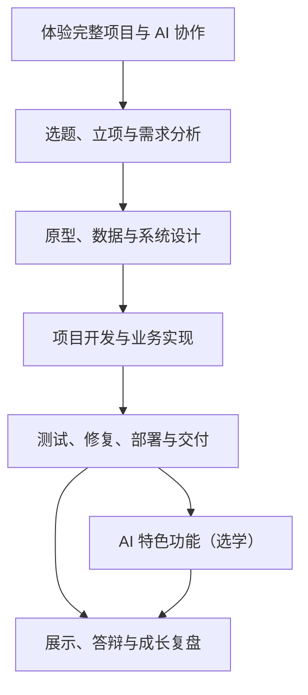

# 课程导学：项目阶段与弹性推进

## 用一个真实项目贯穿课程，按完成情况进入下一阶段

!!! quote "课程路线是方向，不是不能调整的日历"
    这门课以一个真实软件项目贯穿学习过程。你将经历项目体验、选题、需求、设计、开发、测试、部署、展示和复盘，最终完成一件能够运行、能够验证、也能够讲清楚的软件作品。

    不同班级的课时、基础和项目难度不同，实际进度可能受到节假日、竞赛、实习、设备和技术问题影响。因此，本课程按**项目阶段和可检查成果**推进，不要求每一周机械完成同一项任务。教师可以根据实际情况合并、拆分、提前或延后某个阶段。

!!! tip "课程推进原则"
    不以“讲到了第几周”判断进度，而以“当前阶段的关键成果是否完成并通过检查”决定是否进入下一阶段。

[开始第一篇：AI 协同开发实战](../chapter01/index.md){ .md-button .md-button--primary }
[学习与 AI 协作规范](learning-method.md){ .md-button }
[进入项目选题库](../projects/index.md){ .md-button }

---

## 一、这门课最终要完成什么

课程最终交付的不是一个临时运行的代码压缩包，而是一套完整项目成果：

- 一个具有真实业务背景的软件系统；
- 一条能够连续演示的核心业务流程；
- 前端、后端、数据库和接口的协同实现；
- 登录、权限、参数和异常处理；
- 需求、设计、测试、部署和复盘文档；
- 连续、真实、能够解释的 Git 提交记录；
- 可复现的运行或部署方式；
- 项目演示、答辩和个人贡献说明；
- AI 协作过程及人工验证证据；
- 可选的 AI 或其他特色功能。

完成课程后，你应能够：

1. 从真实问题中确定范围可控的项目；
2. 按软件开发过程组织需求、设计、开发、测试和交付；
3. 使用 Git 管理版本和团队协作；
4. 使用 AI 辅助分析、编码、调试、测试和文档整理；
5. 阅读、验证并修改 AI 生成的结果；
6. 完成具有权限和业务规则的核心流程；
7. 通过测试、部署和文档证明项目真实可用；
8. 在答辩中解释项目决策、关键代码和个人贡献。

---

## 二、项目成长路线



路线表达的是前后依赖，不代表每个阶段必须占用固定周数。

例如：

- 需求较简单的项目可以较快进入设计和开发；
- 数据关系复杂的项目可以增加设计评审时间；
- 基础较弱的班级可以延长脚手架学习和第一个模块开发；
- 已有较好基础的团队可以提前进行测试；
- AI 特色功能是选学内容，可以不做，也可以在基础项目交付后完成；
- 测试不是最后才开始，开发过程中应持续进行；
- 文档和 Git 记录应跟随项目更新，不应全部留到期末。

---

## 三、课程阶段与关键成果

| 阶段 | 核心问题 | 关键成果 | 进入下一阶段的判断 |
| :--- | :--- | :--- | :--- |
| 项目体验 | 一个完整项目怎样运行和协作？ | 示例项目运行记录、第一次 AI 协作与 Git 提交 | 能运行、修改并验证示例 |
| 选题与需求 | 为谁解决什么问题，做到什么程度？ | 立项书、用户角色、业务流程、需求和验收条件 | 核心需求明确、范围可控 |
| 原型与设计 | 页面、数据、接口和权限怎样支持业务？ | 原型、架构、ER 图、表结构、接口和设计说明 | 核心流程能在设计中走通 |
| 项目开发 | 怎样形成可运行的完整业务闭环？ | 登录权限、业务模块、前后端联调和集成版本 | 核心流程可连续演示 |
| 测试与交付 | 怎样证明项目正确、可部署、可复现？ | 测试报告、缺陷闭环、部署版本、README 和 `v1.0` | 严重问题关闭，干净环境可运行 |
| AI 扩展（选学） | 怎样增加一个安全、可降级的 AI 功能？ | 一个小而完整的 AI 功能、测试和降级记录 | AI 关闭后基础业务仍正常 |
| 展示与复盘 | 怎样让别人看懂成果并沉淀能力？ | 视频、PPT、贡献说明、作品集和复盘报告 | 能用证据解释项目和个人成长 |

!!! info "阶段可以交叉，但不能跳过关键判断"
    开发中发现需求不清，可以返回需求阶段补充；联调中发现数据设计错误，可以返回设计阶段修正。迭代不是退步，而是软件项目的正常过程。

---

## 四、怎样弹性安排一个学期

如果课程采用常见的 16 周学期，可以将其理解为几个宽松阶段，而不是逐周任务表：

| 大致阶段 | 建议关注 | 可调整方式 |
| :--- | :--- | :--- |
| 学期前段 | 项目体验、选题、需求和设计 | 选题复杂时增加范围评审；示例项目可根据基础缩短或延长 |
| 学期中段 | 项目骨架、登录权限和核心业务 | 优先完成一个纵向闭环，再扩展其他模块 |
| 学期后段 | 集成、测试、修复、部署和文档 | 开发延误时主动缩减非核心功能，保留测试和交付时间 |
| 课程收尾 | 演示、答辩、贡献说明和复盘 | 与学院安排、考试周和答辩形式协调 |
| 机动与选学 | AI 或其他特色功能 | 只有基础项目稳定后才安排，可独立取消 |

!!! warning "不要把最后阶段全部留给测试"
    测试、文档和 Git 记录应贯穿项目。学期后段的重点是系统化执行、缺陷闭环和部署验证，不是第一次开始测试。

### 进度调整的优先级

当实际进度落后时，按以下顺序处理：

```text
保留核心业务闭环
→ 保留登录、权限和数据正确性
→ 保留测试、部署和 README
→ 缩减次要页面和非核心模块
→ 取消不稳定的特色功能
→ AI 扩展最后考虑
```

不要为了保留一个复杂特色功能，牺牲测试、权限和核心流程。

---

## 五、每个阶段怎样推进

无论一个阶段使用多少课时，都可以采用相同循环：

```text
明确本阶段目标
→ 查看已有材料和代码
→ 拆分最小任务
→ 人工与 AI 协作完成
→ 运行和测试
→ 记录问题与证据
→ Git 提交
→ 阶段检查
→ 决定继续、修正或缩减
```

### 阶段任务要足够小

避免：

```text
完成整个后台。
把项目全部做完。
优化用户体验。
```

推荐：

```text
完成管理员新增图书接口，并验证重复编号被拒绝。
完成用户提交报修页面，与真实接口联调。
修复普通用户能够访问管理员删除接口的问题。
在干净数据库中验证 Docker 启动和登录流程。
```

### 每次检查都要有证据

| 结论 | 可用证据 |
| :--- | :--- |
| 功能完成 | 页面操作、接口响应、数据库结果 |
| 权限正确 | 未登录、普通用户和管理员的实际测试 |
| 问题修复 | 修复前现象、提交记录和回归结果 |
| 可以部署 | 构建日志、容器状态和访问截图 |
| AI 有帮助 | 提示词、人工修改和测试结果 |
| 阶段完成 | 演示记录、问题清单和版本标签 |

---

## 六、重要里程碑

课程不要求所有项目在同一日期达到里程碑，但每个项目都应经过这些状态：

### M1：项目已立项

- 目标用户和真实问题明确；
- 核心范围和明确不做的内容已经确定；
- 团队分工和风险基本清楚。

### M2：需求可验收

- 用户角色、核心流程和业务规则明确；
- 核心需求具有可测试的验收条件；
- 原型能够走通主要流程。

### M3：设计可开发

- 架构、数据表、接口、权限和状态规则基本一致；
- 设计评审中的阻断问题已经处理；
- 项目脚手架和技术方案可用。

### M4：核心业务可演示

- 登录、权限和核心模块已经集成；
- 业务流程可以从开始连续走到结束；
- 不依赖静态页面、模拟数据或手工改数据库。

### M5：项目可交付

- 核心需求有测试证据；
- 严重缺陷已经修复；
- 项目能够构建、启动和部署；
- README、配置和初始化方式完整；
- 已形成 `v1.0` 或等价交付版本。

### M6：成果可展示

- 演示视频和答辩材料完整；
- 个人贡献有证据；
- 已知限制和后续计划真实；
- 能回答“做了什么、为什么这样做、怎样验证”。

---

## 七、技术路线与项目范围

课程推荐：

- JDK 17、Spring Boot 3、Maven；
- MyBatis 或 MyBatis-Plus；
- MySQL 或课程允许的数据库；
- Vue 3 或适合项目的前端方案；
- Git、接口测试工具和 AI 编程工具；
- Nginx、Docker 等部署工具。

技术栈不是唯一评价标准。Servlet、JDBC 和原生前端也可以完成项目，只要能够：

- 支持真实业务；
- 正确处理登录和权限；
- 稳定读写数据库；
- 完成测试和部署；
- 由项目成员理解和解释。

!!! tip "项目范围优先于技术复杂度"
    一个范围合适、业务完整、测试充分的小项目，比使用大量框架却无法交付的项目更有价值。

---

## 八、AI 协作贯穿所有阶段

AI 可以辅助：

- 调研和整理项目思路；
- 检查需求是否清楚；
- 比较设计方案；
- 生成原型、接口、代码和测试初稿；
- 分析错误日志；
- 帮助拆分修复步骤；
- 检查文档与代码的一致性；
- 准备演示和答辩问题。

每次协作都应遵循：

```text
提供真实上下文
→ 说明当前目标和限制
→ AI 提出方案
→ 人工判断
→ 分步实施
→ 运行验证
→ 修正问题
→ 保存证据
```

!!! failure "AI 不能替代真实项目过程"
    不能让 AI 编造用户调研、测试结果、部署地址、团队贡献和教师评价。不能提交自己无法运行、无法解释和没有验证的代码。

详细要求参见[学习与 AI 协作规范](learning-method.md)。

---

## 九、文档和过程记录不求多，要求真实

建议保留：

- 项目立项与范围；
- 需求和验收条件；
- 系统设计与关键决策；
- 开发任务和 Git 提交；
- AI 协作记录；
- 测试用例、缺陷和回归结果；
- 集成验收和部署记录；
- README、演示和复盘材料。

模板可以根据项目规模删减。不要重复维护同一个事实，也不要为了篇幅制造空泛内容。

[使用文档与任务模板](../doc-templates/index.md){ .md-button }

---

## 十、遇到进度变化怎么办

### 1. 先看阻塞原因

| 原因 | 建议处理 |
| :--- | :--- |
| 需求范围过大 | 冻结新增需求，保留最小核心流程 |
| 技术学习成本过高 | 回到课程脚手架或熟悉方案 |
| 团队协作不同步 | 明确主责模块，统一接口和集成时间 |
| 缺陷过多 | 暂停新增功能，优先关闭严重问题 |
| 部署困难 | 提前验证最小部署，不等所有页面完成 |
| 外部服务不稳定 | 增加模拟和降级，必要时取消特色功能 |
| 课程安排变化 | 调整里程碑，不伪造阶段成果 |

### 2. 调整后要更新什么

- 当前项目范围；
- 阶段目标；
- 任务负责人；
- 风险和依赖；
- 验收标准；
- 预计交付内容；
- 已明确取消或推迟的功能。

调整计划不是降低要求，而是让有限时间优先保障完整交付。

---

## 十一、开始前检查

- [ ] 已理解课程按阶段成果推进，不机械绑定每周任务；
- [ ] 已准备基本开发环境和 Git；
- [ ] 已阅读 AI 协作规范；
- [ ] 已体验第一篇示例项目或确认具备等价基础；
- [ ] 已准备从真实问题选择项目；
- [ ] 接受项目范围需要根据实际进度调整；
- [ ] 接受测试、文档和部署也是项目开发的一部分；
- [ ] 接受先完成核心业务，再考虑 AI 或其他特色功能。

---

## 本页小结

课程路线可以概括为：

> 先体验完整项目 → 选好题并控制范围 → 让需求可验收 → 让设计能落地 → 完成核心业务闭环 → 用测试和部署证明成果 → 完成展示与复盘

实际教学不需要严格按照固定周次推进。只要始终保留阶段目标、关键成果和验收证据，就可以根据班级情况灵活调整节奏。

[开始第一篇：AI 协同开发实战](../chapter01/index.md){ .md-button .md-button--primary }
[进入第二篇：项目选题与需求分析](../chapter02/index.md){ .md-button }
[进入项目选题库](../projects/index.md){ .md-button }
