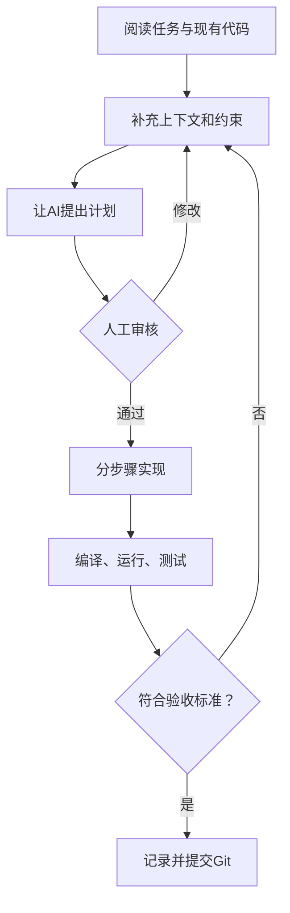

# 学习与AI协作规范

## AI可以参与什么

- 澄清需求、生成用户故事和检查遗漏；
- 比较技术方案并提出实施计划；
- 生成局部代码、测试用例和排错建议；
- 解释代码、分析日志、审查潜在问题；
- 协助整理 README、接口说明和演示提纲。

## 学生必须完成什么

- 确定项目边界和业务规则；
- 审核AI提出的设计与代码；
- 运行、测试并记录真实结果；
- 能解释本人负责的核心代码；
- 对项目安全、质量和真实性负责。

## 标准AI编程工作流

## 禁止行为

- 一次性要求AI生成整个系统；
- 不阅读、不运行就直接提交AI代码；
- 将密码、密钥、个人信息提交给公共模型；
- 伪造测试结果、开发记录或成员贡献；
- 无说明地大规模覆盖已有代码；
- 答辩时无法解释本人负责的功能。

## 每周AI协作记录

记录四项即可：

1. 本周任务；
2. 使用的关键提示词；
3. 采纳或拒绝了哪些建议；
4. 如何验证最终结果。
