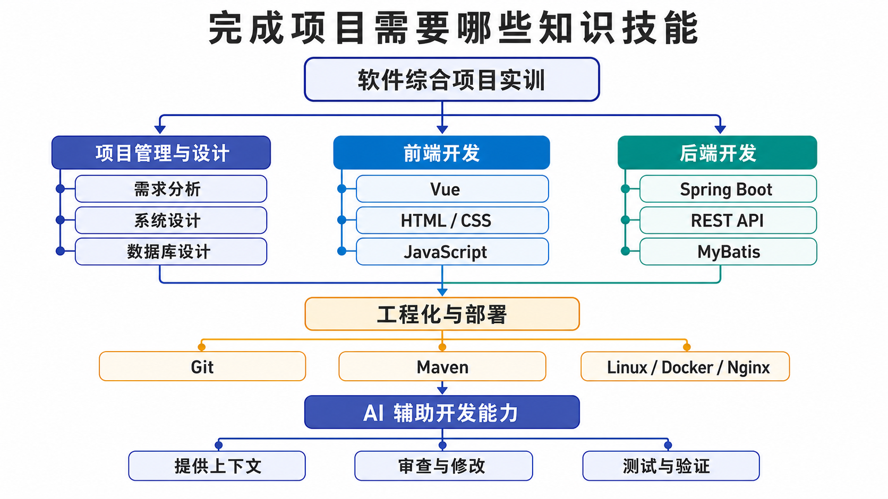
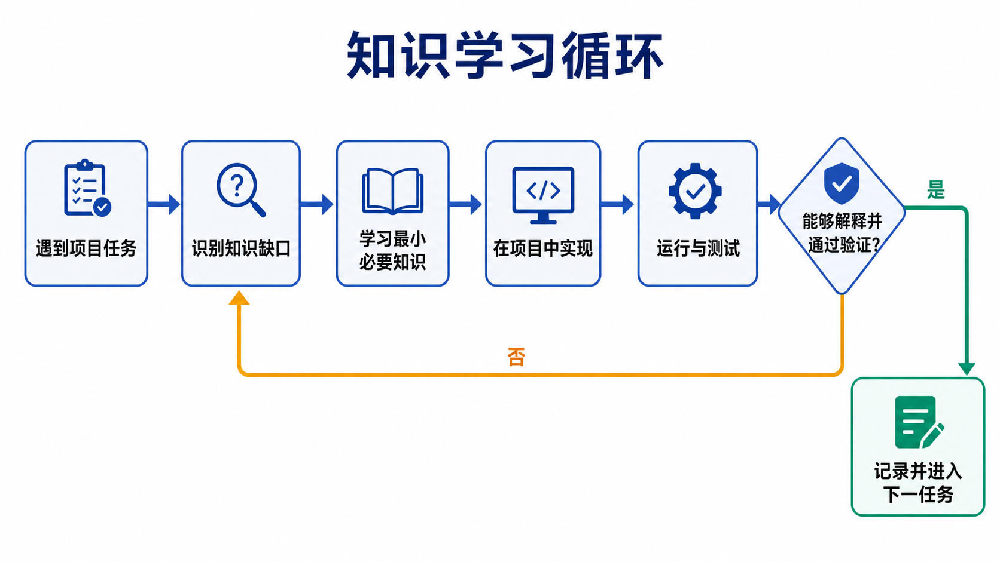
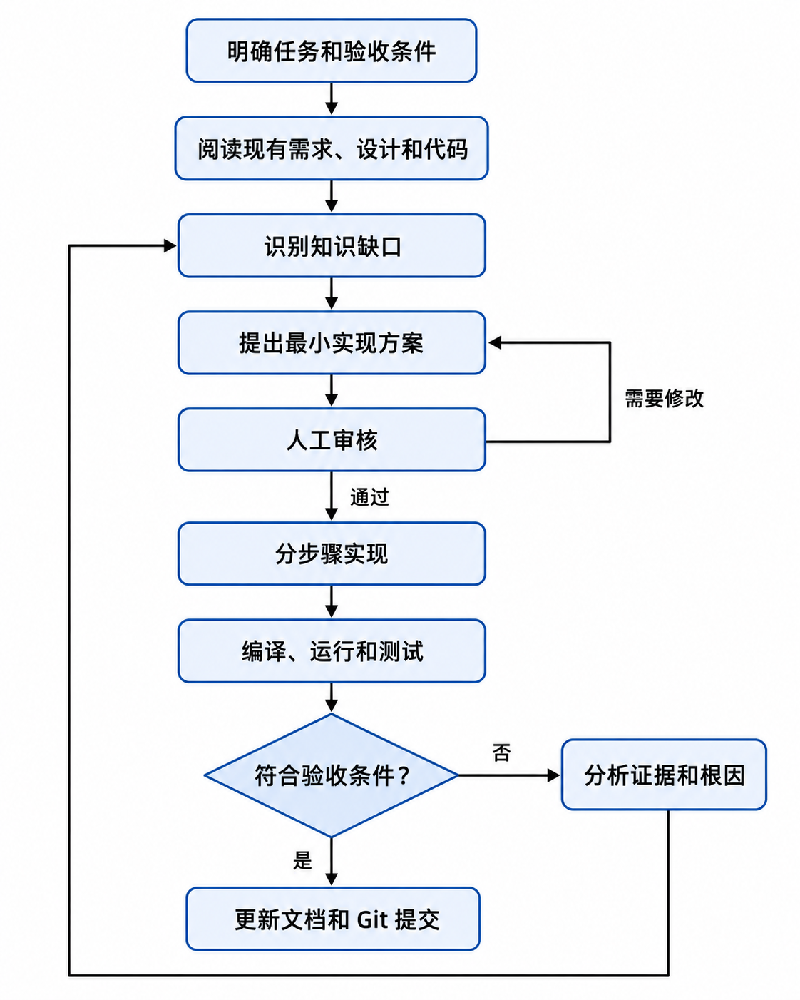

# 学习方法与 AI 协作规范

## 围绕真实项目按需学习，用运行和测试证明成果

!!! quote "不是学完所有知识再做项目，而是在项目中学习真正需要的知识"
    软件综合项目实训涉及需求、设计、前端、后端、数据库、测试、部署和表达，不可能在开始项目前把所有知识重新学一遍。

    正确的方法是先明确当前项目要解决的问题，再把项目拆成可以运行和验证的小任务。遇到不熟悉的知识时，学习完成当前任务所需的最小部分，立即在项目中使用，通过运行、测试和解释确认自己真正掌握。

!!! tip "本页核心"
    项目是学习主线，知识是解决问题的工具，AI 是协作伙伴，运行和测试是判断结果的依据，Git 和文档是保存过程证据的方式。

[返回课程导学](index.md){ .md-button }
[开始第一篇：AI 协同开发实战](../chapter01/index.md){ .md-button .md-button--primary }
[使用文档与任务模板](../doc-templates/index.md){ .md-button }

---

## 一、完成项目需要哪些知识技能

一个完整软件项目不是只写前端页面，也不是只实现后端接口。它需要多类知识协同工作。

{ width="100%" .shadow }

这张图不是先修课程清单，也不表示必须精通所有技术后才能开始。不同项目和技术路线需要的深度不同。

### 1. 项目管理与设计

| 能力 | 需要解决的问题 | 项目证据 |
| :--- | :--- | :--- |
| 需求分析 | 为谁解决什么问题，哪些功能必须完成 | 用户角色、业务流程、需求和验收条件 |
| 范围控制 | 本学期做什么、不做什么 | MVP 清单、优先级和变更记录 |
| 系统设计 | 页面、模块、接口和权限怎样协作 | 原型、架构图、模块图和接口设计 |
| 数据库设计 | 业务对象怎样保存和关联 | ER 图、表结构、约束和初始化脚本 |
| 任务拆分 | 怎样把大目标变成可完成的小任务 | 任务卡、看板和阶段计划 |
| 团队协作 | 谁负责什么，怎样集成 | 分工表、评审记录和 Git 历史 |

不要求先学习复杂的项目管理理论，但必须能够回答：

```text
当前要解决什么问题？
做到什么程度算完成？
下一步最小任务是什么？
怎样验证？
如果时间不足，优先保留什么？
```

### 2. 前端开发

| 能力 | 最低要求 | 进阶方向 |
| :--- | :--- | :--- |
| HTML | 能组织表单、表格、导航和内容结构 | 语义化与可访问性 |
| CSS | 能完成清晰、可用的页面布局 | 响应式布局与设计系统 |
| JavaScript | 能处理事件、数据和异步请求 | 模块化、错误处理和性能 |
| Vue | 能完成组件、状态、路由和接口联调 | 组件抽象、状态管理和复用 |
| 交互状态 | 能处理加载、空数据、错误和无权限 | 更完整的用户体验 |

前端完成的标准不是“页面看起来像”，而是：

```text
用户能够操作
→ 页面调用真实后端接口
→ 加载、成功和失败状态清楚
→ 刷新后数据仍然正确
→ 无权限操作不能只靠隐藏按钮
```

### 3. 后端开发

| 能力 | 最低要求 | 项目证据 |
| :--- | :--- | :--- |
| Java | 能理解类、对象、集合、异常和基本分层 | Service、DTO 和业务代码 |
| Spring Boot | 能运行项目、注入组件、读取配置 | 可启动后端和模块实现 |
| REST API | 能设计请求、响应、状态和错误 | 接口清单、测试响应 |
| MyBatis | 能完成数据库查询和写入 | Mapper、SQL 和数据库结果 |
| 参数校验 | 能拒绝空值、错误值和越界输入 | 异常测试 |
| 登录权限 | 能区分身份、角色和数据归属 | 401、403 和越权测试 |
| 业务规则 | 能实现状态变化和异常流程 | 核心业务闭环 |

后端不能只完成通用增删改查。真正的项目还要处理：

- 谁可以执行操作；
- 用户能操作哪些数据；
- 当前状态是否允许变化；
- 重复请求怎样处理；
- 数据不存在或冲突时返回什么；
- 前端绕过页面直接请求时是否仍然安全。

### 4. 工程化与部署

| 工具或能力 | 作用 | 最低成果 |
| :--- | :--- | :--- |
| Git | 保存版本、协作和过程证据 | 连续、可解释的提交 |
| Maven | 管理 Java 依赖、构建和测试 | 能执行构建和测试命令 |
| npm | 管理前端依赖和构建 | 能安装、运行和打包前端 |
| Linux | 运行服务、查看日志和管理文件 | 能完成基本部署操作 |
| MySQL | 保存项目数据 | 初始化脚本和备份方式 |
| Nginx | 提供前端资源和反向代理 | 可访问的统一入口 |
| Docker | 统一运行环境 | 可选的一键启动方案 |
| 测试工具 | 验证接口和业务流程 | 测试记录和缺陷闭环 |

工程化能力解决的是：

```text
不只在我的电脑上运行
不只由我知道怎样启动
不只在代码没有变化时偶尔成功
```

### 5. AI 辅助开发能力

使用 AI 不只是“会提问”。需要形成以下能力：

| 能力 | 表现 |
| :--- | :--- |
| 提供上下文 | 说明项目、版本、已有代码、错误和限制 |
| 拆分任务 | 一次只让 AI 处理一个可验证的小目标 |
| 审查方案 | 比较建议是否符合需求、架构和权限 |
| 阅读代码 | 知道代码放在哪里、为什么这样写 |
| 运行验证 | 编译、测试并检查真实结果 |
| 发现幻觉 | 核对不存在的接口、依赖、文件和数据 |
| 安全意识 | 不提交密码、密钥和隐私数据 |
| 过程记录 | 保存关键决策、修改和验证证据 |
| 独立表达 | 答辩时能解释本人负责的功能 |

!!! warning "会复制 AI 代码不等于具备 AI 开发能力"
    真正的能力是知道应该提供什么信息、怎样判断建议、如何发现错误，以及怎样用真实运行结果证明最终方案。

---

## 二、不需要一次掌握全部知识

### 1. 采用“当前任务所需的最小知识”

例如当前任务是：

```text
完成图书列表的分页查询。
```

此时需要重点学习：

- 数据库分页查询；
- MyBatis 查询参数；
- 后端分页接口；
- 前端异步请求；
- 表格和分页组件；
- 空数据和请求失败处理。

暂时不需要先学习：

- 微服务；
- 分布式事务；
- 消息队列；
- Kubernetes；
- 复杂设计模式；
- 与当前任务无关的所有框架功能。

### 2. 知识学习循环

{ width="100%" .shadow }

### 3. 怎样判断“学会了”

不是：

```text
看完了视频。
AI 给出了代码。
页面没有报错。
```

而是：

```text
我能说明它解决什么问题；
我知道代码位于哪一层；
我能修改一个条件并预测结果；
我能说明正常和失败情况；
我已经通过运行或测试验证；
我能在不看 AI 回答时解释关键过程。
```

---

## 三、以业务闭环组织学习

不要把项目拆成互不相连的“前端任务”和“后端任务”，应优先完成一个纵向闭环：

```text
用户需求
→ 页面输入
→ 前端校验
→ API 请求
→ 后端身份和参数校验
→ 业务规则
→ 数据库读写
→ API 响应
→ 页面结果
→ 测试验证
```

### 一个闭环任务示例

```text
目标：用户提交宿舍报修。

完成条件：
1. 登录用户可以打开报修表单；
2. 地点、类别和描述必须填写；
3. 后端从登录状态取得当前用户；
4. 报修记录写入数据库；
5. 初始状态只能为“待受理”；
6. 提交成功后可以在“我的报修”中看到；
7. 未登录、空输入和非法类别测试通过。
```

这种任务同时训练需求、前端、后端、数据库、权限和测试，比先做完所有页面再做接口更容易发现问题。

---

## 四、标准项目学习循环

每个任务都采用相同流程：
{ width="100%" .shadow }

### 1. 明确任务

至少写清：

- 做什么；
- 为什么做；
- 哪些文件或模块相关；
- 哪些内容明确不做；
- 怎样验证；
- 完成后交付什么证据。

### 2. 阅读现有项目

修改前先看：

- 需求和设计；
- 同类模块；
- 项目目录；
- 配置和依赖；
- 统一响应与异常；
- 登录权限；
- 测试方式；
- `AGENTS.md` 或项目规则。

### 3. 分步骤实现

一次只完成一个可以验证的变化：

```text
建表与初始化数据
→ 后端查询
→ 接口验证
→ 前端列表
→ 权限测试
→ 异常和边界
```

### 4. 验证后提交

验证没有通过时，不要为了“保存进度”把明显损坏的版本作为阶段成果。可以保留工作分支，但里程碑版本必须能够运行。

---

## 五、AI 可以参与什么

### 1. 需求与设计

- 帮助澄清用户角色和场景；
- 检查需求是否可测试；
- 比较技术方案；
- 发现原型、表结构和接口遗漏；
- 生成评审问题；
- 整理设计文档初稿。

### 2. 编码与调试

- 阅读和解释现有代码；
- 提出最小改动计划；
- 生成局部实现初稿；
- 分析编译错误和日志；
- 建议排查顺序；
- 补充异常和边界处理；
- 检查重复代码和潜在问题。

### 3. 测试与交付

- 根据需求生成测试用例初稿；
- 识别正常、异常、权限和边界场景；
- 帮助整理缺陷记录；
- 检查 README 和配置遗漏；
- 生成部署检查清单；
- 准备演示脚本和答辩问题。

### 4. 学习辅助

- 用当前项目代码解释概念；
- 比较两种实现方式；
- 生成小型练习；
- 解释陌生报错；
- 帮助建立知识之间的联系。

---

## 六、学生必须负责什么

AI 不能替代以下责任：

### 1. 真实性

- 用户问题和调研是真实的；
- 测试确实执行过；
- 截图和日志来自当前项目；
- 部署地址真实可访问；
- 团队贡献没有夸大；
- 引用和数据来源可以核对。

### 2. 技术判断

- 项目范围是否合适；
- 需求和业务规则是否正确；
- 技术方案是否匹配当前能力；
- AI 代码是否符合项目结构；
- 权限和数据处理是否安全；
- 哪些建议应采纳或拒绝。

### 3. 运行验证

- 安装依赖；
- 编译项目；
- 启动服务；
- 执行测试；
- 检查数据库；
- 验证页面和接口；
- 记录真实结果。

### 4. 理解与表达

- 能解释本人负责的业务；
- 能说明关键代码调用链；
- 能说明为什么这样设计；
- 能展示正常和失败流程；
- 能承认已知限制；
- 能回答 AI 做了什么、自己做了什么。

---

## 七、怎样向 AI 提供有效上下文

模糊提问：

```text
帮我写一个登录功能。
```

更有效的任务说明：

```text
请先阅读当前项目的登录、统一响应、异常处理和数据库结构。

项目环境：
- Java 17、Spring Boot 3、MyBatis-Plus、MySQL；
- 前端 Vue 3；
- 已有 User 表和基础脚手架。

当前任务：
实现普通用户登录，不重写现有响应和异常体系。

业务规则：
1. 用户名和密码必填；
2. 禁用用户不能登录；
3. 密码错误不说明用户名是否存在；
4. 登录成功返回项目现有格式；
5. 暂不实现第三方登录。

请先说明：
- 读取到的现有实现；
- 需要修改的文件；
- 主要风险；
- 分步计划；
- 每一步怎样验证。

不要立即生成整个项目。
```

### 上下文清单

- 项目目标；
- 技术栈和版本；
- 当前目录和相关文件；
- 已有实现；
- 真实错误信息；
- 业务规则；
- 权限要求；
- 明确不做；
- 验收标准；
- 可以使用和不能使用的依赖。

!!! tip "先让 AI 阅读，再让 AI 修改"
    AI 不知道项目中已经有什么。缺少上下文时，它容易重新发明一套登录、异常、目录或配置，导致项目出现两套互相冲突的实现。

---

## 八、怎样审查 AI 的方案与代码

### 1. 需求一致性

- 是否实现了真实需求；
- 是否擅自增加功能；
- 是否遗漏角色、异常和边界；
- 是否修改了已经确认的业务规则。

### 2. 项目一致性

- 包名和目录是否正确；
- 是否复用现有组件；
- 依赖是否匹配真实版本；
- 请求和响应是否符合项目规范；
- 是否创建第二套登录、数据库或异常处理。

### 3. 安全

- 是否泄露密钥和密码；
- 后端是否检查权限；
- 是否信任前端传入的用户身份；
- SQL 是否安全；
- 上传和外部请求是否受限制；
- 日志是否包含隐私数据。

### 4. 可维护性

- 一次改动是否过大；
- 是否存在重复代码；
- 命名是否表达业务含义；
- 失败是否有明确处理；
- 是否可以测试和回退。

### 5. 可验证性

- AI 是否给出了真实可执行的验证方法；
- 测试是否覆盖失败和越权；
- 是否把“应该能运行”当作结果；
- 是否虚构命令输出、接口响应或测试数量。

---

## 九、运行和测试是最终判断依据

AI 说“已经修复”不代表真的修复。至少使用以下证据：

| 层次 | 验证内容 |
| :--- | :--- |
| 静态检查 | 文件、配置、依赖和语法是否合理 |
| 编译构建 | 项目是否能够成功构建 |
| 单元测试 | 局部逻辑是否符合预期 |
| 接口测试 | 请求、响应、权限和异常是否正确 |
| 页面测试 | 用户能否完成操作 |
| 数据检查 | 数据库结果和状态是否正确 |
| 回归测试 | 修改是否破坏已有功能 |
| 干净环境 | 他人能否依据 README 运行 |

### 失败时保留证据

不要只告诉 AI：

```text
还是不行。
```

应提供：

```text
执行的命令：
实际错误：
预期结果：
当前环境：
最近修改：
已经尝试：
相关日志或响应：
```

完整证据能帮助区分配置、代码、数据、权限和网络问题。

---

## 十、Git 是学习和项目证据

### 1. 小步提交

推荐提交：

```text
feat: 完成报修提交接口
test: 增加报修越权测试
fix: 阻止用户修改他人报修
docs: 补充报修模块接口说明
```

避免：

```text
修改代码
最终版
全部完成
AI生成
```

### 2. 一次提交表达一个目标

不要把以下内容放进同一个巨大提交：

- 登录重构；
- 新业务模块；
- 数据库重建；
- 页面改版；
- 部署配置；
- 大量格式化。

小步提交更容易：

- 检查；
- 理解；
- 回退；
- 合并；
- 证明个人贡献。

### 3. 提交前检查

- [ ] 修改范围符合当前任务；
- [ ] 没有真实密码和密钥；
- [ ] 没有调试文件和无关生成物；
- [ ] 项目能够构建或启动；
- [ ] 相关测试已执行；
- [ ] 文档与代码同步；
- [ ] 提交信息说明真实目的。

---

## 十一、怎样记录 AI 协作

不要求保存每一句普通问答，重点记录影响项目的关键协作：

| 项目 | 内容 |
| :--- | :--- |
| 任务背景 | 当时要解决什么问题 |
| 使用工具 | 使用了哪个 AI 工具或模型 |
| 关键上下文 | 提供了哪些代码、限制和验收条件 |
| AI 建议 | 核心方案是什么 |
| 人工判断 | 采纳、修改或拒绝了什么，为什么 |
| 实际改动 | 最终修改了哪些内容 |
| 验证方式 | 执行了什么命令或测试 |
| 真实结果 | 成功、失败和遗留问题 |
| 学习反思 | 下次怎样提问或检查得更好 |

### 简洁记录示例

```markdown
## 登录失效问题

- 任务：修复刷新页面后登录状态丢失；
- AI 建议：将用户信息和 Token 一起持久化；
- 人工判断：只持久化 Token，用户信息通过 `/api/auth/me` 重新获取；
- 原因：避免本地用户信息过期；
- 验证：登录后刷新页面，当前用户接口返回成功；退出后再次访问返回 401；
- 提交：fix: restore user session from token
```

记录的是决策和证据，不是复制整段聊天。

---

## 十二、多人项目怎样协作

### 1. 分工不是各写各的

每个成员需要明确：

- 主责模块；
- 协作接口；
- 输入和输出；
- 依赖谁；
- 谁评审；
- 怎样集成；
- 个人证据。

### 2. 共同规则

团队应统一：

- 分支和提交规范；
- 数据库命名；
- API 格式；
- 错误码；
- 登录和权限；
- 测试账号；
- 环境配置；
- 文档入口；
- 合并和评审方式。

### 3. AI 不能掩盖个人贡献

答辩时每个人都应说明：

- 自己负责什么；
- 做过哪些关键决策；
- 遇到什么问题；
- AI 提供了什么帮助；
- 自己怎样修改和验证；
- 对团队整体流程了解多少。

---

## 十三、遇到困难时怎样处理

### 1. 先缩小问题

```text
整个系统不能运行
→ 前端还是后端？
→ 后端是否启动？
→ 数据库是否连接？
→ 哪个接口失败？
→ 最小可复现请求是什么？
```

### 2. 使用最小复现

保留：

- 必要代码；
- 固定输入；
- 完整错误；
- 环境版本；
- 复现步骤。

移除：

- 无关页面；
- 无关日志；
- 不能解释的大量猜测；
- 密钥和隐私数据。

### 3. 判断是否继续

| 情况 | 处理 |
| :--- | :--- |
| 核心业务缺陷 | 优先修复 |
| 技术方案不匹配 | 及时回到简单方案 |
| 次要功能耗时过多 | 缩减或取消 |
| AI 特色功能不稳定 | 关闭并保留基础流程 |
| 外部服务不可用 | 使用模拟、降级或替代方案 |
| 时间不足 | 保留测试、部署和交付，减少扩展 |

### 4. 求助时怎样描述

```text
我正在完成：
预期结果：
实际结果：
复现步骤：
错误信息：
技术版本：
相关代码：
已经尝试：
明确不能改变：
```

这种描述对教师、同学和 AI 都更有效。

---

## 十四、禁止行为与安全红线

### 1. 项目真实性

- 一次要求 AI 生成整个系统并直接提交；
- 使用他人项目冒充自己的成果；
- 伪造用户调研、测试、截图和部署地址；
- 夸大个人贡献；
- 答辩前临时复制无法解释的代码。

### 2. 数据与安全

- 向公共模型提交密码、密钥和 Token；
- 上传未授权源代码和私有文档；
- 提交真实身份证号、手机号和个人隐私；
- 将数据库备份直接发送给模型；
- 在前端保存第三方服务密钥；
- 把敏感日志作为公开提问内容。

### 3. 工程操作

- 不阅读就大规模覆盖已有代码；
- 删除数据库或仓库而没有备份和确认；
- 绕过权限只为让演示成功；
- 隐藏失败测试；
- 将静态页面当作已完成业务；
- 将“模型说通过”当作测试证据。

!!! failure "不能解释、不能运行、没有验证的内容，不算有效成果"
    课程允许使用 AI 提高效率，但不降低对真实性、理解能力和软件质量的要求。

---

## 十五、个人学习自查

### 当前任务

- [ ] 我能用一句话说明当前任务；
- [ ] 我知道它来自哪项需求；
- [ ] 我写出了完成条件；
- [ ] 我明确了本次不做什么；
- [ ] 我知道需要学习哪些最小知识。

### AI 协作

- [ ] 我提供了真实项目上下文；
- [ ] 我让 AI 先分析和计划；
- [ ] 我审查了方案和代码；
- [ ] 我没有暴露密钥和隐私；
- [ ] 我能说明采纳和拒绝的理由。

### 验证

- [ ] 项目成功编译或启动；
- [ ] 正常流程已经测试；
- [ ] 错误、边界和权限已经检查；
- [ ] 修改没有破坏已有功能；
- [ ] 结果来自真实运行。

### 沉淀

- [ ] Git 提交表达一个明确目标；
- [ ] 文档与代码保持一致；
- [ ] 关键 AI 协作有简洁记录；
- [ ] 我能独立解释关键调用链；
- [ ] 我知道当前仍有哪些限制。

---

## 本页小结

完成软件综合项目需要项目管理、前端、后端、数据库、工程化、部署和 AI 协作等多方面能力，但不要求在开始时全部精通。

推荐学习方法是：

> 以真实项目为主线 → 按业务闭环拆分任务 → 学习最小必要知识 → 让 AI 提供协助 → 人工审查和修改 → 用运行与测试验证 → 用 Git 和文档保存证据

最终评价的不是你向 AI 提了多少问题，而是你能否完成、验证、部署并解释一个真实的软件项目。

[返回课程导学](index.md){ .md-button }
[开始第一篇：AI 协同开发实战](../chapter01/index.md){ .md-button .md-button--primary }
[使用文档与任务模板](../doc-templates/index.md){ .md-button }
