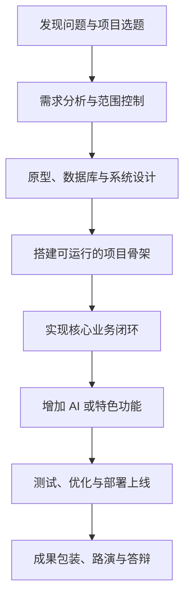

# 软件开发综合项目实训

## 在 AI 时代，做出属于自己的软件作品

这是一门以**真实软件项目**为主线的综合实践课程。

你不需要照着教师复制一个一模一样的管理系统，而是要从一个真实问题出发，借助 Trae 等 AI 编程工具，经历选题、需求分析、系统设计、编码、测试、部署和答辩，最终完成一件能够运行、能够展示、也能够讲清楚的软件作品。

!!! tip "这门课最终交付的不是一个代码压缩包"
    而是一个可以部署展示、写进简历，并有机会继续发展为毕业设计或竞赛作品的完整项目。

[查看 16 周项目路线](guide/roadmap.md){ .md-button .md-button--primary }
[进入项目选题库](projects/index.md){ .md-button }
[使用文档与任务模板](templates/index.md){ .md-button }

---

## 这门课希望帮助你做到

| 有兴趣 | 听得懂 | 做得出来 | 有成就感 |
| --- | --- | --- | --- |
| 选择与校园、生活、行业或个人发展有关的真实项目 | 先看成果、再拆任务，只学习当前项目真正需要的知识 | 有脚手架、任务单、示例、AI助教和阶段验收提供支持 | 每周看到进展，最终完成部署、路演和作品展示 |

课程遵循一条清晰的学习路径：

> 选择一个愿意做的项目 → 每节课完成一个小任务 → 每周看到项目发生变化 → 最终交付一件完整作品

## 完成课程后，你将获得

- 一个具有真实业务背景、能够运行和部署的软件系统；
- 一套与项目一致的需求、设计、测试和总结文档；
- 一个具有连续提交记录、能够体现开发过程的 Git 仓库；
- 一段可以用于毕业设计、竞赛申报或求职面试的项目经历；
- 一套能够迁移到其他项目中的 AI 协同开发方法；
- 分析问题、设计方案、调试代码、测试系统和表达项目的综合能力。

## 16 周，你将这样完成一个项目

| 阶段 | 主要任务 | 阶段成果 |
| --- | --- | --- |
| 第 1—4 周 | AI编程体验、选题、需求和系统设计 | 立项书、需求文档、原型和设计方案 |
| 第 5—8 周 | 搭建项目、完成登录及第一个核心模块 | 可运行项目骨架和中期演示版本 |
| 第 9—12 周 | 完成核心业务流程，增加特色功能 | 完整业务闭环和项目特色 |
| 第 13—15 周 | 测试、修复、优化、部署和成果包装 | 可访问项目、测试报告、README和演示材料 |
| 第 16 周 | 项目路演、个人答辩和课程复盘 | 最终作品和个人项目总结 |

每周结束时，你都应该能够回答：

> **本周，我的项目新增了什么可以运行、可以验证的成果？**

## 项目可以做什么

课程采用“**项目选题库＋有限自主选题**”的方式。你可以从推荐方向中选择，也可以提出自己的创意，但项目范围和工作量需要经过教师审核。

- **校园服务类：**失物招领、宿舍报修、社团活动、校园二手交易；
- **生活服务类：**健康管理、宠物救助、个人记账、志愿服务；
- **行业应用类：**旅游推荐、社区服务、预约管理、商品管理；
- **AI应用类：**AI学习助手、AI简历优化、课程知识问答、智能推荐系统。

原则上鼓励个人独立完成。功能模块较复杂的项目可以组队，**每组不超过 3 人**，并需要明确任务分工和个人贡献。

[查看项目选题与范围控制方法](chapter02/01-topic-selection.md){ .md-button }
[浏览项目选题库](projects/index.md){ .md-button }

## 技术路线不“一刀切”

课程推荐使用以下技术栈：

- JDK 17、Spring Boot 3、Maven；
- MyBatis、MySQL 或 openGauss；
- Vue 3 或适合项目的其他前端方案；
- Git、Apifox、Trae；
- Linux、Nginx，Docker 作为进阶选项。

推荐使用 **Spring Boot + Vue**，但这不是唯一选择。如果你已经熟悉 Servlet、JDBC、HTML、CSS、JavaScript 等技术，也可以根据项目需要选择使用。

课程评价的重点不是“是否使用了最流行的框架”，而是：

- 项目是否真正运行；
- 业务流程是否完整；
- 代码是否能够理解和解释；
- 是否进行真实测试和问题修复；
- 是否完成版本管理、部署和成果交付。

## 每个人都能找到合适的挑战

| 学习层次 | 项目目标 |
| --- | --- |
| 保底目标 | 项目能运行，完成登录、基础业务、数据库、测试和Git提交 |
| 标准目标 | 完成多角色权限、完整业务闭环、异常处理、统计分析和部署 |
| 进阶目标 | 加入RAG、智能问答、推荐、Tool Calling、MCP或智能体能力 |

基础较弱并不可怕。先完成一个小而完整的项目，再逐步增加功能，比一开始追求复杂架构却无法运行更有价值。

## AI 是开发伙伴，不是项目代写者

在课程中，你可以使用 AI 辅助需求分析、方案设计、编码、调试、测试和文档编写，但必须对最终结果负责。

每个阶段统一采用下面的 AI 协作流程：

> 明确任务 → 提供上下文 → AI提出方案 → 人工审核 → 分步实现 → 运行测试 → 修正问题 → Git提交 → 阶段验收

你需要做到：

1. 向AI说明项目背景、技术环境、已有代码和验收标准；
2. 将复杂功能拆分成能够逐步验证的小任务；
3. 阅读、运行、测试并修改AI生成的代码；
4. 记录关键提问、错误现象、修改过程和验证结果；
5. 在答辩时能够解释核心业务、关键代码和本人真实贡献。

!!! warning "不能运行、不能解释、没有经过验证的AI生成内容，不算有效项目成果。"

[学习 AI 辅助编程方法](chapter01/02-ai-coding.md){ .md-button }
[查看学习与 AI 协作规范](guide/learning-method.md){ .md-button }

## 你的最终作品应该包括

- 可运行、可演示的软件系统；
- 可访问的部署地址；
- Git代码仓库及连续提交记录；
- 项目立项书和需求分析文档；
- 原型、数据库、接口和系统设计说明；
- 测试用例、缺陷记录和测试报告；
- 项目README、系统截图和演示视频；
- 答辩PPT、个人总结和简历项目描述。

课程中的每一步，都在为最终作品服务。

---

## 从这里开始

1. 阅读[16周项目路线](guide/roadmap.md)，了解完整学习安排；
2. 学习[AI辅助编程工作流](chapter01/02-ai-coding.md)，建立正确的AI协作方式；
3. 进入[项目选题库](projects/index.md)，寻找自己愿意完成的项目；
4. 使用[文档与任务模板](templates/index.md)，记录每一个阶段的真实成果。

!!! info "先修知识"
    本教程不重复系统讲授 Java Web 基础。遇到相关知识，可以查阅[《Java Web开发技术》电子教材](https://javaweb.chende.top/)。

> **先看见成果，再学习知识；先保证运行，再逐步完善；先完成核心业务闭环，再增加特色功能。**
