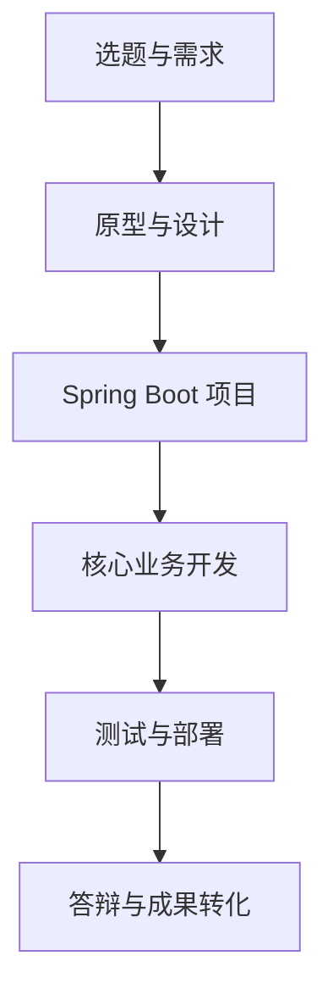

# 软件开发综合项目实训

## AI辅助的软件项目开发

本课程不是“跟着教师复制一个管理系统”，而是要求每个项目组借助 AI 完成一个能够运行、部署和展示的软件项目。

!!! info "课程定位"
    以软件项目全过程为主线，将 Trae 等 AI 编程工具融入需求分析、系统设计、编码、测试、部署和项目总结，但项目决策、代码审查和结果验证必须由学生完成。

## 完成课程后，你将获得

- 一个可运行、可部署的软件系统；
- 一套需求、设计、测试和项目总结文档；
- 一个具有阶段提交记录的 Git 仓库；
- 一段能够用于毕业设计和求职面试的项目经历；
- 一套可迁移到其他项目的 AI 协同开发方法。

## 技术主线

推荐技术栈：

- JDK 17、Spring Boot 3、Maven；
- MyBatis、MySQL 或 openGauss；
- Vue 3 或适合项目的前端方案；
- Git、Apifox、Trae；
- Linux、Nginx，Docker 作为进阶选项。

## 学习方式

每个阶段统一采用：

> 明确任务 → 提供上下文 → AI提出计划 → 人工审核 → 分步实现 → 运行测试 → Git提交 → 阶段验收

## 先修资源

本教程不重复系统讲授 Java Web 基础。遇到相关知识，可查阅 [《Java Web开发技术》电子教材](https://javaweb.chende.top/)。
